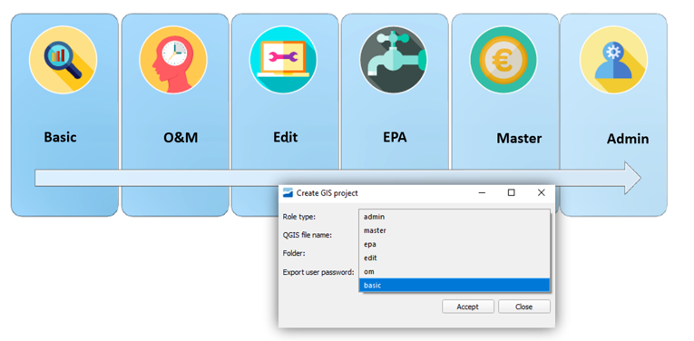

.. _giswater.documentation.steps-to-create-a-new-project:

********
Creating Schema and Project Using Giswater Plugin on QGIS
********

.. only:: html

   .. contents::
      :local:

This guide will help you create a new project, assuming you have all required programs installed and a properly configured database connection with all necessary extensions.

.. note::
   We recommend installing the example project first. This provides a reference you can check against when questions arise.

.. _qgis.documentation.create-db-project-schema:

Creating the Database Project Schema
~~~~~~~~~~~~~~~~~~~~~~~~~~~~~~~~~~

1. Choose your language [LANG] and coordinate system [EPSG]
2. Select an empty project (without sample data or INP files)

.. important::
   You need PostgreSQL superadmin privileges to work with Giswater.

.. _qgis.documentation.create-qgis-project-file:

Creating the QGIS Project File
~~~~~~~~~~~~~~~~~~~~~~~~~~~~

Choose your role type when creating the QGIS project file.

.. note::
   * Always protect your password
   * For beginners, the [basic] role type is recommended as it has fewer functions and layers to manage
   * Advanced roles provide access to additional layer views and Giswater features

