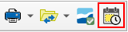

.. _additional-toolbars-audit:

======
Módulo Audit
======

.. only:: html

   .. contents::
      :local:

El módulo de auditoría en Giswater está basando en la incorporación de un nuevo esquema en la base de datos, el cual llamaremos **audit**. En este documento se explicará como se pone en marcha y como se usan las herramientas vinculadas a este esquema, el cual irá almacenando información de los cambios hechos en nuestros esquemas de trabajos Giswater.

Inicialización y gestión del esquema audit
======

La primera fase en la implementación del entorno de auditoría consiste en la configuración del esquema audit en la base de datos PostgreSQL. Para facilitar este proceso y garantizar una gestión eficiente, se ha desarrollado una herramienta avanzada de administración dentro del plugin Giswater. Esta funcionalidad está disponible exclusivamente para usuarios con privilegios de administración y se encuentra en la pestaña “Avanzado” del panel de gestión de esquemas.

.. figure:: img/gw-audit-manager.png

   Formulario para gestionar esquema audit

La herramienta se compone de tres funcionalidades principales, cada una accesible mediante un botón específico:
1. **Crear esquema de auditoría de base de datos.** Esta opción ejecuta el proceso de creación del esquema audit, utilizando los recursos contenidos en las carpetas del plugin ``giswater\dbmodel\audit\structure`` y ``giswater\dbmodel\audit\audit_checkproject``. Los recursos utilizados incluyen:

    - Archivos DDL y DDLVIEW: Definen la estructura de tablas y vistas necesarias.
    - Archivos DML: Establecen los procedimientos para la manipulación de datos en las tablas de auditoría.
    - Scripts de tipo Report: Incorporan funcionalidades complementarias a la caja de herramientas de Giswater.
    - Definiciones de Roles: Configuran los permisos requeridos para una correcta gestión del esquema.

2. **Activar entorno de auditoría.** Esta funcionalidad permite activar el entorno audit para el esquema GIS actualmente en uso. Para ello, se utilizan los scripts disponibles en la carpeta ``giswater\dbmodel\audit\activate``.
Antes de completar la activación, la herramienta genera automáticamente una imagen de la red operativa en el esquema audit, la cual servirá como punto de referencia inicial. Esta imagen constituirá el estado más antiguo consultable durante los procesos de auditoría.
El esquema GIS objetivo de la activación se determina en función de la conexión activa del usuario, visible en la interfaz del panel.

3. **Actualizar auditoría.** Esta opción permite aplicar cambios sobre una instancia de GIS previamente configurada con el entorno de auditoría. Nos permite actualizar los parámetros de configuración o incorporar nuevas capas auditadas, sin necesidad de reiniciar el esquema completo.

4. **Activar herramientas adicionales en el complemento Giswater**. Cuando el módulo ya esté en marcha, será el momento de activar la visualización de las 2 herramientas desarrolladas para la consulta de datos de auditoría. Estas se integran en las barras de herramientas existentes en Giswater, pero en proyectos dónde no se ha activado el módulo de auditoría, se recomienda mantenerlas escondidas, pues no serían para nada funcionales.
Para activarlas hay que ir al menú Giswater, en el apartado Avanzado, y cambiar el valor a True de la variable ``audit_active`` dentro del grupo ``toolbars_add``. Esto habrá que hacerlo en cada cliente de QGIS.

   Configuración avanzada dónde activar las herramientas del módulo audit

Previo a la puesta en marcha, el administrador del sistema debe realizar una configuración detallada del entorno audit, ajustando los parámetros según los requerimientos téc-nicos del proyecto. Los parámetros configurables son los siguientes:

- Frecuencia de generación de imágenes de red: Determina el intervalo de días a partir del cual se genera automáticamente una nueva imagen completa del es-tado de la red.
- Retención de imágenes de red: Establece el número de días durante los cuales cada imagen histórica permanecerá disponible. Al superar este umbral, las imá-genes se eliminan del sistema de forma automática.
- Elementos GIS auditables: Define qué elementos de la red deben ser objeto de seguimiento. Para ello, se especifican las tablas concretas que se incluirán en el proceso de auditoría.

Todos estos valores son modificables en cualquier momento por parte del administrador. Cualquier cambio realizado deberá ser aplicado mediante la funcionalidad “Actualizar auditoría”, a fin de que el sistema adopte la nueva configuración de forma efectiva e inmediata.

Implicaciones de la activación del entorno audit
======
La activación del entorno de auditoría en Giswater implica la integración de un mecanismo transversal de trazabilidad dentro del GIS, que registra de forma estructurada todos los cambios efectuados sobre los datos geoespaciales. Este registro se realiza automáticamente en la tabla **log** ubicada en el esquema audit, lo que garantiza un control exhaustivo sobre la evolución de la red.
A partir de este momento, cualquier operación de modificación ejecutada sobre las capas del modelo —ya sea una inserción, una actualización o una eliminación— genera una entrada correspondiente en dicha tabla, permitiendo la reconstrucción precisa de cada estado anterior de los objetos gestionados.
El comportamiento es el siguiente según el tipo de operación:
- **Inserción**: Se registra el nombre del esquema y de la tabla afectada, el usuario que realiza la operación, el tipo de acción (INSERT), los datos actuales del objeto insertado (en formato JSON), el comando ejecutado y la fecha/hora de la operación.
- **Actualización**: Se registra la información del esquema, tabla, usuario y tipo de acción (UPDATE), así como los datos anteriores y actuales del objeto (ambos en formato JSON), junto con el comando SQL ejecutado y la marca temporal correspondiente.
- **Eliminación**: Se conserva el esquema y tabla afectados, el usuario, el tipo de acción (DELETE), los datos anteriores del objeto (JSON), el comando ejecutado y la fecha/hora de ejecución.

La columna de datos en formato JSON proporciona una representación estructurada del objeto completo, incluyendo todos los atributos existentes en la tabla en el momento de la operación. Esta característica permite no solo conocer qué valores han cambiado, sino también reproducir con total fidelidad el estado anterior o posterior de cualquier entidad, tanto en términos alfanuméricos como geométricos.

.. figure:: img/log-table.png

   Table log con registros de modificaciones hechas

Este mecanismo de almacenamiento constituye la base para la gestión de versionado dentro del GIS, ya que permite realizar consultas históricas, auditorías de cambios, y procesos de restauración de versiones anteriores de forma selectiva y controlada. La información contenida en el esquema audit se convierte, por tanto, en un activo estratégico para garantizar integridad, trazabilidad y capacidad de recuperación ante errores o modificaciones no deseadas.

Herramienta de inspección de cambios
======
Una vez almacenada la información relativa a las operaciones realizadas sobre los objetos del GIS, se habilita la posibilidad de consultar versiones históricas directamente desde la interfaz de usuario.

Para ello, se incorpora una nueva funcionalidad en los formularios de los objetos, accesible mediante un botón específico en el conjunto de herramientas. Al activar esta opción, el sistema realiza una consulta en el esquema audit, localizando todas las operaciones registradas sobre el objeto en cuestión —identificado por su clave primaria— y presentando los resultados en un formulario adicional. Esta lista de versiones, ordenada cronológicamente, permite examinar la evolución completa del objeto a lo largo del tiempo.

.. figure:: img/audit-custom-form.png

   Botón para la herramienta de inspección de cambios

Cada entrada en la lista representa un instante histórico vinculado a una operación concreta (inserción, modificación o eliminación), e incluye tanto los atributos del objeto como su geometría, reflejando fielmente el estado del mismo en ese momento. 

   Formulario de la herramienta de inspección de cambios

Esta herramienta no solo potencia la trazabilidad, sino que constituye la base para acciones de inspección detallada y restauración selectiva, mediante las siguientes utilidades:
- Botón **Abrir**: Permite seleccionar un registro de la lista y visualizar en un formulario auxiliar los valores de los atributos afectados por la operación, mostrando tanto el estado anterior como el nuevo. Esto facilita, de forma clara e inmediata, la comprensión del cambio aplicado y su impacto.
- Botón **Fecha abierta**: Ofrece la posibilidad de seleccionar una fecha en la que existan registros de modificación, mostrando en un único formulario auxiliar todos los cambios auditados en ese día. Esta funcionalidad resulta especialmente útil para comparar el estado del objeto antes del inicio y después del cierre de la jornada laboral, permitiendo una revisión completa de las modificaciones efectuadas en la fecha seleccionada.

   Formulario de la herramienta de inspección de cambios con un registro seleccionado para ver específicamente qué cambios se hicieron

Herramienta de recuperación temporal del estado de la red
======
A partir de la información registrada por el entorno de auditoría, se ha desarrollado una nueva utilidad dentro de Giswater que permite reconstruir de forma precisa el estado histórico de la red en una fecha concreta, facilitando así tareas de análisis, diagnóstico o auditoría avanzada.

Al tratarse de una herramienta útil para cualquier usuario de Giswater, se ha incrustado en la barra de herramientas de Utilidades (previa activación necesaria).

   Herramienta de recuperación temporal del estado de la red, incrustada en la barra de Utilidades

Esta funcionalidad permite al usuario configurar una serie de parámetros clave a través de un formulario específico:
- Fecha de referencia: Permite seleccionar el momento temporal del cual se desea recuperar el estado de la red.
- Extensión espacial: Se puede definir el área geográfica de análisis de dos maneras: mediante una herramienta de dibujo sobre el lienzo de QGIS o reutilizando la extensión visible actual del mapa.
- Elementos a recuperar: El usuario puede seleccionar uno o varios tipos de objeto sobre los cuales se desea aplicar la reconstrucción: arcos, nodos, conexiones, links, elementos o documentos.

.. figure:: img/audit-network-manager.png

   Formulario de la herramienta de recuperación temporal del estado de la red

Una vez establecidos los parámetros, el proceso se encarga de identificar la imagen de red más cercana anterior a la fecha seleccionada y aplica, de forma secuencial, todos los cambios registrados entre dicha imagen y la fecha objetivo. De este modo, se genera una reconstrucción fiel del estado de la red tal como se encontraba en ese momento.

El resultado se almacena en tablas temporales, que son cargadas automáticamente en QGIS con una simbología personalizada. Esta simbología incluye categorías de color y estilo diferenciadas que permiten identificar visualmente qué elementos han sido **modificados** (naranja), cuáles han sido **eliminados** (rojo) y cuáles permanecen **sin cambios** (azul). Además, esta capa reconstruida es completamente consultable, permitiendo al usuario explorar en detalle las propiedades de cada elemento tal como estaban en la fecha seleccionada.

.. figure:: img/audit-network-result.png

   Resultado del proceso de recuperación temporal, mostrando los cambios realizados a través de distintas capas y simbologías

Esta herramienta amplía de manera significativa las capacidades analíticas de Giswater, proporcionando una visión histórica detallada del comportamiento y evolución de la red, sin alterar la integridad de los datos operativos actuales.

