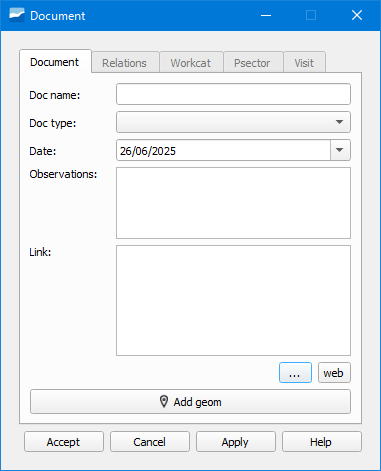

.. _dialog-add-doc:

================
Añadir documento
================

Herramienta que permite añadir información contenida en documentos tipo Word, Excel, fotos...

     Ventana de la herramienta Añadir documento.

Para añadir un documento podremos hacerlo a través del botón *Añadir documento* de la barra de herramientas *Edit*, mediante el formulario de atributos del objeto yendo a la pestaña *Documento* y pinchando en el botón *Documento nuevo* o 
con el *Gestor de documentos*.

En el formulario para añadir un documento especificaremos su tipo en el desplegable *Tipo doc* así como la ruta del mismo en la pestaña *Documento*.
A continuación, en la pestaña *Relaciones* seleccionaremos el objeto al cual queremos añadir el documento.