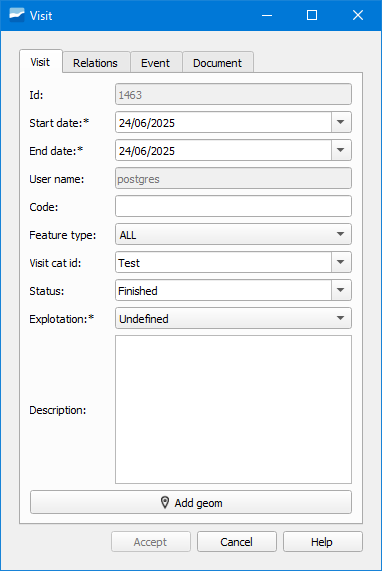

.. _dialog-add-visit:

=============
Add Visit
=============

Tool that allows adding a new visit and linking it to elements of the network.

     Window of the Add Visit tool.

These visits are used to keep a record of the times that the elements of the network have been visited in the field.

In each visit we can collect several parameters of information or events.

The form is divided into several tabs:

- Visit: collects basic data about the visit.
- Relations: shows the element with which the visit is linked. We can add it directly by writing its id or using the selection button. Depending on the element to add (arc, node, connection, gully or link) we will use one or the other tab.
- Event: indicates the parameters and information related to the visit.
- Document: to link external documents to the visit.

We can also add visits from the elements' form.