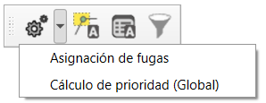

.. _dialog-am-administrative-tool:

==============================
Administrative tool
==============================

.. only:: html

   .. contents::
      :local:

Tool that groups several advanced functionalities related to the management of the network. It includes the assignment of leaks and the priority calculation (Global).

   Window of the administrative tool.

The window contains the following buttons:

- Leak assignment: allows assigning leaks to the selected elements in the main QGIS view. By clicking on it a new window opens where the parameters of the leak assignment can be defined. For more details, see the section :ref:`dialog-am-breakdown-assignation`.
- Priority calculation (Global): allows executing the priority calculation globally over the entire network. For more details, see the section :ref:`dialog-am-prioirity-calculation-global`.
