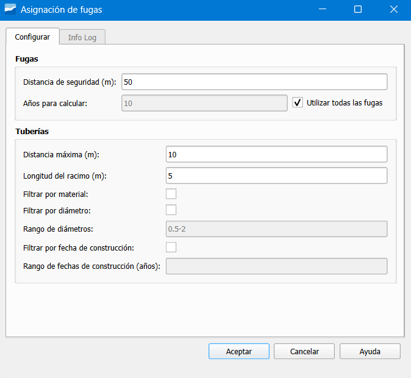

.. _dialog-am-breakdown-assignation:

==================================
Breakdown assignation tool
==================================

.. only:: html

   .. contents::
      :local:

Tool that allows assigning leaks over the network.

   Window of the breakdown assignation tool.

The window contains the following buttons:

**Leaks**

- Safety distance (m): search radius around each leak.
- Years to calculate: temporal limit for the analysis.
- Use all leaks: ignores the year filter and uses all registered leaks.

**Pipes**

- Maximum distance (m): maximum distance between leak and pipe.
- Cluster length (m): minimum length of the grouped section.
- Filter by material: activates the filter by material of the pipe.
- Filter by diameter: activates the filter by diameter.
- Diameter range: allowed diameter range.
- Filter by construction date: activates the filter by construction year.
- Construction date range (years): defines the temporal range for the pipes.