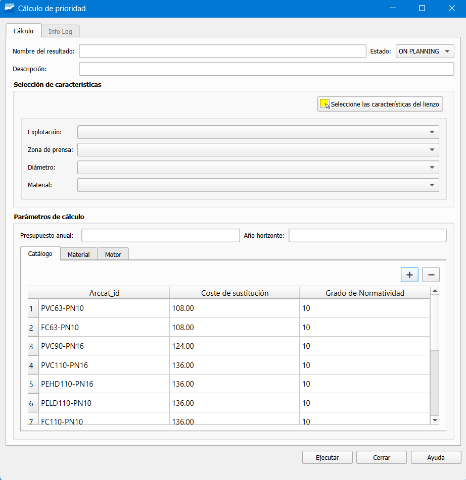

.. _dialog-am-prioirity-calculation-by-selection:

====================================
Priority calculation by selection
====================================

.. only:: html

   .. contents::
      :local:

Tool that allows executing the priority calculation directly on the selection of elements or on the defined sets.

   Window of the priority calculation by selection tool.

The window contains the following buttons:

**Calculation**

- Name of the result: name of the calculation that will be generated.
- Description: additional information of the calculation (optional).
- State: process phase, by default ON PLANNING.

**Selection of features**

- Select the features of the canvas: allows selecting the elements directly from the map.
- Exploitation: filters by exploitation or operational sector.
- Press zone: filters by specific working zone.
- Diameter: filters by diameter of pipe.
- Material: filters by type of material.

**Calculation parameters**

- Annual budget: budget available for actions.
- Horizon year: year limit for the economic analysis.