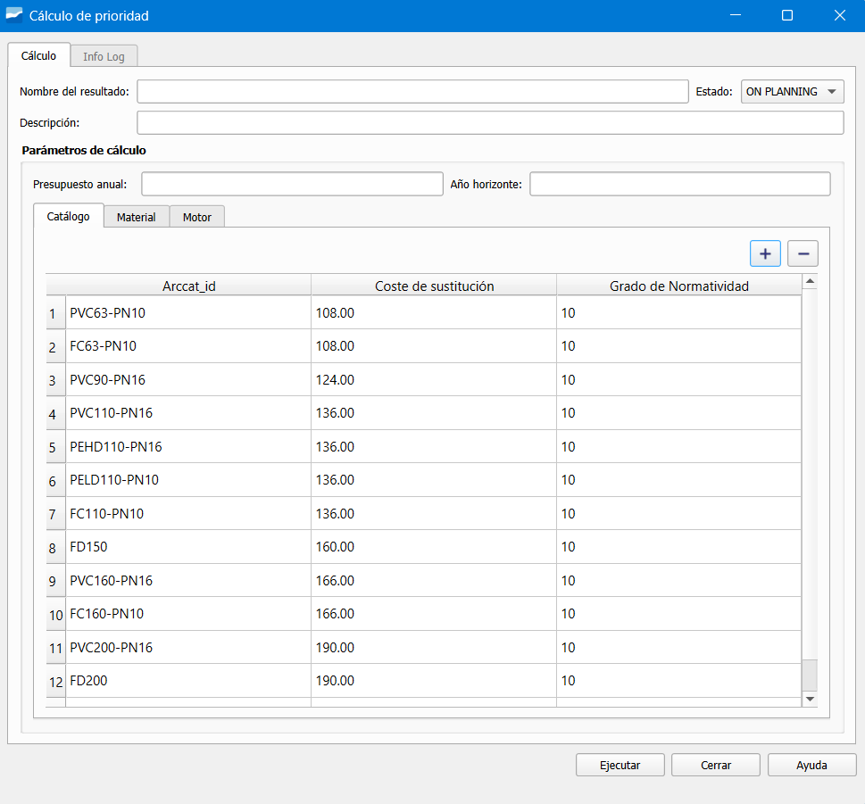

.. _dialog-am-prioirity-calculation-global:

===============================
Priority calculation (Global)
===============================

.. only:: html

   .. contents::
      :local:

Tool that allows executing the priority calculation globally over the entire network.

   Window of the priority calculation (Global) tool.

The window contains the following buttons:

**Calculation**

- Name of the result: name of the calculation that will be generated.
- Description: additional information of the calculation (optional).
- State: process phase, by default ON PLANNING.

**Calculation parameters**

- Annual budget: budget available for actions.
- Horizon year: year limit for the economic analysis.