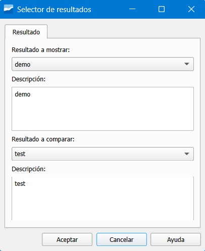

.. _dialog-am-result-selector:

====================================
Selector de resultados Asset Manage
====================================

.. only:: html

   .. contents::
      :local:

Herramienta que permite filtrar y seleccionar de manera rápida los resultados disponibles, optimizando la revisión y comparación de escenarios.

   Ventana de la herramienta Selector de resultados Asset manage.

En el apartado *Resultado a mostrar* indicaremos el resultado a mostrar y en *Resultado a comparar*, el resultado con el cual queremos comparar.
