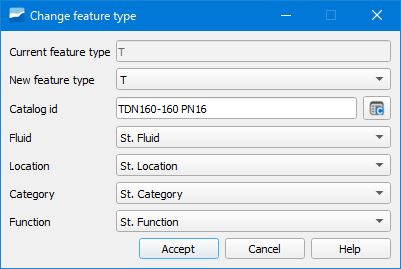
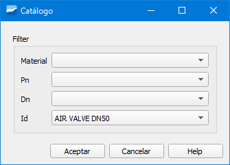

.. _dialog-change-featuretype:

===========================
Cambiar el tipo de elemento
===========================

Herramienta que permite cambiar el tipo de elemento de un objeto de la red por otro de un tipo distinto.

   
   Ventana de la herramienta Cambiar el tipo de elemento.

El cambio lo podemos hacer entre arcos, nodos, connecs y gullys. Una vez seleccionado el elemento a cambiar, en la ventana emergente obligatoriamente deberemos especificar:

- Current feature type: tipo de elemento actual. Se selecciona por defecto.
- New feature type: tipo de elemento al cual queremos cambiar. Seleccionaremos uno en el desplegable.
  Tendremos disponibles todos aquellos que en el "Node feature catalog" tengan el valor *verdadero* en el campo *active*.
- Catalog id: catálogo del nuevo elemento. Pinchando en el botón adyacente se abrirá una ventana donde especificaremos:

   
   Ventana para cambiar el catálogo al nuevo elemento.

- Material: material del elemento.
- Pn: presión nominal del elemento.
- Dn: diámetro nominal del elemento.
- Id: identificador del elemento.

Además, si disponemos de información acerca del tipo de fluido, localización, categoría y función podremos seleccionarlo en *Fluid*, *Location*, *Category* y *Function*.
