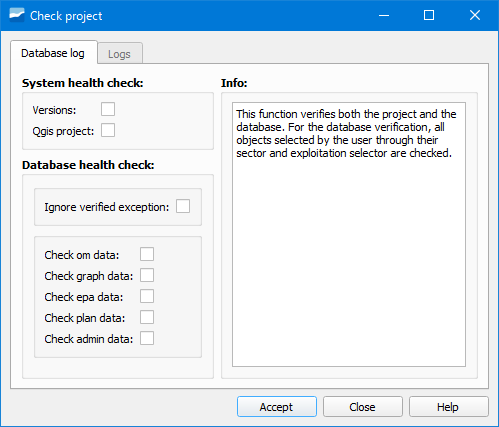

.. _dialog-check-project:

==================
Check Project
==================

.. only:: html

   .. contents::
      :local:

Tool that allows selecting different verifications for Giswater to perform checks
on the project data.

   Window of the Check Project tool.

The verifications available are:

- Versions: checks the versions of the software.
- Qgis project: checks the variables of the QGIS project.
- Check om data: checks the data for operations and maintenance.
- Check graph data: checks the data for the graph.
- Check epa data: checks the data for the epa simulation.
- Check plan data: checks the data for planning.
- Check admin data: checks the data for administration.