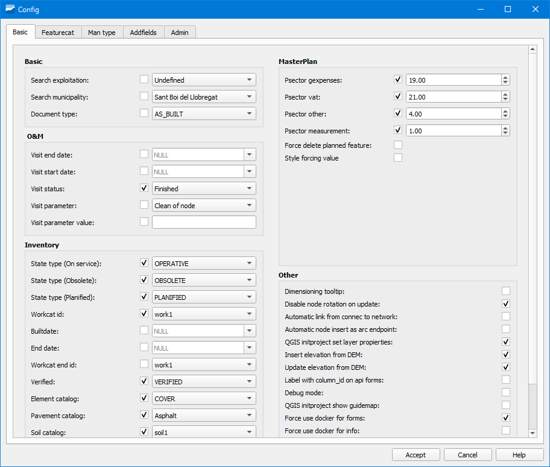

.. _dialog-config:

=========================
Config
=========================

.. only:: html

   .. contents::
      :local:

Tool where we can configure different aspects of Giswater.

The window is formed by five tabs, in each of which we can
establecer the configuration of Giswater.

Tool to manage all the zones of the map contained in the project.

   Window of the Config tool.

.. warning::
  
   Depending on the user's permissions, some of the tabs may not be available.
