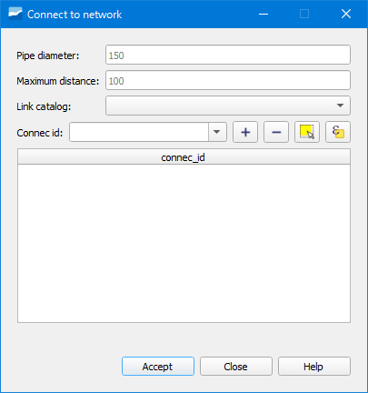

.. _dialog-connect-to-net:

=================
Connect to Net
=================

Tool that allows automatically connecting the connec/gully to the network through a link.

Window of the Connect to Net tool.

After clicking on the tool a window will open in which we will have to indicate the diameter of the pipe (*Pipe diameter*), the maximum distance (*Maximum distance*) and the catalog of the link (*Link catalog*).

We can write its id in the *Connec id* box and click on the *+* button to add it to the list of connecs to connect or use the *Select on the canvas* button.

When we click on the *Accept* button, our connec/gully will be connected to the network.
