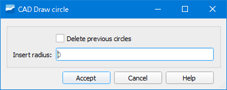

.. _dialog-create-circle:

=============
Create Circle
=============

Tool that allows drawing auxiliary circles with which to help digitize with greater precision.

     Window of the Create Circle tool.

The only thing we have to do to draw the circle is to set the point on which we want it and indicate its radius.

Depending on where we want to draw the circle we will have to configure the autoassembly options.

The created circle is added to the *v_edit_cad_auxcircle* layer which will be loaded in the ToC.