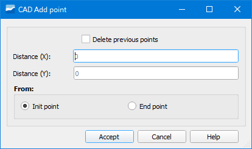

.. _dialog-create-point:

===========
Crear punto
===========

Herramienta que permite dibujar puntos auxiliares con los que ayudarse para digitalizar con mayor precisión en base a una recta auxiliar previamente dibujada con la propia herramienta.

     Ventana de la herramienta Crear punto.

Una vez establecidos los puntos de la recta de apoyo, indicaremos las distancias X e Y respecto del punto inicial o final para dibujar el punto.

El punto representado se añade a la capa *v_edit_cad_auxpoint* la cual se cargará en el ToC.