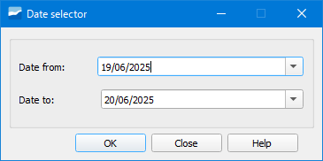

.. _dialog-date-selector:

==================
Selector de fechas
==================

Herramienta que permite fijar unos valores de fechas concretos.

    Ventana de la herramienta Selector de fechas.

Al establecer las fechas de inicio y fin, se aplicará el cambio en la tabla *selector_date* de la base de datos para nuestro usuario.

Con esta herramienta los usuarios pueden crear consultas o vistas sobre datos con carácter temporal y relacionarlas con la tabla *selector_date*.
Una vez cargadas estas consultas como capas en QGIS, se podrán filtrar de forma dinámica gracias a este botón, lo que puede ofrecer un gran valor añadido a la visualización 
de ciertos datos en el mapa.