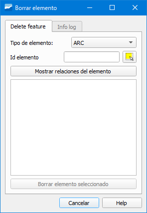

.. _dialog-delete-feature:

========================
Eliminar elemento de red
========================

.. warning::
  
   Extremar la precaución al eliminar objetos; borrarlos puede acarrear errores graves en la red porque puede romperse la topología.

Herramienta que permite borrar de manera definitiva un elemento de la red.

   
   Ventana de la herramienta Eliminar elemento de red.

Podremos eliminar arcos, nodos, connecs o gullys. En la ventana emergente deberemos especificar:

- Tipo de elemento: seleccionaremos del desplegable el tipo de objeto a eliminar (arco, nodo, connec o gully).
- Id elemento: identificador del elemento a eliminar. Si lo desconocemos podremos hacer uso del botón *Seleccionar objeto* que está a la derecha para seleccionarlo.
- Botón *Mostrar relaciones del elemento*: pincharemos sobre él para ver las relaciones del objeto con el resto de la red.
  Para poder eliminar un elemento deberemos pinchar obligatoriamente sobre él y solo se pueden borrar objetos de uno en uno.
- Botón *Borrar elemento seleccionado*: pincharemos sobre él para eliminar definitivamente el objeto y solo estará disponible tras haber pinchado en el botón *Mostrar relaciones del elemento*.

Tras eliminar el elemento veremos en la pestaña *Info log* un resumen de las operaciones realizadas.

.. important::

   Los objetos solo se pueden borrar de uno en uno y si tras borrar uno queremos borrar otro, tendremos que pinchar en el botón *Eliminar otro elemento* que estará disponible en la pestaña *Info log*.