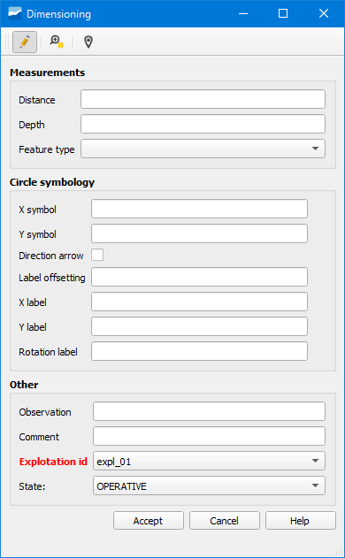

.. _dialog-dimensioning:

===========
Acotaciones
===========

.. warning::

     Antes de crear una acotación tendremos que configurar **obligatoriamente** las opciones de autoensamblado.

Herramienta que permite crear acotaciones que se utilizan como apoyo sobre el mapa.

     Ventana de la herramienta Acotaciones.

Tras haber dibujado la línea de acotación, rellenaremos la ventana emergente con los datos necesarios.
