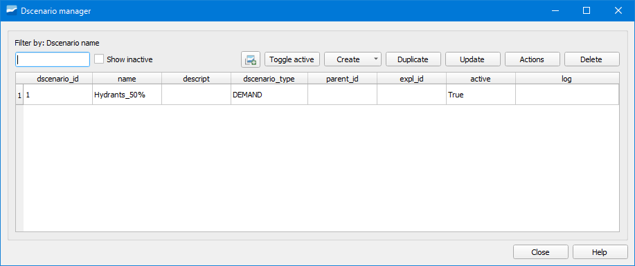

.. _dialog-dscenario-manager:

====================
Escenarios dinámicos
====================

.. only:: html

   .. contents::
      :local:

Herramienta que permite crear escenarios de objetos de red donde podremos modificar cualquier parámetro de cualquier objeto
sin que ello conlleve modificar datos en el inventario.

     Ventana de la herramienta Escenarios dinámicos para proyectos ws.

Para proyectos de saneamiento y drenaje urbano tendremos disponible un menú desplegable en el botón para poder seleccionar si queremos crear
un escenario de objetos de red (opción *Dscenario manager*), un escenario de hidrología (opción *Hydrology scenario manager*) o un escenario 
en tiempo seco (opción *DWF scenario manager*).

Dscenario manager (ws y ud)
===========================

Opción a elegir cuando queramos crear un escenario de un objeto cualquiera de la red.

Para crearlo pincharemos en el desplegable del botón *Create* y seleccionaremos alguna de las siguientes opciones:

- Create valve dscenario from mincut (ws): permite crear un escenario de válvulas para un polígono de corte. Requiere tener creado previamente un polígono de corte.
- Create Demand Dscenario from CRM (ws): permite crear un escenario de demanda con datos provenientes de un CRM.
- Create Demand Dscenario from ToC (ws): permite crear un escenario de demanda con datos de la ToC de nuestro proyecto.
- Create empty Dscenario (ws y ud): permite crear un escenario vacío.
- Create Network Dscenario from ToC (ws): permite crear un escenario de red con datos de la ToC de nuestro proyecto.
- Create Dscenario with values from ToC (ud): permite crear un escenario de red con datos de la ToC de nuestro proyecto.

En función de la opción elegida habrá que especificar distintas opciones. Para que podamos tener el escenario disponible es **obligatorio** activar la casilla *Active*.
Una vez creado el escenario, lo veremos listado en el gestor de escenarios.

Para añadir objetos al escenario y así poder modificar sus campos, lo tendremos que seleccionar con la herramienta de selección que se encuentra dentro del propio escenario.

Los datos de los objetos se podrán modificar de tres maneras distintas: a través del gestor de escenarios, accediendo a la pestaña EPA del objeto mediante el botón *Info Giswater* y
mediante la tabla de atributos de la capa del dscenario correspondiente.

Hydrology scenario manager (ud)
===============================

Opción a elegir cuando queramos crear un escenario de hidrología.

Para crearlo pincharemos en el desplegable del *Create* y seleccionaremos la opción *Create empty Hydrology scenario*.

En la ventana emergente tendremos que indicar el nombre del escenario, el método de infiltración, la explotación y si lo queremos activo o no.

Con el escenario creado ya se podrá construir la hidrología a utilizar.

DWF scenario manager (ud)
=========================

Opción a elegir cuando queremos crear un escenario de caudales en tiempo seco (DWF).

Para crearlo pincharemos en el desplegable del *Create* y seleccionaremos la opción *Create empty DWF scenario*.

En la ventana emergente tendremos que indicar el nombre del escenario, la explotación y si lo queremos activo o no.

Con el escenario creado ya se podrán añadir los datos de caudal en tiempo seco.
