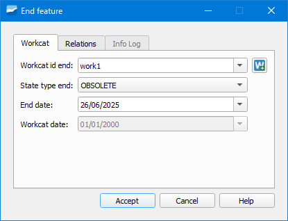

.. _dialog-end-feature:

===========
End Feature
===========

Tool that allows changing the *Obsolete* status of one or more elements of the network by associating them with a construction file.

     Window of the End Feature tool.

The window is formed by the *File* tab where we will have to indicate the data to end the object, the *Relations* tab where we will have to select what type of object we want to end for then selecting it
with the *Selection* button and the *Info log* tab where we will see a brief summary of the operation carried out.

