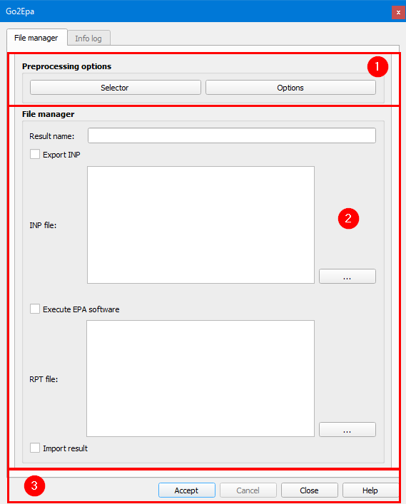

.. _dialog-go2epa:

======
Go2Epa
======

.. only:: html

   .. contents::
      :local:

Herramienta que permite establecer qué sector o sectores de la red se simulan hidráulicamente así como cuáles son sus opciones de exportación.

Desde aquí podremos exportar la red a INP para luego simularla en EPANET o SWMM o realizar el ciclo completo de simulación (exportación-simulación-importación de resultados) en el entorno de QGIS.

     Ventana de la herramienta Go2Epa.

La ventana está formada por tres partes: la superior (1), la central (2) y la inferior (3).

En la parte superior, gracias a los dos botones disponibles, seleccionaremos qué zonas de la red simularemos (sector, escenario de demanda, psector...) y estableceremos sus opciones de exportación.
Las opciones de exportación se pueden ver en detalle en la sección :ref:`export-options`.

En la parte central especificaremos un nombre para el resultado y marcaremos las casillas correspondientes en función del tipo de exportación que queramos realizar. Si solo queremos exportar el INP marcaremos solo la casilla correspondiente.
Si por el contrario queremos realizar el ciclo completo, marcaremos todas las casillas e indicaremos una ruta y un nombre para los archivos INP y RPT que se generarán.

En la parte inferior se encuentran los botones correspondientes a las acciones aceptar, cancelar, cerrar y ayuda de esta ventana.

Durante la exportación del archivo INP Giswater realiza comprobaciones para verificar que el estado de la red es correcto y que no contiene ningún error. Si todas las comprobaciones se realizan con éxito, devolverá un resumen sobre el 
análisis realizado. En caso contrario mostrará un resumen en el que veremos una serie de errores críticos (*CRITICAL ERRORS*) que habrá que corregir. Para ello podremos hacer uso de las herramientas de la caja de herramientas de Giswater.