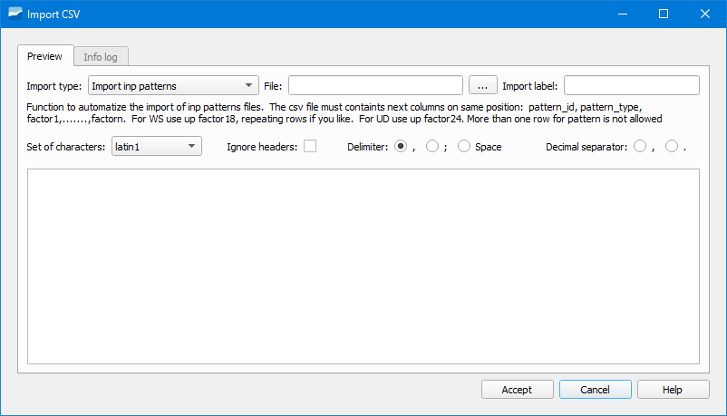

.. _dialog-gwfiletransferbutton:

===========================================
Giswater File Transfer Button
===========================================

.. only:: html

   .. contents::
      :local:

Tool that allows importing and exporting files from Giswater.

It has a CSV file importer which allows importing different types of files using
preconfigured functions.

   Window of the CSV importer.

To import a file we will first have to select in the dropdown *Import type* the type of 
file to import.

Next, we will select the file by clicking on the search button in the *File* section.

Next, we will configure the importer specifying the character encoding (*Set of characters*),
if we ignore the headers of the file (*Ignore headers*), which is the separator (*Delimiter*), as
well as which is the decimal separator.