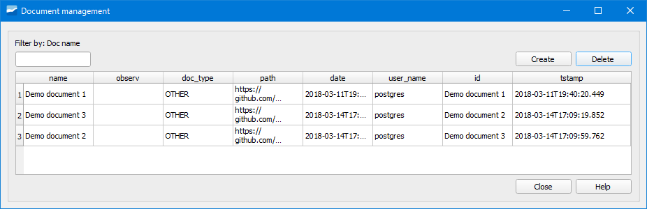

.. _dialog-manage-docs:

====================
Gestor de documentos
====================

Herramienta que permite gestionar los documentos que están vinculados con los elementos de la red.

     Ventana de la herramienta Gestor de documentos.

Cuando queramos eliminar un documento de manera definitiva tendremos que hacerlo mediante el gestor de documentos.