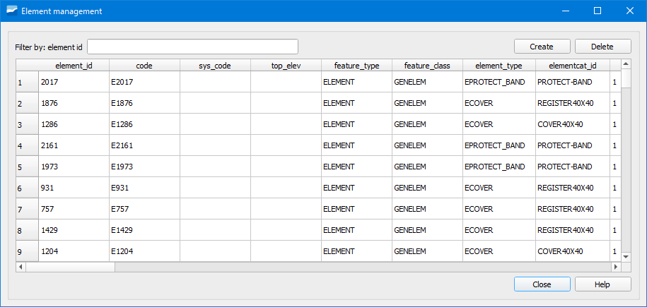

.. _dialog-manage-element:

===================
Gestor de elementos
===================

Herramienta que permite gestionar los elementos que están vinculados con los elementos de la red.

     Ventana de la herramienta Gestor de elementos.

Cuando queramos eliminar un elemento de manera definitiva tendremos que hacerlo mediante el gestor de elementos.