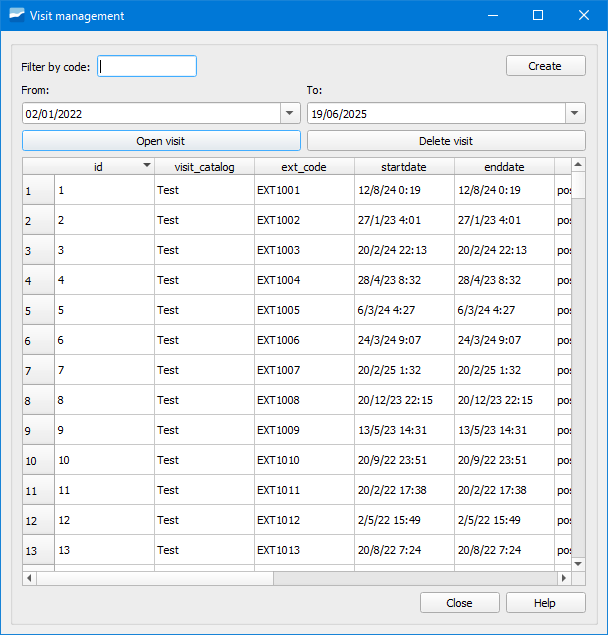

.. _dialog-manage-visit:

=================
Gestor de visitas
=================

Herramienta que permite gestionar las visitas existentes.

    Ventana de la herramienta Gestor de visitas.

El formulario contiene una tabla con todas las visitas realizadas en el proyecto así como sus datos.

Desde aquí podemos abrir o borrar una visita utilizando los botones correspondientes así como crear una nueva. También podemos filtrar por el campo *ext_code*.

En aquellos casos en los que una visita tenga geometría, también podremos abrirla utilizando el botón *Info Giswater*.

