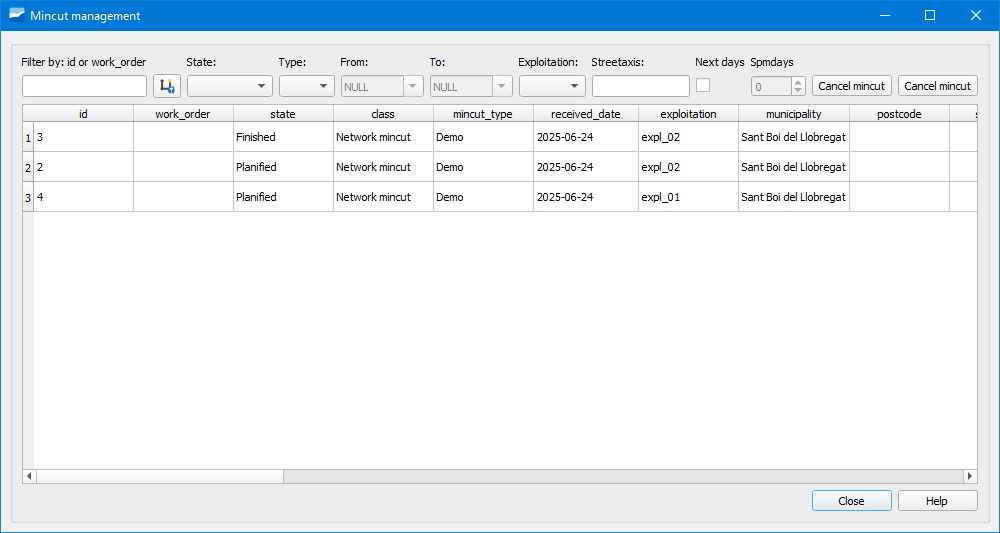

.. _dialog-mincut-manage:

============================
Gestor de polígonos de corte
============================

Herramienta que permite hacer una gestión activa de los polígonos de corte planificados, en curso e históricos.

     Ventana de la herramienta Gestor de polígonos de corte.

Haciendo doble clic sobre uno de ellos podemos recuperarlo y volverlo a ver en pantalla. También podemos filtrar en base a distintos estados o tipos así como cancelar o eliminar un polígono.