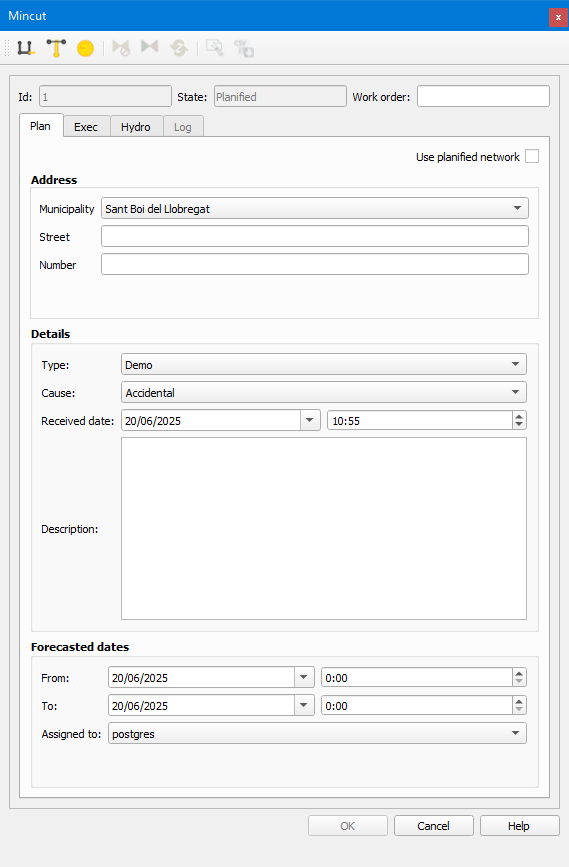

.. _dialog-mincut:

=================
Polígono de corte
=================

Herramienta que permite calcular el tamaño de red afectada y las válvulas a cerrar en el caso de querer dejar sin abastecimiento de agua un punto concreto.

    Ventana de la herramienta Polígono de corte.

Para que el polígono de corte funcione correctamente se deben cumplir unos requisitos:

- La topología arco-nodo debe ser correcta, es decir, todos los arcos deben tener informado los campos *node_1* y *node_2*.
- Los campos *closed* y *broken* de las válvulas no pueden tener valor *NULL*.
- En la tabla *config_graph_mincut* hay que configurar los nodos que aportan agua al sistema (generalmente, los depósitos). Si alguno de los tramos que llega a este nodo es el de 
  la red de alta, hay que configurarlo en la columna *paramenters* como *inletArc*. Todos los que no estén en esta tabla se considerarán tramos de salida.
- En la tabla *cat_feature_node* hay que establecer qué tipo de válvulas se pueden utilizar para realizar el cierre. Hay que poner el valor *MINSECTOR* en la columna *graph_delimiter*.

Podremos calcular el polígono de corte si, tras clicar sobre el botón *Polígono de corte automático*, pinchamos en el punto de la red afectado.

Se mostrará en pantalla la zona afectada así como las válvulas sobre las que hay que operar. En el ToC aparecerá un grupo de capas con el resultado.