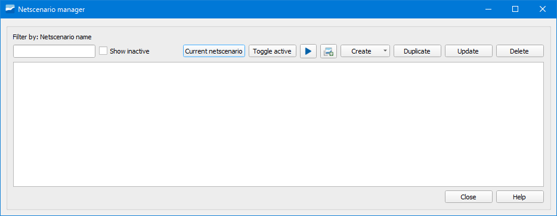
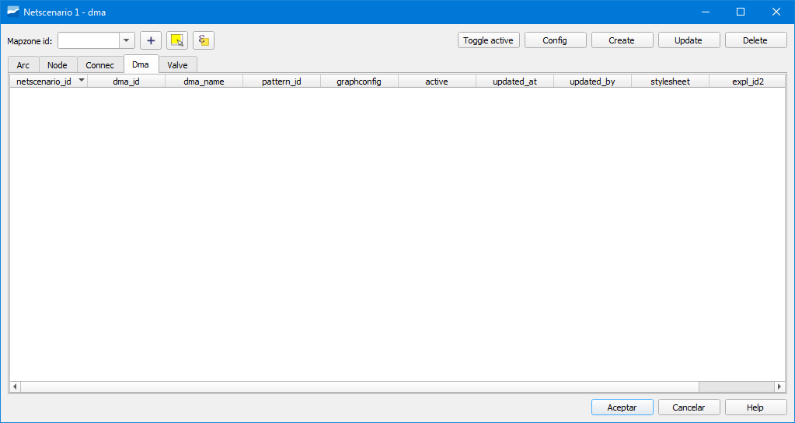
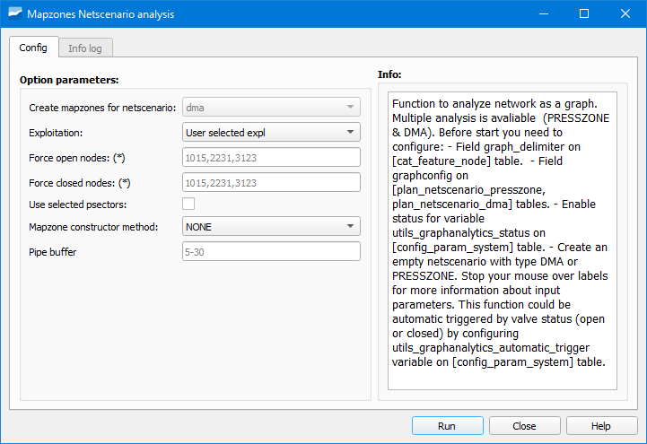
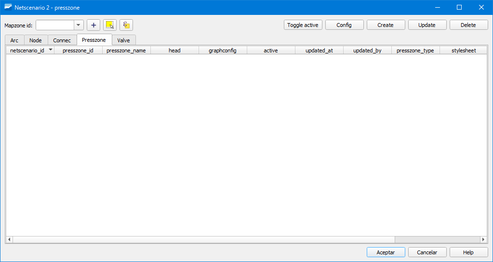
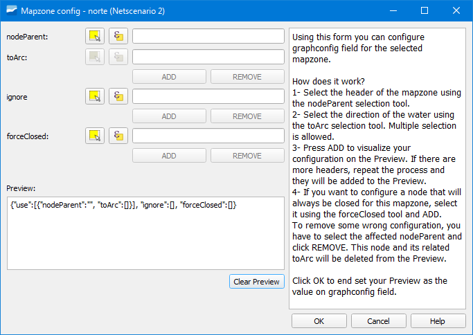

.. _dialog-netscenarios:

===========================
Netscenarios
===========================

.. only:: html

   .. contents::
      :local:

Tool that allows proposing scenarios on the network to perform changes in the map areas to optimize them.

    Window of the Netscenarios tool.

To create a netscenario we will have to click on the *Create* button and select one of the available options:

- Create empty scenario: allows creating an empty scenario.
- Create Netscenario from ToC: allows creating a scenario with data from the ToC.

We can create DMA scenarios and PRESSZONE scenarios. In both cases, the fields to fill in the creation window are the name, the type (*DMA* or *PRESSZONE*), if it is active and the exploitation.

Escenario de *DMA*
==================

Once the scenario is created we can visualize it in the netscenario manager where, if we double-click on it,
we can access the scenario.

   Window of the Dma netscenario created.

To create the different measurement zones contained in the scenario we will have to click on the *Create* button and in the popup window
we will have to specify the *Dma id* (must be numeric), a name as well as mark the *Active* box.

With the measurement zone created, we will configure it by selecting it and clicking on the *Config* button.

   Window of the configuration of the DMA.

We will have to specify:

- nodeParent: node header from which the zoning starts.
- toArc: direction towards which the water flow is directed.
- ignore: nodes that will be ignored in the process (optional).
- forceClosed: nodes at which the process will stop.

As many measurement zones as needed will be created and configured.

When we have all of them created and configured we will determine them using the *Execute mapzones analysis* button.

   Window of the execution of Mapzones Netscenario analysis.

In the popup window we will specify, at least:

- Exploitation: exploitation regarding which we are performing the analysis.
- Mapzone constructor method: method to construct the mapzone. We can choose between:

     - NONE: will not draw anything.
     - CONCAVE POLYGON: will draw a concave polygon.
     - PIPE BUFFER: will draw a buffer around the pipes.
     - PLOT & PIPE BUFFER: will draw a buffer around the pipes together with the buildings that are related to them as long as we have them included in the *Plot* layer.
     - LINK & PIPE BUFFER: will draw a buffer around the pipes and the links.

- Pipe buffer: size of the buffer to draw in the analysis according to the construction method chosen.

Escenario de *PRESSZONE*
========================

Once the scenario is created we can visualize it in the netscenario manager where, if we double-click on it,
we can access the scenario.

   Window of the Presszone netscenario created.

To create the different pressure zones contained in the scenario we will have to click on the *Create* button and in the popup window
we will have to specify the *Presszone id* (must be numeric), a name, indicate a value in *Head* as well as mark the *Active* box.

The *Head* field represents the height of the load (measured in meters) regarding which the static pressures will be calculated.

With the measurement zone created, we will configure it by selecting it and clicking on the *Config* button.

   Window of the configuration of the PRESSZONE.

We will have to specify:

- nodeParent: node header from which the zoning starts.
- toArc: direction towards which the water flow is directed.
- ignore: nodes that will be ignored in the process (optional).
- forceClosed: nodes at which the process will stop.

As many pressure zones as needed will be created and configured.

When we have all of them created and configured we will determine them using the *Execute mapzones analysis* button.

   Window of the execution of Mapzones Netscenario analysis.

In the popup window we will specify, at least:

- Exploitation: exploitation regarding which we are performing the analysis.
- Mapzone constructor method: method to construct the mapzone. We can choose between:

     - NONE: will not draw anything.
     - CONCAVE POLYGON: will draw a concave polygon.
     - PIPE BUFFER: will draw a buffer around the pipes.
     - PLOT & PIPE BUFFER: will draw a buffer around the pipes together with the buildings that are related to them as long as we have them included in the *Plot* layer.
     - LINK & PIPE BUFFER: will draw a buffer around the pipes and the links.

- Pipe buffer: size of the buffer to draw in the analysis according to the construction method chosen.

