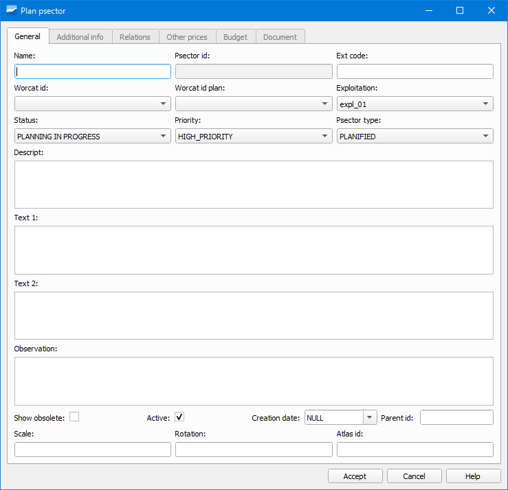

.. _dialog-new-psector:

=============================
Nuevo sector de planificación
=============================

.. only:: html

   .. contents::
      :local:

Herramienta que permite crear un nuevo sector de planificación (psector).

    Ventana de la herramienta Nuevo sector de planificación.

Para crear un nuevo psector pincharemos en el botón *Nuevo psector* y se abrirá una ventana como la mostrada en la imagen anterior. En ella deberemos especificar, como mínimo, el nombre.

Tras haberlo creado se establecerá como el psector actual. **A partir de ese momento, cualquier objeto que digitalicemos en nuestra red estará en estado planificado**.

Paralelamente, podremos comprobar que todos los botones correspondientes a la edición de los objetos de red han cambiado a color naranja.

   Barra de herramientas Edit en modo planificación.

Además, aparece una nueva barra de herramientas debajo de la ToC donde podremos activar/desactivar el psector así como seleccionar el psector sobre el cual estamos trabajando.

   Barra de psector.

Para volver a digitalizar objetos en estado operativo, pulsaremos sobre el botón de pausa de la barra anterior.