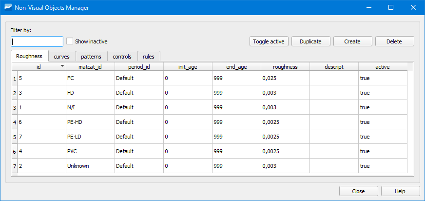
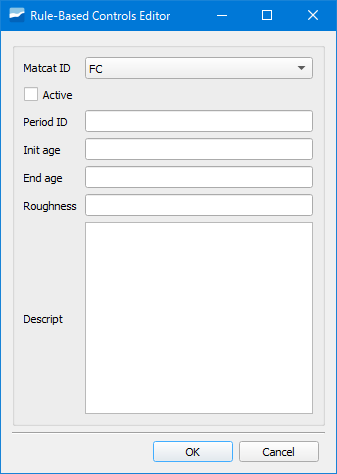
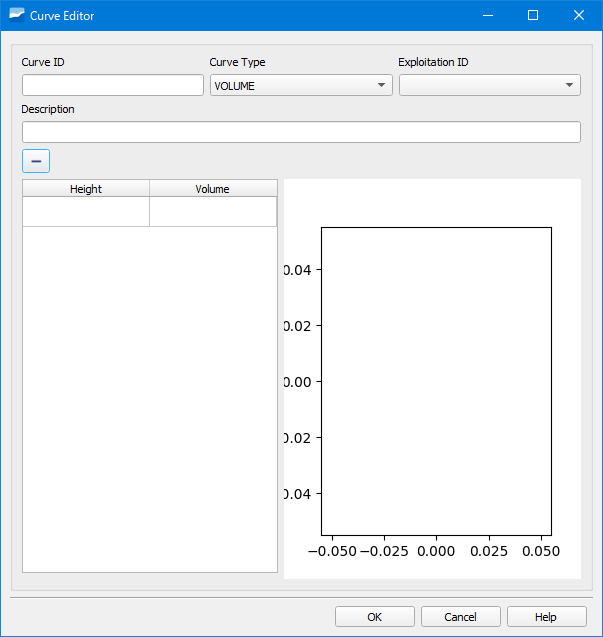
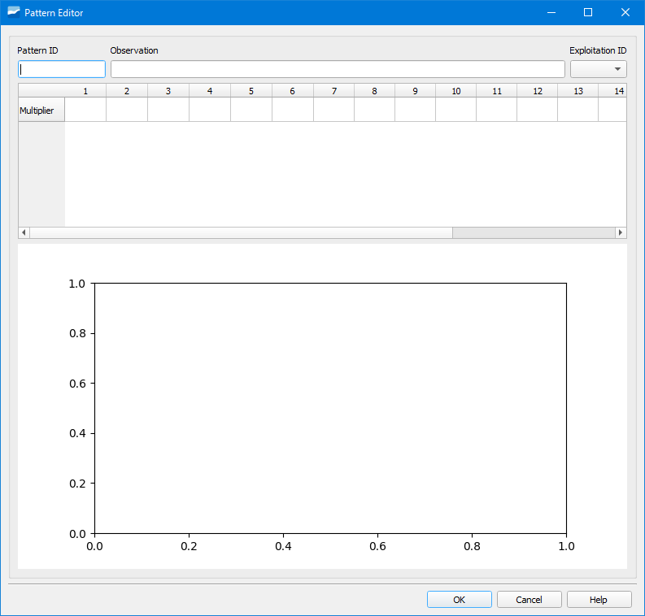
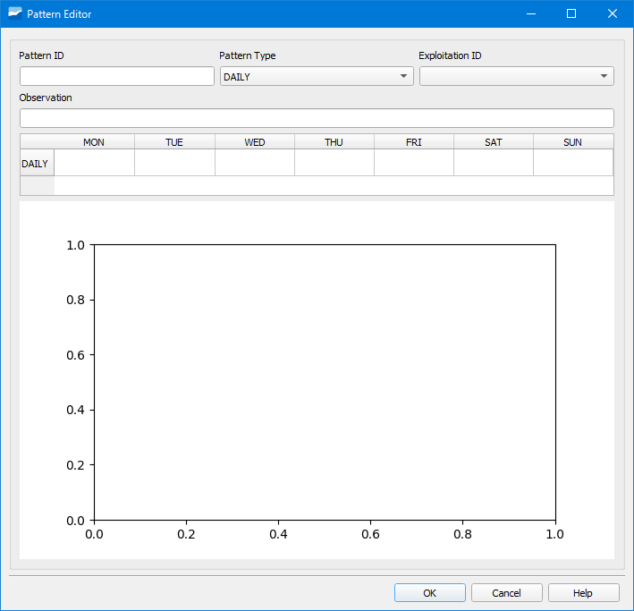
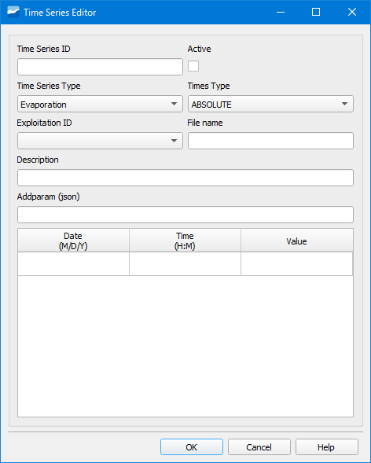
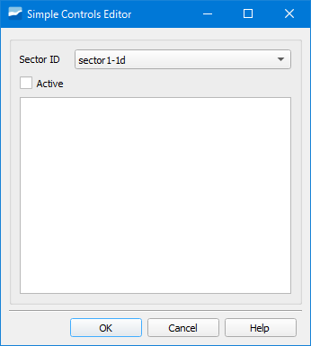
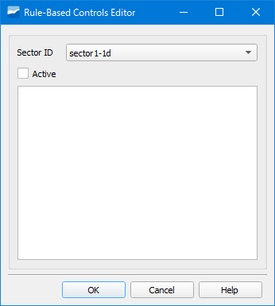
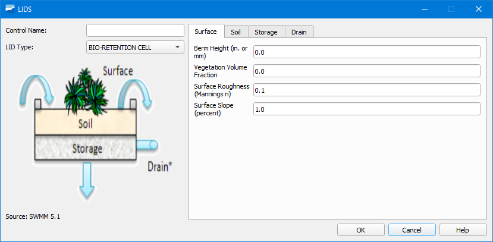

.. _dialog-non-visual-obj:

=============================
Gestor de objetos no visuales
=============================

.. only:: html

   .. contents::
      :local:

Herramienta que permite gestionar todos los objetos no visuales que se necesitan para la modelación hidráulica.

     Ventana de la herramienta Gestor de objetos no visuales para esquemas ws.

Dependiendo de si estamos con un proyecto ws o ud, las pestañas disponibles serán unas u otras.

Los objetos a gestionar son *Roughness* (rugosidad), *Curves* (curvas), *Patterns* (patrones), *Timeseries* (series temporales), *Controls* (controles), *Rules* (reglas) y *Lids* (SUDS).

Para crear un objeto no visual concreto tendremos que situarnos sobre la pestaña correspondiente, pinchar sobre el botón *Crear* y rellenar los datos necesarios en la ventana emergente.

Roughness (ws)
==============

Permite crear rugosidades de materiales.

     Formulario para crear rugosidades.

En la ventana emergente tendremos que especificar el material, las edades inicial y final, el valor de la rugosidad así como marcar la casilla *Activo* para poder tenerla disponible.

Curves
======

Permite crear distintos tipos de curva en función de las necesidades del proyecto.

     Formulario para crear curvas.

En la parte superior de la ventana emergente tendremos que indicar el ID de la curva así como el tipo de curva que queremos crear. Dependiendo de si estamos con un proyecto de ws o ud tendremos disponibles unos tipos de curva u otros.

Seleccionado el tipo de curva tendremos que asignarle pares de valores para construirla en la tabla que tenemos en la propia ventana. Disponemos de una representación de la curva para poder visualizarla una vez introducida.

Patterns
========

Permite crear patrones para proyectos ws y ud.

Patterns ws
-----------

     Formulario para crear patrones ws.

Tendremos que indicar el nombre del patrón en el campo *Pattern ID* y rellenar los valores correspondientes. Una vez rellenados todos los valores los veremos representados en el gráfico ubicado en la parte inferior de la ventana.

Los patrones de 24 horas deberán introducirse en dos filas de 12 valores.

Patterns ud
-----------

     Formulario para crear patrones ud.

Tendremos que indicar el nombre del patrón en el campo *Pattern ID*, especificar su tipo y rellenar los valores correspondientes. Una vez rellenados todos los valores los veremos representados en el gráfico ubicado en la parte inferior de la ventana.

Timeseries (ud)
===============

Permite crear series temporales de distintos tipos.

     Formulario para crear series temporales.

Tendremos que indicar el nombre de la serie temporal en el campo *Time Series ID*, el tipo de serie temporal en *Time Series Type*, el tipo de tiempo en *Times Type*, rellenar los valores de la serie temporal así 
como marcar la casilla *Activo* para poder tenerla disponible.

Controls
========

Permite introducir controles.

     Formulario para crear controles.

Tendremos que indicar el sector al que pertenecerá el control, indicar si está activo y escribirlo en el cuadro de texto que tenemos disponible.

Rules (ws)
==========

Permite introducir reglas.

     Formulario para crear reglas.

Tendremos que indicar el sector al que pertenecerá la regla, indicar si está activa y escribirla en el cuadro de texto que tenemos disponible.

Lids (ud)
=========

Permite introducir los *Low Impact Developments*, (desarrollos de bajo impacto, también llamados SUDS o sistemas urbanos de drenaje sostenible).

     Formulario para crear lids.

Para crear un Lid tendremos que seleccionar uno de los disponibles en el desplegable *LID Type* y rellenar sus datos en las pestañas correspondientes que se encuentran a la derecha.
Dependiendo del tipo de Lid escogido tendremos unas pestañas u otras.

.. note::

     Los Lids disponibles en Giswater son los que están disponibles en SWMM.
