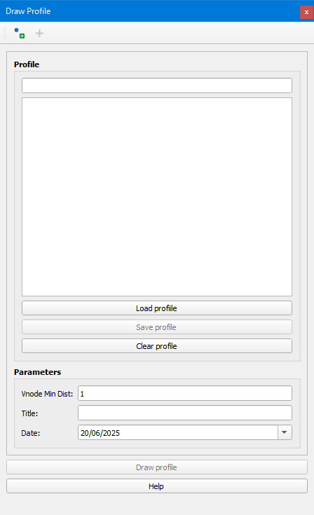

.. _dialog-profile-tool:

=====================
Profile tool
=====================

Tool that allows drawing the longitudinal profile existing between two nodes.

    Window of the Profile tool.

Clicking on the *Set nodes* button we will be able to select the two nodes regarding which we want to draw the longitudinal profile.
Once established, we will see listed all the arcs that will be drawn and we will be able to represent it by clicking on the *Draw profile* button.

If we want, we can save a profile by clicking on the *Save profile* button. To recover it we will have to click on the *Load profile* button and to delete it and be able to calculate another one we will have to click on the *Clear profile* button.

All the profiles are saved in the *om_profile* table of the database.

In addition, in the tool we will be able to specify a minimum distance between connections to be represented in the profile in *Vnode Min Dist* together with a title and a date.

Once the profile has been represented we will be able to see interesting values such as the maximum elevations of the nodes, material, diameter and slope of the arcs...

The texts shown in the guitar of the profile can be customized in the *Admin* tab through the *Configuration* button of Giswater in the *Profile guitar legend configuration* 
in the O&M section.