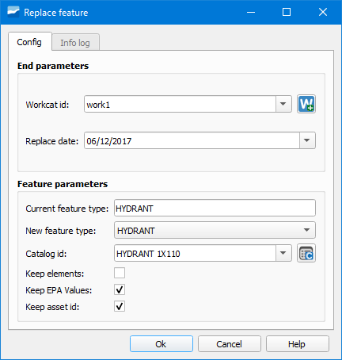

.. _dialog-feature-replace:

=================
Reemplazar objeto
=================

Herramienta que permite reemplazar un nodo, arco, connec o gully por uno nuevo sin afectar la topología. El objeto reemplazado pasa a tener estado obsoleto.

Tras seleccionar en el desplegable del botón de la herramienta el tipo de objeto a reemplazar, pincharemos sobre el objeto en cuestión.

     Ventana de la herramienta Reemplazar objeto.

Se abrirá entonces la ventana de la herramienta donde deberemos especificar el expediente de baja (*Workcat id*), fecha de sustitución (*Replace date*), tipo actual de objeto (*Current feature type*),
tipo nuevo de objeto (*New feature type*) y catálogo del objeto nuevo (*Catalog id*).

A través de las casillas de verificación podremos decidir si mantener o no ciertos aspectos del objeto.