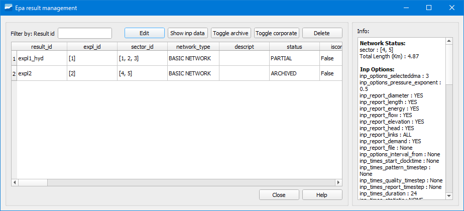

.. _dialog-result-manager:

========================
Gestor de resultados EPA
========================

.. only:: html

   .. contents::
      :local:

Herramienta que permite gestionar los resultados de las simulaciones EPA.

     Ventana de la herramienta Gestor de resultados EPA.

La ventana contiene los siguientes botones:

- Edit: permite editar el campo *descript*.
- Show inp data: al pinchar sobre él se genera una capa temporal de puntos y de líneas con la información contenida en el archivo inp.
- Toggle archive: permite archivar el resultado seleccionado. Para poder hacerlo se ha tenido que realizar el ciclo completo de simulación.
- Toggle corporate: permite hacer corporativo el resultado seleccionado.
- Delete: permite borrar un resultado.
