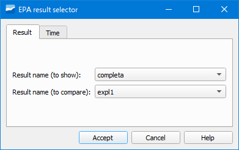

.. _dialog-result-selector:

============================
Result selector
============================

.. only:: html

   .. contents::
      :local:

Tool that allows comparing the results of two EPA simulations.

     Window of the Result selector tool.

In the *Result name (to show)* section we will indicate the result to show and in *Result name (to compare)*, the result with which we want to compare.