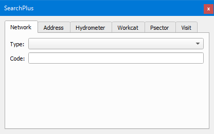

.. _dialog-search:

========
Search
========

Tool that allows performing searches on different objects and scopes of the project.

    Window of the Network tab in the Search tool.

It is divided into the following tabs:

- Network: allows searching specific elements of the network according to their element type and code. The searcher will take us to the object in question and open its form.
- Address: allows searching by selecting the municipality, the street and the number of the street directory, where Giswater will show the matching rows. Clicking on one of the rows will zoom to the street extension.
  To be able to use it, the layers *ext_streetaxis*, *ext_address* and *municipality* have to be configured beforehand where the first two must have line geometry and point geometry respectively
  (the third one is the corresponding map zone).
- Hydrometer (WS): allows searching subscribers in case we have them associated with the inlets. Each inlet can be linked to multiple subscribers and these, the consumptions registered in different periods.
  If we have them associated, by writing the subscriber code and clicking on it a form with its information will open and zoom to the location of the related inlet.
  If the *Use contains* box is marked, it allows searching with any character. If it is not marked, the search engine will only show results when coinciding with the first characters.
- Workcat: allows identifying which elements of the network are related to the same works file. By selecting one among the available ones, a polygon with the maximum extension of the related elements will be shown and a window will open showing them all together with a summary of the number of them as well as the total length of the arcs.
- Psector: allows searching, for each of theexplotations of the project, the planning sectors that have been created. By selecting one, it will zoom to the extension of the psector and open its form.
- Visit: allows searching a visit linked to any type of operation made on the network elements. By selecting one, it will zoom to its related element and open its form.

