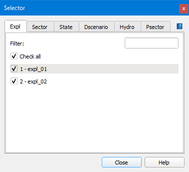

.. _dialog-selector:

========
Selector
========

Herramienta que permite filtrar la información que se quiere usar en diferentes ámbitos del proyecto.

    Ventana de la pestaña Expl en el Selector para un proyecto ws.

Se divide en las pestañas:

- Expl: muestra un listado de todas las explotaciones que tenemos en el proyecto. Al pinchar sobre una de ellas se activará o desactivará su visualización.
  Al activar cualquiera de ellas, se desactivarán todas las demás. Para visualizar varias hay que pulsar la tecla *Shift* del teclado a la vez que pinchamos sobre las explotaciones a visualizar.
- Sector: muestra un listado de todos los sectores hidráulicos del proyecto. Su funcionamiento es idéntico al de las explotaciones.
  Los que estén seleccionados serán los que se exporten en el archivo INP y, por tanto, los que se simularán hidráulicamente.
- State: estado de los objetos a mostrar en el mapa. Se pueden visualizar los objetos operativos y/o los obsoletos.
- Dscenario: listado de los escenarios de demanda contenidos en el proyecto. Aquellos que estén seleccionados serán los que se exportarán en el archivo INP y, por tanto, serán los que se simulen.
- Hydro (WS): muestra un listado de los estados de los abonados que se quiere consultar. Solo se verá reflejado en la pestaña *Hydrometer* de los connec.
- Psector: listado de los sectores de planificación contenidos en el proyecto. Aquellos que estén seleccionados se verán directamente en el mapa y serán lo que se exporten en el archivo INP.

