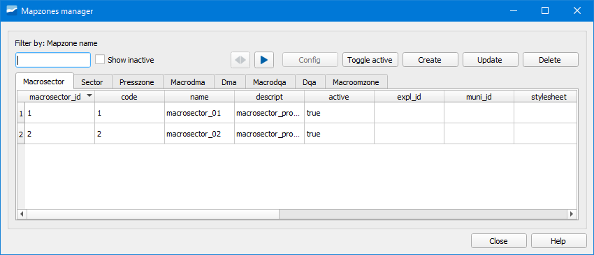
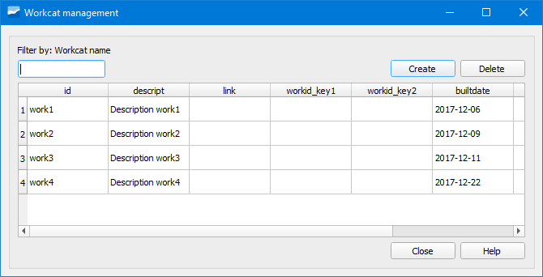
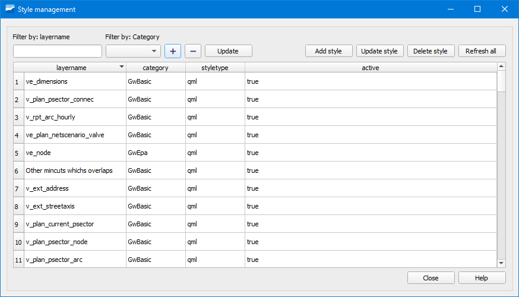

.. _dialog-utils-manager:

====================
Utils manager
====================

.. only:: html

   .. contents::
      :local:

Tool that incorporates the following utilities.

Map zones manager
========================

Tool that allows managing all the map zones contained in the project.

   Window of the Map zones manager tool.

In the different tabs we have available the map zones contained in the project.
We can configure them, make them active/inactive, create them, update them or delete them.

Workcat manager
=============================

Tool that allows managing the workcat files contained in the project.

   Window of the Workcat manager tool.

From here we can create and delete workcat files.

By double clicking on one of them, a popup window will open with the details of the objects contained in the selected workcat. Additionally, we will see them selected in the QGIS canvas.

Style manager
=================

Tool that allows managing the styles of the layers of the project.

   Window of the Style manager tool.

