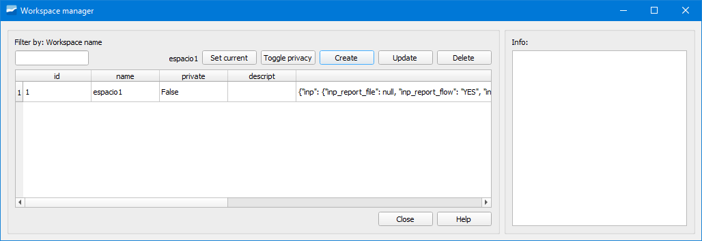

.. _dialog-workspace:

===================
Workspace
===================

.. only:: html

   .. contents::
      :local:

Tool that allows creating workspaces where the selections made in the different selectors and export options will be kept, 
facilitating moving between preconfigured work scenarios without having to mark/unmark options.

   Window of the Workspace tool.

