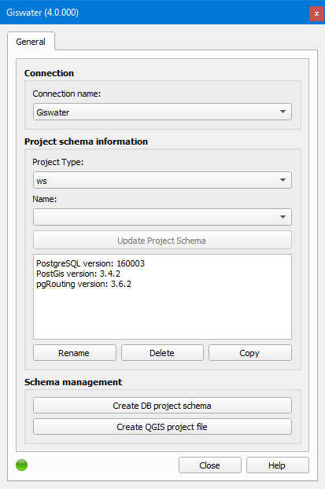
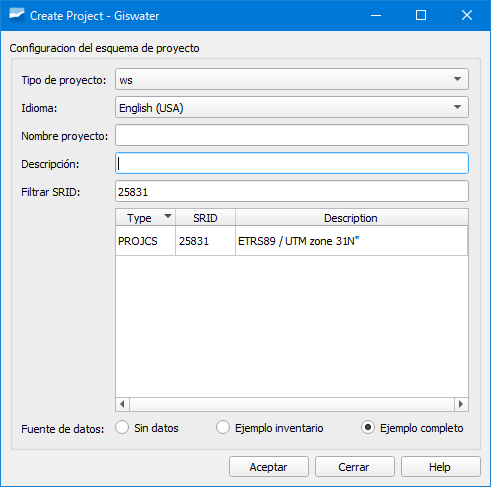
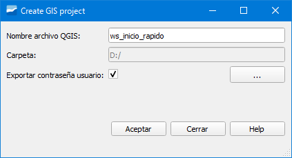

===============
Guía de inicio rápido
===============

.. only:: html

   .. contents::
      :local:

Esta guía te ayudará a crear un nuevo proyecto, asumiendo que tienes todos los programas requeridos instalados y una conexión de base de datos correctamente configurada con todas las extensiones necesarias.

.. note::
   Recomendamos crear un proyecto de ejemplo primero. Esto proporciona una referencia que puedes usar cuando surjan preguntas.

Creación del esquema del proyecto de base de datos
===================================

Sobre un proyecto en blanco de QGIS, empezaremos por pinchar en el único botón de Giswater que tenemos disponible por el momento para que se abra la siguiente ventana:

   Ventana del gestor de proyectos Giswater.

A continuación, seleccionaremos qué tipo de esquema queremos crear en el desplegable *Project Type* (ws para abastecimiento o ud para saneamiento)
y pincharemos en el botón *Create DB project schema* para que se abra la ventana de creación del esquema:

   Ventana de creación de esquema nuevo.

En la ventana anterior tendremos que especificar:

- Tipo de proyecto: tipo de proyecto que vamos a crear (ws para abastecimiento o ud para saneamiento).
- Idioma: idioma en el que se creará el esquema. Podremos elegir uno de los disponibles en el desplegable.
  Si vamos a crear uno de los ejemplos disponibles (*Ejemplo inventario* o *Ejemplo completo*) **obligatoriamente tendremos que seleccionar el idioma English (USA)**.
- Nombre proyecto: indicaremos el nombre del esquema de proyecto. **No puede contener letras mayúsculas**.
- Descripción: breve descripción del proyecto.
- Filtrar SRID: sistema de referencia de coordenadas de la zona donde se creará el esquema.
- Fuente de datos: tenemos disponibles tres opciones:

    - Sin datos: opción seleccionada para crear un esquema en blanco.
    - Ejemplo inventario: opción seleccionada para tener un esquema de ejemplo **solo con datos de inventario**.
    - Ejemplo completo: opción seleccionada para tener un esquema de ejemplo con **datos completos (inventario y EPA)**.

Tras especificar lo mencionado arriba, pincharemos en el botón *Aceptar* para que se inicie la creación del esquema.

.. important::
   Necesitas privilegios de superadministrador de PostgreSQL para trabajar con Giswater.

Creación del archivo de proyecto de QGIS
===================================

Con el esquema de proyecto creado, el siguiente paso es crear el proyecto de QGIS. Para ello, en la ventana del gestor de proyectos, pincharemos sobre el botón *Create QGIS project file*.
En la ventana emergente especificaremos el nombre del proyecto de QGIS, la ruta donde se guardará el proyecto así como deberemos marcar o desmarcar la casilla *Exportar contraseña usuario*.

   Ventana de creación de proyecto QGIS.

El proyecto de QGIS se cargará tras ser creado y ya podremos empezar a trabajar con Giswater.

