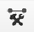
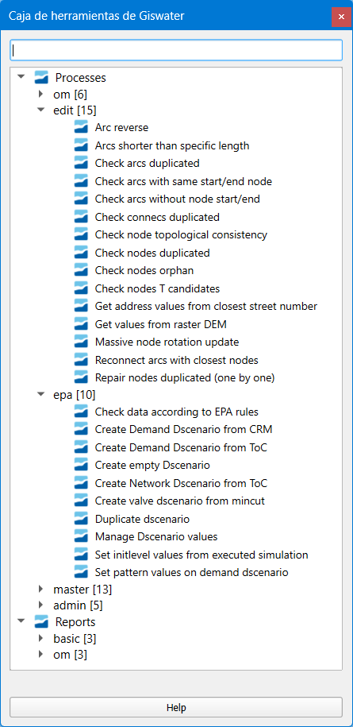

====================================
Caja de herramientas de Giswater
====================================

*Este capítulo tiene como objetivo presentar la caja de herramientas de Giswater que se
puede aplicar a la identificación y corrección de datos topológicos faltantes o inconsistentes de la información.*

La caja de herramientas de Giswater es una herramienta muy útil, ya que permite al usuario, con solo hacer clic en sus herramientas,
visualizar capas vectoriales temporales que muestran espacialmente dónde están las inconsistencias topológicas y geométricas de la red. 
Además, a través de las tablas de atributos, el usuario puede calcular automática o manualmente las correcciones necesarias para que un
modelo hidráulico funcione.

*Ilustración de la caja de herramientas auxiliar de Giswater en un esquema de WS*

.. note:: Para cada inciso de la caja de herramientas se presentan apartados con características similares,
     diseñados para WS y UD. Cada apartado se etiquetará claramente con (ws/ud): se usará dicha etiqueta para
     indicar si es aplicable a ambos o si es exclusivo para (WS) o para (UD).

**Processes** (procesos) se divide en:

* *om:* herramientas disponibles para operaciones y mantenimiento.

* *edit:* herramientas disponibles para la edición de la red. Aquí encontraremos la mayor parte de las que necesitamos para corregir los errores.

* *epa:* herramientas disponibles para gestionar las capas desde el punto de vista de la simulación.

* *master:* herramientas variadas relacionadas con la gestión de alternativas, pero también con zonificación dinámica y balances hidráulicos.

* *admin:* herramientas disponibles desde el punto de vista de la administración de la red.

**Reports** (informes) se divide en:

* *basic:* informes sobre aspectos básicos de la red.

* *om:* informes sobre aspectos referentes a operaciones y mantenimiento.

A continuación, se describe de forma ordenada cada uno de sus componentes todos los elementos que integran la caja de herramientas.

Processes
==============================

om (WS/UD)
===============

Calculate the reach of hydrants (WS) 
---------------------------------------------------------
Calcular el alcance de los hidrantes: función que calcula el alcance de los hidrantes creando un área de influencia alrededor
de ellos y permitiendo definir ubicaciones para nuevos hidrantes.

Para esto, el alcance se determina sobre la capa de ejes viales (om_streetaxis), usando la longitud de la manguera contra incendios como base.

Ofrece dos modos de trabajo:

* Área de influencia: Calcula la zona cubierta por los hidrantes existentes.

* Propuesta de hidrantes: Marca áreas donde ubicar nuevos hidrantes (normalmente al final de la zona calculada).

Los hidrantes propuestos se gestionan en la vista auxiliar *v_edit_anl_hydrant* y no se guardan automáticamente en el inventario ni en el psector.

Si se activa Usar psector seleccionado, los cálculos incluirán los datos del psector elegido.

**Para ver más detalles, consulta la sección Diálogo "Calculate the reach of hydrants"**

Check data for graphanalytics process (WS) revisar
---------------------------------------------------------
Verificador de datos para el proceso de análisis de grafos: función que revisa la calidad y coherencia de los datos asociados a la
estructura del grafo (graphclass), asegurando que cumplan con los requisitos para análisis avanzados.

**Para ver más detalles, consulta la sección Diálogo "Calculate the reach of hydrants"**

Check data for o&m process (WS/UD)
---------------------------------------------------------
Verificador de datos para procesos de Operación y Mantenimiento(O&M): función que detecta errores e inconsistencias en los datos antes de
ejecutar procesos clave de O&M (mincut, mapzones dinámicos (ws), perfil (ud)).

Procesos cubiertos:

* WS: **Mincut** (cortes mínimos) y **Mapas dinámicos de zonas** (mapzones dynamic).
* UD: **Perfiles** (profile).

**Para ver más detalles, consulta la sección Diálogo "Check data for o&m process"**

Flow trace analytics (WS/UD)
---------------------------------------------------------
Análisis de trazado de flujo: función para analizar el trazado de flujo de la red desde un nodo. Se deben analizar los
arcos conectados y los arcos desconectados.

**Para ver más detalles, consulta la sección Diálogo "Flow trace analytics"**

Show current mincuts (WS)
---------------------------------------------------------
Mostrar cortes mínimos actuales: función que visualiza los cortes mínimos que se están ejecutando activamente en campo.

**Para ver más detalles, consulta la sección Diálogo "Show current mincuts"**

Mapzones analysis (UD)
---------------------------------------------------------
Análisis de zonas de drenaje (Mapzones): función para analizar la red como un grafo. El análisis solo está disponible para DRAINZONE.

Configuración previa necesaria:

* Definir el campo *graphconfig* en la tabla *drainzone.*

* Habilitar el estado de la variable *utils_graphanalytics_status* en la tabla *config_param_system.*

**Para ver más detalles, consulta la sección Diálogo "Mapzones analysis"**

User check data (WS/UD)
---------------------------------------------------------
Verificación de datos por usuario: función que analiza la calidad de los datos utilizando consultas personalizadas definidas por el usuario.

**Para ver más detalles, consulta la sección Diálogo "User check data"**

edit (WS/UD)
===============
Arc repair (UD)
-------------------------------------------------------
Reparación de arcos: función de reparación masiva. Todos los arcos que no están conectados con un nodo extremo se
reconectarán utilizando el parámetro *arc_searchnodes.*

Condición:
* Solo actúa sobre elementos operativos (con state=1).

**Para ver más detalles, consulta la sección Diálogo "Arc repair "**

Arc reverse (WS/UD)
-------------------------------------------------------
Invertir arco: Función que invierte la dirección de un arco en la red.

**Para ver más detalles, consulta la sección Diálogo "Arc reverse"**

Arcs shorter than specific length (WS/UD)
-------------------------------------------------------
Arcos más cortos que una longitud específica: función que utiliza el asistente de topología para detectar arcos duplicados,
ya sea por coincidencia de nodos finales o por geometría completa.

**Para ver más detalles, consulta la sección Diálogo "Arcs shorter than specific length"**

Check arcs duplicated (WS/UD)
-------------------------------------------------------
Verificar arcos duplicados: función que utiliza el asistente de topología para detectar arcos duplicados por:

* Coincidencia de nodos finales.
* Coincidencia de geometría completa.

**Para ver más detalles, consulta la sección Diálogo "Check arcs duplicated"**

Check arcs elevation values (UD)
-------------------------------------------------------
Verificar valores de elevación en arcos: función que analiza valores duplicados ingresados en los campos y (coordenada Y) y elev (elevación).

**Para ver más detalles, consulta la sección Diálogo "Check arcs elevation values"**

Check arcs intersected (UD)
-------------------------------------------------------
Verificar arcos intersectados: función que utiliza el asistente de topología para identificar intersecciones entre arcos en la tabla correspondiente.

**Para ver más detalles, consulta la sección Diálogo "Check arcs intersected"**

Check arcs with same start/end node (WS/UD)
-------------------------------------------------------
Verificar arcos con mismo nodo inicial/final:función que utiliza el asistente de topología para identificar arcos con,

* Mismo nodo inicial (node1).
* Mismo nodo final (node2).

Detectar nodos duplicados basados en pares de nodos extremos, facilitando la corrección de conexiones redundantes o erróneas.

**Para ver más detalles, consulta la sección Diálogo "Check arcs with same start/end node"**

Check arcs with the slope inverted (UD)
-------------------------------------------------------
Verificar arcos con pendiente invertida: función que utiliza el asistente de topología para identificar arcos cuya pendiente tiene dirección
opuesta a la del sentido del arco.

"Slope inverted" → Pendiente invertida.

"Opposite sense that the direction" → Dirección opuesta al sentido del arco

**Para ver más detalles, consulta la sección Diálogo "Check arcs with the slope inverted"**

Check arcs without node start/end (WS/UD)
-------------------------------------------------------
Verificar arcos sin nodo inicial/final: función que utiliza el asistente de topología para identificar arcos que no tienen,

* Nodo inicial (node1).
* Nodo final (node2).

Detectar arcos desconectados que carecen de nodos extremos, esencial para garantizar la integridad topológica de la red.

**Para ver más detalles, consulta la sección Diálogo "Check arcs without node start/end"**

Check connecs duplicated (WS/UD)
-------------------------------------------------------
Verificar connecs duplicados: función que utiliza el asistente de topología para identificar cuántos connecs (conexiones) están duplicados en la red.

**Para ver más detalles, consulta la sección Diálogo "Check connecs duplicated"**

Check node topological consistency (WS/UD)
-------------------------------------------------------
Verificar consistencia topológica de nodos: función que utiliza el asistente de topología para identificar nodos con,

* Más arcos conectados de los registrados en el campo num_arcs de la tabla cat_feature_node.
* Menos arcos conectados de los especificados en el mismo campo.

Asegurar que el número de arcos vinculados a cada nodo coincida con el valor definido en cat_feature_node y num_arcs.

**Para ver más detalles, consulta la sección Diálogo "Check node topological consistency"**

Check nodes as a outfall (UD)
-------------------------------------------------------
Verificar nodos como desagüe (outfall): función que utiliza el asistente de topología para identificar nodos no desconectados que carecen de arcos de salida (exit arcs).

**Para ver más detalles, consulta la sección Diálogo "Check nodes as a outfall"**

Check nodes duplicated (WS/UD)
-------------------------------------------------------
Verificar nodos duplicados: función que utiliza el asistente de topología para identificar cuántos nodos están duplicados en la red.

**Para ver más detalles, consulta la sección Diálogo "Check nodes duplicated"**

Check nodes elevation values(UD )
-------------------------------------------------------
Verificar valores de elevación en nodos: análisis de valores duplicados ingresados en los campos top_elev, ymax y elev.

**Para ver más detalles, consulta la sección Diálogo "Check nodes elevation values"**

Check nodes orphan (WS/UD)
-------------------------------------------------------
Verificar nodos huérfanos: función que utiliza el asistente de topología para identificar cuántos nodos están desconectados de la red.

**Para ver más detalles, consulta la sección Diálogo "Check nodes orphan"**

Check nodes T candidates (WS/UD)
-------------------------------------------------------
Verificar nodos candidatos a 'T': función que identifica nodos T candidate (posibles uniones en forma de T) con topología incorrecta.

**Para ver más detalles, consulta la sección Diálogo "Check nodes T candidates"**

Check nodes with more than one exit (UD)
-------------------------------------------------------
Verificar nodos con más de un arco de salida: función que utiliza el asistente de topología para identificar nodos que tienen más de un arco de salida.

**Para ver más detalles, consulta la sección Diálogo "Check nodes with more than one exit"**

Check nodes-find exit-arcs over entry-arcs (UD)
-------------------------------------------------------
Verificar nodos con arcos de salida sobre arcos de entrada: función que utiliza el asistente de topología para identificar nodos donde todos los arcos de salida
están por encima de todos los arcos de entrada.

**Para ver más detalles, consulta la sección Diálogo "Check nodes-find exit-arcs over entry-arcs"**

Control conduit sections (UD)
-------------------------------------------------------
Controlar secciones de conductos: función que detecta inconsistencias en las secciones de conductos consecutivos.

Seleccione un nodo para ejecutar un análisis ascendente de las secciones de los conductos.
El sistema compara los valores de geom1 (altura) del catálogo de arcos para identificar discrepancias.

Nota técnica:

La validación se basa en la coherencia de la altura (geom1) entre conductos conectados aguas arriba.

**Para ver más detalles, consulta la sección Diálogo "Control conduit sections"**

Get address values from closest street number (WS/UD)
-------------------------------------------------------
Obtener valores de dirección desde el número de calle más cercano: función que captura automáticamente la dirección más cercana para cada nodo/conexión (node/connec).

Parámetros de configuración:

Tipo: se elije si desea actualizar todos los nodos/conexiones o solo un tipo específico.

Campo a actualizar:

* postnumber (entero): Actualiza el número de dirección (uso común).
* postcomplement (texto): Actualiza complementos alfanuméricos (ej.: "BIS", "A") si el número no es numérico.

Distancia de búsqueda: Máxima distancia (en unidades del proyecto) para buscar direcciones cercanas al punto.

Elementos a actualizar:

* Opción para actualizar solo elementos donde streetaxis_id, postnumber o postcomplement sean null (vacíos).

Intersección con capa poligonal:

* Si se selecciona una capa diferente a NONE, la dirección solo se capturará para elementos que intersecten con la capa configurada.

Notas técnicas:

* Conserva términos clave como postnumber, streetaxis_id o null para precisión técnica.
* NONE se mantiene en mayúsculas como valor predefinido del sistema.

**Para ver más detalles, consulta la sección Diálogo "Get address values from closest street number"**

Get values from raster DEM (WS/UD)
-------------------------------------------------------
Obtener valores desde el ráster MDE: función que actualiza los valores de elevación utilizando los datos capturados desde un modelo digital de elevación
(MDE) en formato ráster.

Reemplaza o complementa las elevaciones existentes con valores extraídos directamente del MDE.

Requiere que el ráster MDE esté correctamente configurado en el proyecto.

Ideal para ajustar automáticamente cotas de nodos o arcos basándose en relieve real.

**Para ver más detalles, consulta la sección Diálogo "Get values from raster DEM"**

Massive node rotation update (WS/UD)
-------------------------------------------------------
Actualización masiva de rotación de nodos: función que actualiza masivamente la columna rotation de los nodos, trabajando con la selección del usuario
(exploitation y psectors).

"Column rotation" → columna rotation.

"Selection of user (exploitation and psectors)" → selección del usuario (exploitation y psectors).

**Para ver más detalles, consulta la sección Diálogo "Massive node rotation update"**

Repair nodes duplicated (one by one) (WS/UD)
-------------------------------------------------------
Reparar nodos duplicados (uno por uno): función que corrige nodos duplicados en una misma ubicación, permitiendo acciones específicas sobre ellos.

Parámetros de configuración:

Nodo: node_id donde se aplicará la acción.

Nodo objetivo: Otro node_id involucrado (opcional). Si es NULL, el sistema buscará el nodo más cercano.

Acción:

* ELIMINAR: Borra el nodo. El nodo objetivo hereda su topología.

* DESCLASIFICAR: Desclasifica el nodo. El nodo objetivo hereda su topología.

* MOVER Y PERDER TOPOLOGÍA: Mueve el nodo (pierde topología). El nodo objetivo la hereda.

* MOVER Y MANTENER TOPOLOGÍA: Mueve el nodo (conserva topología). El nodo objetivo la pierde.

* MOVER Y ADQUIRIR TOPOLOGÍA: Mueve el nodo (adquiere topología). El nodo objetivo la pierde.

* Desplazamiento en ejes X/Y (metros): Distancia para mover el nodo (solo aplica a acciones de movimiento).

Nota:

Herramienta manual para resolver conflictos de nodos duplicados, con control preciso sobre la topología y ubicación.

Topología se refiere a las conexiones/relaciones del nodo con arcos y otros elementos de la red.

**Para ver más detalles, consulta la sección Diálogo "Repair nodes duplicated (one by one)"**

Slope consistency (UD)
-------------------------------------------------------
Consistencia de pendiente: función que identifica arcos cuya dirección de dibujo es opuesta al flujo de agua, utilizando los valores de elevación (sys_elev) del arco para el cálculo.

Nota técnica:

* Ideal para corregir arcos mal orientados que afectan análisis de flujo o pendiente.

**Para ver más detalles, consulta la sección Diálogo "Slope consistency"**

Reconnect arcs with closest nodes (WS)
-------------------------------------------------------
Reconectar arcos con nodos más cercanos: función de reparación masiva que reconecta los arcos no vinculados a sus nodos extremos,
utilizando el parámetro arc_searchnodes para definir el radio de búsqueda de nodos disponibles.

Condición:

Solo actúa sobre elementos operativos (state=1).

**Para ver más detalles, consulta la sección Diálogo "Reconnect arcs with closest nodes"**

epa (WS/UD)
===============
Check data according to EPA rules (WS/UD)
--------------------------------------------------------------
Verificar datos según normas EPA: función que detecta errores e inconsistencias en los datos antes de exportarlos a modelos EPA, sin requerir parámetros de entrada.

Busca automáticamente problemas de formato o lógica que incumplan estándares EPA.

Garantiza que los datos sean válidos para su uso en simulaciones o análisis regulatorios.

Nota:

Ideal como paso final previo a la exportación, evitando fallos en herramientas externas.

**Para ver más detalles, consulta la sección Diálogo "Check data according to EPA rules"**

Create Demand Dscenario from CRM (WS)
--------------------------------------------------------------
Crear escenario de demanda (Dscenario) desde CRM: función que genera escenarios (de simulación) de
demanda a partir de datos CRM, almacenando los valores en las conexiones (CONNEC).

Nota técnica:

* Cuando el generador de geometría de red trabaja con [NODE], el 30% de las demandas se redistribuye a los campos *node_30 y node_300*.

Fecha límite propuesta para hidrantes con consumo fuera del período:

* Se establece al 1% de los hidrantes la fecha 2015-07-31 00:00:00.

**Para ver más detalles, consulta la sección Diálogo "Create Demand Dscenario from CRM"**

Create Demand Dscenario from ToC (WS)
--------------------------------------------------------------
Crear escenario de demanda (Dscenario) desde ToC: función que genera escenarios (escenario de simulación) de
demanda desde las capas [CONNEC, JUNCTION], transfiriendo datos de demanda y patrones a la tabla inp_dscenario_demand.

Notas clave:

* Requiere que las capas EPA (connec o junction) estén cargadas en el proyecto.
* Los datos se migran directamente desde las capas origen al escenario de demanda configurado.

**Para ver más detalles, consulta la sección Diálogo "Create Demand Dscenario from ToC"**

Create empty Dscenario (WS/UD)
--------------------------------------------------------------
Crear Dscenario vacío: función que genera un escenario de demanda (escenario de simulación) sin datos predefinidos,
listo para ser configurado según necesidades específicas.

* Simular una ampliación futura de la red

* Probar diferentes soluciones técnicas ante un problema hidráulico

* Comparar el comportamiento de la red con distintas configuraciones

**Para ver más detalles, consulta la sección Diálogo "Create empty Dscenario"**

Create Network Dscenario from ToC (WS)
--------------------------------------------------------------
Crear Dscenario de red desde ToC: función que genera escenarios de red (escenario de simulación) 
a partir de la tabla de contenidos (ToC). Capas cargadas y visibles en el mapa

Esta herramienta es ideal cuando estás modelando expansiones de red o analizando intervenciones sectorizadas.
En vez de duplicar toda la base de datos, podés trabajar con una versión extraída directamente de lo que estás viendo en pantalla.

**Para ver más detalles, consulta la sección Diálogo "Create Network Dscenario from ToC"**

Create valve dscenario from mincut (WS)
--------------------------------------------------------------
Crear Dscenario de válvulas desde mincut: función que genera un escenario de válvulas (valve dscenario-escenario de simulación)
basado en los resultados de un análisis de cortes mínimos (mincut)

El minimum cut (o mincut) es un algoritmo que identifica el conjunto mínimo de elementos (en este caso, válvulas) que deben ser cerrados para aislar una parte de la red.

* Simular cierres de válvulas ante eventos como roturas de cañerías.

* Identificar sectores hidráulicos o zonas de presión.

* Optimizar la ubicación y el uso de válvulas para minimizar interrupciones del servicio.

**Para ver más detalles, consulta la sección Diálogo "Create valve dscenario from mincut"**

Duplicate dscenario (WS/UD)
--------------------------------------------------------------
Duplicar dscenario: función que crea una copia exacta de un dscenario(escenario de simulación) existente.

* Clona todos los elementos de un escenario existente (nodos, tuberías, válvulas, depósitos, pozos, etc.) a un nuevo escenario.

* Copia también las propiedades asociadas, como materiales, diámetros, cotas, longitudes, estados, configuraciones de válvulas, etc.

* El nuevo dscenario es idéntico al original, pero tiene un nuevo id y nombre.

**Para ver más detalles, consulta la sección Diálogo "Duplicate dscenario"**

Manage Dscenario values (WS/UD)
--------------------------------------------------------------
Gestionar valores de Dscenario: función que permite gestionar los valores de un catálogo de dscenarios,
ya sea eliminándolos o copiándolos desde otro dscenario (escenario de simulación) existente.

Te permite modificar propiedades específicas (valores hidráulicos, materiales, estados, etc.) de los elementos del dscenario, como:

* Tuberías (v_arc): diámetro, rugosidad, longitud, estado operativo, etc.

* Nodos (v_node): demanda, cota, presión mínima, etc.

Aplica los cambios solo dentro de un dscenario determinado, sin afectar los datos base de otros escenarios.

**Para ver más detalles, consulta la sección Diálogo "Manage Dscenario values"**

Set initlevel values from executed simulation (WS)
--------------------------------------------------------------
Establecer valores de nivel inicial desde una simulación ejecutada: función que actualiza el nivel inicial (initlevel) de entradas (inlets) y
tanques (tanks) utilizando los valores obtenidos de una simulación previamente seleccionada.

* Toma el resultado final del nivel de agua en tanques y depósitos (tank, reservoir) de una simulación ejecutada con EPANET.

* Asigna esos niveles como nuevo valor inicial (initlevel) en el dscenario activo.

* Así, la próxima simulación comienza desde ese estado hidráulico, y no desde valores genéricos o por defecto.

**Para ver más detalles, consulta la sección Diálogo "Set initlevel values from executed simulation"**

Set pattern values on demand dscenario (WS)
--------------------------------------------------------------
Establecer valores de patrón en el dscenario de demanda: función que configura el dscenario de demanda para conexiones (connecs) y nodos,
utilizando las zonas de red (mapzones) definidas en la tabla plan_netscenario_dma. Cada zona tiene asignado un 
pattern_id específico para definir su patrón de demanda.

**Para ver más detalles, consulta la sección Diálogo "Set pattern values on demand dscenario"**

Calculate the hydraulic performance for specific result (UD)
--------------------------------------------------------------
Calcular el rendimiento hidráulico para un resultado específico: función que evalúa el rendimiento hidráulico de la red,
basándose en los datos de una simulación seleccionada.

Análisis de parámetros críticos como presión, caudal o pérdidas de carga.

Evaluación de la eficiencia operativa de la red según estándares técnicos.

**Para ver más detalles, consulta la sección Diálogo "Calculate the hydraulic performance for specific result"**

Create Dscenario with values from ToC (UD)
--------------------------------------------------------------
Crear Dscenario con valores desde ToC: función que genera un escenario de simulacion (Dscenario) extrayendo valores de
capas específicas de la Tabla de Contenidos (ToC), incluyendo las capas inp pertenecientes al grupo EPA.

* Crea un nuevo dscenario (escenario de simulación).
* Copia automáticamente los valores actuales de las entidades visibles en la ToC (por ejemplo, conduits, manholes, subcatchments, etc.) y los asigna al nuevo escenario.

Genera una versión base para empezar a trabajar con modificaciones sin alterar el escenario base o de referencia.

**Para ver más detalles, consulta la sección Diálogo "Create Dscenario with values from ToC"**

Create empty DWF scenario (UD)
--------------------------------------------------------------
Crear escenario DWF vacío: función que genera un escenario de flujo en tiempo seco
(DWF) sin datos predefinidos, listo para ser configurado según requerimientos específicos.

* Genera una entrada en la tabla de escenarios de DWF (dwf_dscenario).
* No asigna valores de caudal base a ningún nodo, simplemente crea la estructura del escenario.
* Deja el escenario listo para que lo rellenes manualmente o con funciones automáticas (por ejemplo, desde datos de población o coeficientes unitarios).

**Para ver más detalles, consulta la sección Diálogo "Create empty DWF scenario"**

Create empty Hydrology scenario (UD)
--------------------------------------------------------------
Crear escenario de hidrología vacío: función que genera un escenario de hidrología sin datos predefinidos, 
listo para ser configurado según necesidades específicas.

* Crea una nueva entrada en la tabla de escenarios de hidrología .
* El escenario se crea sin parámetros asignados (porcentajes de impermeabilidad, curvas SCS, tiempos de concentración, etc.).
* Prepara el entorno para que se carguen manualmente o con otras herramientas los datos de los subcatchments.

**Para ver más detalles, consulta la sección Diálogo "Create empty Hydrology scenario"**

Create Thyssen subcatchments (UD)
--------------------------------------------------------------
Crear subcuencas Thyssen: función que calcula los parámetros necesarios para definir subcuencas siguiendo el método Thyssen.

Área, pendiente, tiempo de concentración u otros atributos hidrológicos clave, dependiendo de la configuración del modelo.

Nota técnica:

* Método específico para división de subcuencas, integrado en el contexto de modelación hidrológica.

**Para ver más detalles, consulta la sección Diálogo "Create Thyssen subcatchments"**

Duplicate DWF scenario (UD)
--------------------------------------------------------------
Duplicar escenario DWF: función que crea una copia exacta de un escenario de flujo en tiempo seco (DWF) existente.

* Crea un nuevo escenario DWF con un nombre distinto.

Copia todos los registros del escenario original:
* Asignaciones de caudal por nodo .
* Patrones horarios o diarios vinculados (si están definidos).

Deja el nuevo escenario disponible para edición sin afectar el original.

**Para ver más detalles, consulta la sección Diálogo "Duplicate DWF scenario"**

Duplicate Hydrology scenario (UD)
--------------------------------------------------------------
Duplicar escenario de hidrología: función que crea una copia exacta de un escenario de hidrología existente.

**Para ver más detalles, consulta la sección Diálogo "Duplicate Hydrology scenario"**

Manage Dwf values (UD)
--------------------------------------------------------------
Gestionar valores DWF: función que permite administrar los valores de un catálogo DWF objetivo, ofreciendo las siguientes acciones,

* Insertar nuevos valores.
* Eliminar valores existentes.
* Copiar valores desde otro catálogo DWF.

Nota técnica:

Opera directamente sobre la tabla DWF configurada en el sistema.

**Para ver más detalles, consulta la sección Diálogo "Manage Dwf values"**

Manage Hydrology values (UD)
--------------------------------------------------------------
Gestionar valores de hidrología: función que permite gestionar los valores de un catálogo de hidrología objetivo,
ofreciendo las siguientes acciones:

* Eliminar valores existentes.
* Copiar valores desde otro catálogo de hidrología.

Objetos vinculados al catálogo:

* Subcatchment (subcuencas).
* LIDs (estructuras de bajo impacto).
* Loadings (cargas contaminantes).
* Coverages (coberturas del terreno).
* Groundwater (aguas subterráneas).

Nota técnica:

Opera sobre todos los elementos vinculados al catálogo de hidrología en el sistema.

**Para ver más detalles, consulta la sección Diálogo "Manage Hydrology values"**

Set junctions as outlet (UD)
--------------------------------------------------------------
Establecer junctions como outlets de subcuencas: función que designa junctions (uniones) como puntos de salida
(outlets) para subcuencas, garantizando una distancia mínima entre ellos para evitar superposiciones.

Distancia mínima: Configurable para asegurar que los outlets no estén demasiado cerca entre sí.

Nota técnica:

Ideal para modelos hidrológicos donde la proximidad de outlets podría generar errores en el cálculo de flujos.

**Para ver más detalles, consulta la sección Diálogo "Set junctions as outlet"**

master (WS/UD)
================
Check plan data (WS/UD)
------------------------------------------------
Verificar datos del plan: función que detecta errores e inconsistencias en los elementos del catálogo de precios,
sin requerir parámetros de entrada.

**Para ver más detalles, consulta la sección Diálogo "Check plan data "**

Create empty Netscenario (WS)
------------------------------------------------
Crear Netscenario vacío: función que genera un nuevo Netscenario (escenario de red) sin datos predefinidos,
listo para ser configurado según necesidades específicas.

**Para ver más detalles, consulta la sección Diálogo "Create empty Netscenario"**

Create Netscenario from ToC (WS)
------------------------------------------------
Crear Netscenario desde ToC: función que permite,

* Crear una nueva configuración de Netscenario (escenario de red).

* Copiar la configuración de zonas de mapa (mapzones) asociadas a la explotación seleccionada (selected exploitation).

**Para ver más detalles, consulta la sección Diálogo "Create Netscenario from ToC"**

Duplicate Netscenario (WS)
------------------------------------------------
Duplicar Netscenario: función que permite, 

* Crear una nueva configuración de Netscenario (escenario de red).

* Copiar la configuración de mapzones desde un Netscenario ya existent-

**Para ver más detalles, consulta la sección Diálogo "Duplicate Netscenario"**

Macrominsector analysis (WS/UD)
------------------------------------------------
Análisis de Macrominsectores: función que genera macrominsectores,
divisiones amplias de la red para facilitar análisis operativos o de mantenimiento.

Identifica y representa sectores hidráulicos, ya sea:

* Macrosector: zonas amplias de gestión o regulación.
* Minisector: zonas más pequeñas con control y medición más detallada (DMAs).

Evalúa:

* Qué nodos/puntos están dentro de cada sector.

**Para ver más detalles, consulta la sección Diálogo "Macrominsector analysis"**

Mapzones analysis (WS)
------------------------------------------------
Análisis de zonas de mapa (Mapzones): función que analiza la red como un grafo, permitiendo múltiples tipos de análisis:
SECTOR, DQA, PRESSZONE y DMA.

Configuración previa obligatoria:

* Campo graph_delimiter en la tabla [cat_feature_node].
* Campo graphconfig en las tablas [dma], [sector], [cat_presszone] y [dqa].
* Habilitar la variable utils_graphanalytics_status en la tabla [config_param_system].

Notas adicionales:

* Información de parámetros: Pase el cursor sobre las etiquetas para ver detalles de los parámetros de entrada.
* Activación automática por estado de válvulas: Configure la variable utils_graphanalytics_automatic_trigger en [config_param_system] para que el análisis se ejecute automáticamente al cambiar el estado de una válvula (abierta/cerrada).

**Para ver más detalles, consulta la sección Diálogo "Mapzones analysis"**

Mapzones Netscenario analysis (WS)
------------------------------------------------
Análisis de Netscenario con zonas de mapa (Mapzones): función que analiza la red como un grafo,
permitiendo análisis de tipo PRESSZONE y DMA.

Configuración previa obligatoria:

* Campo graph_delimiter en la tabla [cat_feature_node].
* Campo graphconfig en las tablas [plan_netscenario_presszone] y [plan_netscenario_dma].
* Habilitar la variable utils_graphanalytics_status en la tabla [config_param_system].
* Crear un Netscenario vacío con tipo DMA o PRESSZONE.

Notas adicionales:
* Información de parámetros: Pase el cursor sobre las etiquetas para ver detalles de los parámetros de entrada.
* Activación automática por estado de válvulas: Configure la variable utils_graphanalytics_automatic_trigger en
[config_param_system] para ejecutar el análisis automáticamente al cambiar el estado de una válvula (abierta/cerrada).

**Para ver más detalles, consulta la sección Diálogo "Mapzones Netscenario analysis"**

Massive mincut analysis (WS)
------------------------------------------------
Análisis masivo de cortes mínimos (mincut): función de análisis de grafos para identificar zonas de cortes
mínimos a gran escala en la red completa de una explotación seleccionada.

Características principales:

* Modo de análisis: Usa el identificador predeterminado mincut id = -1.
* Enfoque masivo: Aplica el cálculo de cortes mínimos a toda la red, no a sectores individuales.

Requisitos previos:

* Estructura de datos de minsector: Los minsectors (sectores mínimos) de la red deben estar correctamente organizados para optimizar el análisis.
* Use la función análisis de minsector para actualizarlos previamente si es necesario.

Detalles técnicos:
* Uso de recursos: Este proceso puede ser lento debido a la complejidad computacional.
Planifique su ejecución en momentos de baja demanda.
* Optimización: Los minsectors bien estructurados aceleran el cálculo al permitir particiones eficientes de la red.

Este análisis puede requerir varios minutos/horas, dependiendo del tamaño y complejidad de la red.

**Para ver más detalles, consulta la sección Diálogo "Massive mincut analysis"**

Merge two or more psectors into one (WS/UD)
------------------------------------------------
Fusionar dos o más psectors en uno: función que combina múltiples psectors (sectores de proyecto) en uno único,
consolidando sus datos y configuraciones.

Características clave:

* Elimina redundancias al unificar psectors relacionados.
* Mantiene la integridad de los datos y relaciones topológicas.

Nota técnica:

Asegúrese de que los psectors a fusionar sean compatibles (ej.: misma explotación, estructura similar).

**Para ver más detalles, consulta la sección Diálogo "Merge two or more psectors into one"**

Minsector analysis (WS)
------------------------------------------------
Análisis de Minsectores: función dinámica para sectorizar la red utilizando traza de flujo y establecer Sectores Mínimos.

Configuración previa obligatoria:

* Campo graph_delimiter en la tabla [cat_feature_node]: Define los elementos que se usarán para sectorizar.
* Habilitar el estado para minsector: Active la variable utils_graphanalytics_status en la tabla [config_param_system].

Parámetros de ejecución, ID de explotación:

* Use -9 para seleccionar todas las explotaciones.

* Ingrese una lista de IDs separados por comas para analizar explotaciones específicas.

Notas técnicas:

Los Sectores Mínimos se calculan analizando la conectividad y flujo de la red.

Requiere que la red esté topológicamente correcta para resultados precisos.

**Para ver más detalles, consulta la sección Diálogo "Minsector analysis"**

Reconstruction cost & amortization values (WS/UD)
-------------------------------------------------
Cálculo de costos de reconstrucción y valores de amortización: función que realiza el cálculo en dos etapas obligatorias,

Primera etapa (Costos de reconstrucción):

Cálculo inicial, se basa en:

* Tablas de precios configuradas.
* Longitudes de los elementos.
* Valores de sección transversal (geometría de arcos).

Segunda etapa (Amortización), requisito previo:

* Complete manualmente las columnas builtcost (costo de construcción) y acoeff (coeficiente de amortización) en las tablas plan_rec_result correspondientes al resultado específico.

Proceso, ejecutar la segunda etapa para calcular:

* Aperiod (periodo de amortización).
* Arate (tasa anual de amortización).
* Amortized (monto amortizado acumulado).
* Pending (monto pendiente de amortizar).

Notas técnicas:

Tablas involucradas: plan_rec_result (el sufijo varía según el tipo de resultado).

Precisión: Los resultados dependen de los valores ingresados en builtcost y acoeff.

**Para ver más detalles, consulta la sección Diálogo "Reconstruction cost & amortization values"**

Set cost for removed material on psectors (WS)
-------------------------------------------------
Establecer el costo del material removido en sectores: función que permite asignar automáticamente un coste económico a
los materiales que serán retirados o reemplazados dentro de un determinado sector de proyecto (psector), como parte de un
plan de renovación o intervención sobre la red

La asignación se realiza en base a:

* El tipo de elemento (tuberías, válvulas, etc.).
* El material original de cada componente (por ejemplo, PVC, fundición, acero, etc.).

**Para ver más detalles, consulta la sección Diálogo "Set cost for removed material on psectors"**

Water balance by Exploitation and Period (WS)
-------------------------------------------------
Balance hídrico por Explotación y Período: función que calcula el balance hídrico según estándares IWA
(International Water Association).

Requisitos previos, datos necesarios en tablas:

* ext_cat_period: Definir períodos de análisis.
* ext_rtc_hydrometer_x_data: Datos de hidrantes.
* ext_rtc_scada_x_data: Datos SCADA (ej.: presiones, caudales).

Ejecutar el grafo DMA:

* Asegurar que la sectorización en Distritos de Medición (DMA) esté actualizada.

Notas importantes:

* Fecha límite para hidrantes con consumo fuera del período: Para el 1% de los hidrantes con consumo fuera del rango temporal, se propone automáticamente la fecha 2015-07-31 00:00:00.

* Precisión del cálculo: Depende de la calidad y completitud de los datos en las tablas configuradas.

Proceso técnico:

* Validación de datos: El sistema verifica la coherencia temporal y espacial de los datos de entrada.
* Cálculo de pérdidas: Diferencias entre agua suministrada y registrada por hidrantes.
* Generación de reportes: Resultados organizados por explotación y período para análisis detallado.

**Para ver más detalles, consulta la sección Diálogo "Water balance by Exploitation and Period"**

admin (WS/UD)
===============
Build nodes using arcs start & end vertices (WS/UD)
-------------------------------------------------------
Construir nodos usando vértices iniciales/finales de arcos: función de construcción masiva que genera los
nodos necesarios para cumplir las reglas topológicas de la red.

Configuración y proceso

Valores asignados a nuevos nodos:

* Todos los nodos se insertan con los valores definidos por el usuario (estado, categoría de trabajo, etc.).
* Los valores predeterminados (node type, node catalog) se toman de la configuración genérica establecida por el usuario.

Verificación previa:

* Asegúrese de que los nuevos nodos se inserten dentro de los límites de las zonas de mapa (mapzones).

Opciones de inserción:

* Inserción directa en tabla de nodos: Activada por defecto.
* Usar tabla intermedia (anl_node): Desmarque la opción anterior si desea revisar/validar los nodos antes de confirmar su inserción definitiva.

Notas técnicas:

Tabla intermedia (anl_node): Permite validar coordenadas, atributos o relaciones topológicas antes de guardar los nodos en la tabla principal.

Coherencia topológica: Garantiza que todos los arcos tengan nodos iniciales/finales válidos.

**Para ver más detalles, consulta la sección Diálogo "Build nodes using arcs start & end vertices"**

Check backend configuration (WS/UD)
-------------------------------------------------------
Verificar configuración del backend: función que revisa la configuración de la API y las vistas secundarias
(child views), asegurando su correcta integración con el sistema.

**Para ver más detalles, consulta la sección Diálogo "Check backend configuration"**

Create full Network dscenario (WS)
-------------------------------------------------------
Crear Dscenario de red completo: función que genera un escenario de simulación (dscenario) para toda la red de manera eficiente,
optimizando la creación de mensajes del sistema (sys_message) durante el proceso.

Características clave:

* Eficiencia: Minimiza el tiempo de procesamiento y recursos utilizados.
* Integridad: Asegura que todos los elementos de la red estén incluidos en el escenario.

Notas técnicas:

sys_message: Mensajes generados automáticamente para registrar eventos, advertencias o errores durante la creación del escenario.

Recomendación: Verifique los sys_message después de ejecutar la función para detectar posibles inconsistencias.

**Para ver más detalles, consulta la sección Diálogo "Create full Network dscenario"**

Reset user profile (WS/UD)
-------------------------------------------------------
Restablecer perfil de usuario: función que reinicia los valores del perfil de usuario.

Opciones disponibles:

* Restablecer desde valores predeterminados: Recupera la configuración inicial del sistema.
* Restablecer desde valores de otro usuario: Copia la configuración de otro perfil existente.

Útil para corregir configuraciones erróneas o estandarizar perfiles entre usuarios.

**Para ver más detalles, consulta la sección Diálogo "Reset user profile"**

Topocontrol for data migration (WS/UD)
-------------------------------------------------------
Topocontrol para migración de datos: función que desactiva y reactiva variables topológicas (topo variables)
durante procesos de migración, asegurando la integridad de la red al manipular datos críticos.

Ideal para procesos de actualización o transferencia de datos entre sistemas, donde la topología debe preservarse.

**Para ver más detalles, consulta la sección Diálogo "Topocontrol for data migration"**

Reports
===========================

basic (WS/UD)
===============
Connecs by Exploitation (WS/UD)
-------------------------------------------------
Conexiones por explotación: función que filtra y muestra únicamente las conexiones que pertenecen a las
explotaciones seleccionadas mediante el Selector de Explotaciones. Esto facilita el análisis y la gestión de
datos específicos de una explotación sin interferencias de otras áreas.

**Para ver más detalles, consulta la sección Diálogo "Connecs by Exploitation"**

Nodes by exploitation and type (WS/UD)
-------------------------------------------------
Nodos por explotación y tipo: función que filtra y muestra únicamente los nodos que pertenecen a
las explotaciones y tipos seleccionados mediante el Selector de Explotaciones y el Selector de Tipos de Nodo.
Esto facilita el análisis y la gestión de datos específicos de una explotación y tipo de nodo sin interferencias de otras áreas.

**Para ver más detalles, consulta la sección Diálogo "Nodes by exploitation and type"**

Pipe length by Exploitation and Catalog (WS)
-------------------------------------------------
Longitud de tuberías por explotación y catálogo: función que permite calcular y visualizar la longitud total de las
tuberías en la red de abastecimiento según la explotación y el catálogo de materiales.

**Para ver más detalles, consulta la sección Diálogo "Pipe length by Exploitation and Catalog"**

Conduit length by exploitation and catalog (UD)
-------------------------------------------------
Longitud de conductos por explotación y catálogo: función que permite calcular y visualizar la longitud total de los
conductos (conduits) en la red de saneamiento, agrupados por explotación y tipo de material

**Para ver más detalles, consulta la sección Diálogo "Conduit length by exploitation and catalog"**

om (WS)
===============
Losses & NRW by Exploitation, Dma & Period (WS)
------------------------------------------------
Pérdidas y Agua No Registrada (NRW) por Explotación, DMA y Período: función que permite generar balances hídricos
detallados para una o varias explotaciones y áreas de medición distrital (DMA), considerando un período de tiempo específico.
Utiliza datos provenientes de sistemas como CRM (sistema de gestión comercial) y SCADA (sistema de control y adquisición de datos)
para calcular:​

* Agua ingresada al sistema.
* Volumen facturado a los clientes.
* Pérdidas físicas (por ejemplo, fugas).
* Pérdidas comerciales (por ejemplo, consumos no autorizados o errores de medición).
* Agua No Registrada (NRW), que es la diferencia entre el agua ingresada y la facturada.

Total Losses & NRW by Dma (WS)
--------------------------------------------
Pérdidas totales y Agua No Registrada (NRW) por DMA: función que permite calcular y analizar las pérdidas totales y el Agua
No Registrada (NRW) en cada Área de Medición Distrital (DMA) de la red de abastecimiento de agua.

* Calcula las pérdidas totales (físicas y comerciales) en cada DMA.

* Determina el volumen de Agua No Registrada (NRW), que es la diferencia entre el agua suministrada y la facturada.

* Agrupa los resultados por DMA, proporcionando una visión detallada de cada área.

* Permite seleccionar un período de análisis específico, facilitando estudios temporales.​

**Para ver más detalles, consulta la sección Diálogo "Total Losses & NRW by Dma"**

Total Losses & NRW by Exploitation (WS)
--------------------------------------------
Pérdidas totales y Agua No Registrada (NRW) por Explotación: función que permite calcular y analizar las pérdidas
totales y el Agua No Registrada (NRW) en cada explotación de la red de abastecimiento de agua.

**Para ver más detalles, consulta la sección Diálogo "Total Losses & NRW by Exploitation"**
