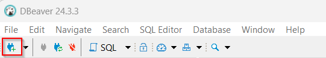
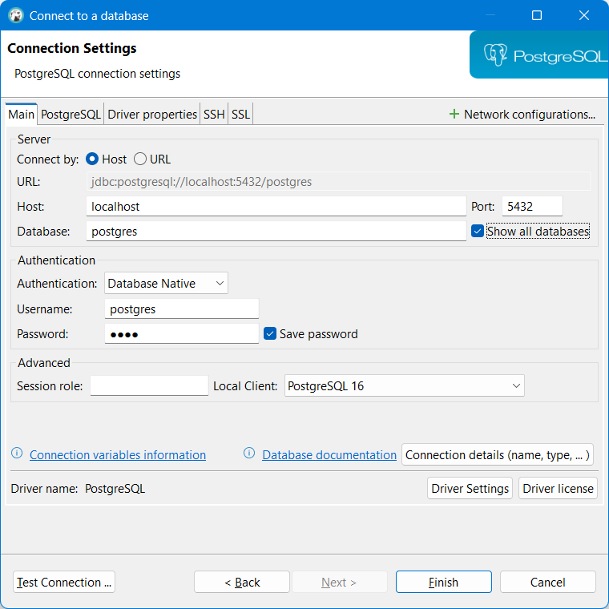
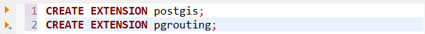
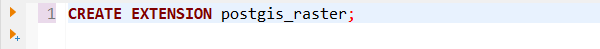
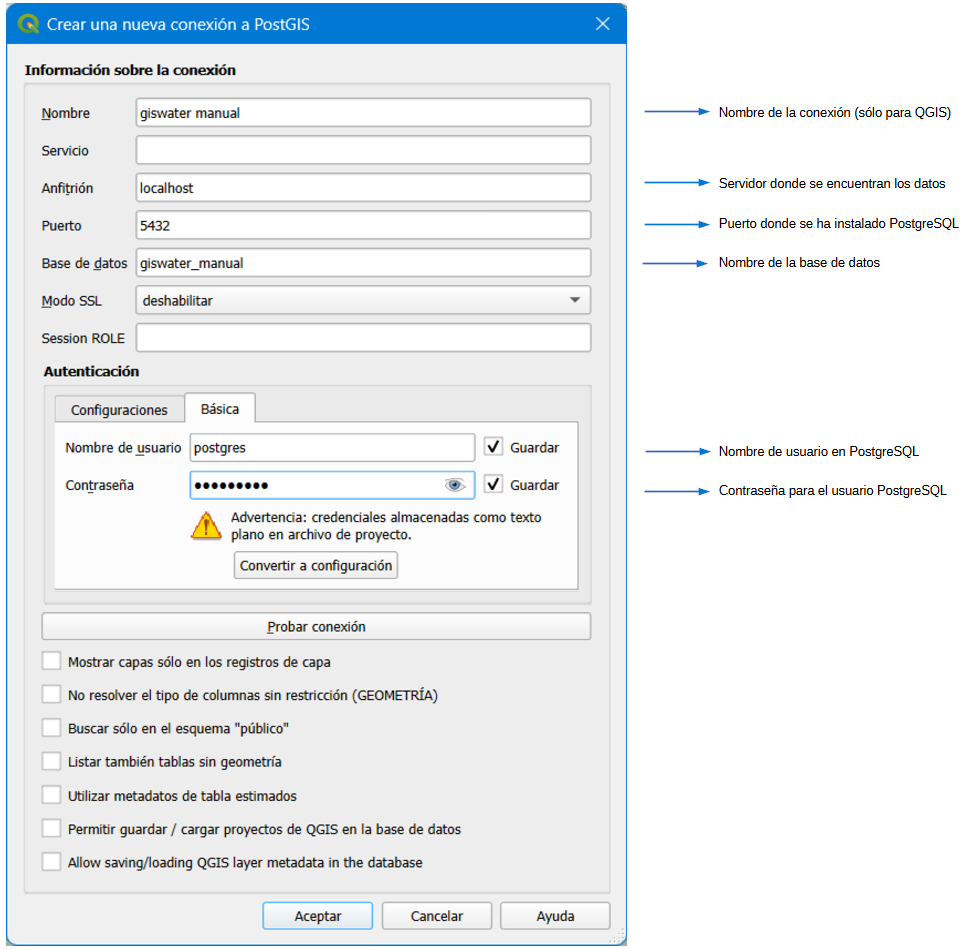
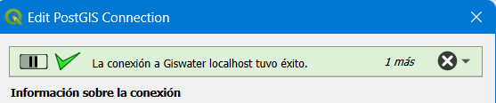

==================================
Creación de las conexiones previas
==================================

En este apartado del manual, el usuario encontrará todos los pasos necesarios 
para la creación de conexiones previas.

Creación de base de datos de trabajo
====================================

Una vez instalados DBeaver y PostgreSQL, al abrir DBeaver, lo primero que debemos
hacer es añadir una nueva conexión.

    
   Añadir nueva conexión.

En la ventana **"Connect to a database"** hay que rellenar los siguientes campos 
para añadir una nueva conexión:

**Host:** puede ser localhost o una conexión a otro servidor.

**Port:** puerto.

**Database:** nombre de la conexión.

**Username:** nombre de usuario. El primer usuario debe ser 'postgres'.

**Password:** contraseña, que para el usuario postgres también es 'postgres'.

   Añadir una nueva conexión a Postgres mediante DBeaver.

Una vez creada la nueva conexión, veremos que se nos ha creado automáticamente
un primer esquema *public*. A continuación, hay que añadir la extensión PostGIS, 
para tener disponible toda la funcionalidad GIS del programa, y también la 
extensión pgRouting, que añade funcionalidades de ruteo y análisis de redes a 
base de datos. pgRouting será imprescindible para algunas de las herramientas 
de Giswater como el polígono de corte y los perfiles longitudinales. 

Clicando el botón de comandos SQL podremos escribir nuestra primera query :|icon_sql|:

.. attention::

   A partir de la **versión 3** de **PostGIS** también será necesario añadir la 
   extensión específica para gestionar capas ráster.

Conexión a la base de datos de trabajo desde QGIS
=================================================

Al abrir QGIS por primera vez, se deben configurar una serie de parámetros, 
necesarios para trabajar con Giswater. Son los siguientes:

- Crear una conexión PostGIS a la base de datos donde se encuentra el esquema de datos.

- Para trabajar de forma cómoda y rápida con ráster, se recomienda ampliar la memoria 
caché de QGIS a 1GB y 1 año, mediante el menú *'Configuración/Opciones/Red'*.

- Escoger abrir formulario si una única entidad es seleccionada.

**¿Cómo configurar una conexión de QGIS a PostGIS?**

1. Pinchamos sobre el icono **Añadir capa PostGIS**.

2. Hacemos clic sobre el botón **Nueva** y en el formulario introducimos los parámetros de conexión.

    
   Formulario de conexión a PostGIS desde QGIS. Así se podrán importar capas de la base de datos.

3. Una vez introducidos los parámetros, hacemos clic sobre el botón **Probar conexión**. 
Si todo es correcto, en la parte superior de la ventana obtendremos el siguiente mensaje:

    
   Probar conexión.

4. Pinchamos sobre el botón **Aceptar**. En este momento la información de conexión se 
guardará con el nombre en la lista de conexiones.

.. attention::
   
   Si con esta conexión queremos tener la posibilidad de generar nuevos esquemas de 
   trabajo, el usuario de conexión deberá ser **SUPERUSER** en PostgreSQL.

Para usar el plugin Giswater es necesario tener creada una conexión a la base de datos 
que usaremos para trabajar. Con crearla una vez para cada QGIS instalado será suficiente.

Múltiples conexiones a distintas bases de datos son posibles, aunque es este caso se 
recomienda trabajar con precaución para no mezclar datos entre una u otra base de datos.

Cuando estemos conectados podremos visualizar las tablas (con y sin geometría) 
que contenga la base de datos correspondiente y, si es necesario, añadirlas al proyecto.

