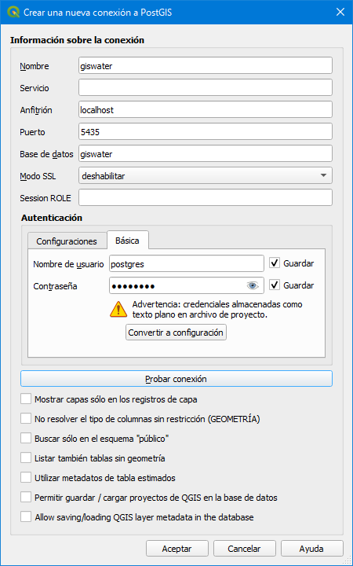

.. _creacion-conexiones-previas:

========================================================
Creación de las conexiones previas y de la base de datos
========================================================

.. only:: html

   .. contents::
      :local:

Tras haber instalado los programas necesarios, los siguientes pasos son crear la conexión entre DBeaver y PostgreSQL, crear la base de datos de trabajo
y crear la conexión entre QGIS y dicha base de datos.

Conexión entre DBeaver y PostgreSQL
===================================

Dado que recomendamos utilizar como gestor de bases de datos DBeaver, para trabajar tenemos que empezar por crear la conexión entre él y PostgreSQL.
Para ello, en DBeaver pincharemos en el botón correspondiente para crear una conexión nueva donde elegiremos la opción *PostgreSQL*.

    
     Crear nueva conexión PostgreSQL.

En la ventana *Conectar a base de datos* tenemos que rellenar los siguientes campos en la pestaña *General* para crear la nueva conexión:

- Host: si los datos están almacenados en nuestro ordenador local, pondremos *localhost*; si no, pondremos la dirección IP del servidor donde están alojados.
- Port: número del puerto al que nos conectaremos.
- Database: nombre de la conexión.
- Nombre de usuario: nombre de usuario con el que nos conectaremos a la base de datos.
- Contraseña: contraseña del usuario con el que nos conectaremos a la base de datos.
- Local Client: cliente PostgreSQL que tenemos instalado. Como podemos tener instalados varios PostgreSQL, tendremos que seleccionar aquel con el que queramos trabajar.

     Campos a rellenar para crear la conexión entre DBeaver y PostgreSQL.

Es aconsejable marcar la casilla *Show all databases* para que podamos visualizar todas las bases de datos que tengamos disponibles.
En el caso de la casilla *Save password*, **si se trabaja en un entorno corporativo, se recomienda no marcar por motivos de seguridad**.

.. warning::
   
     Si solo tenemos una versión de PostgreSQL instalada y no lo hemos modificado durante la instalación, el puerto de conexión será el 5432.

Creación de la base de datos
============================

Con la conexión creada, el siguiente paso es crear la base de datos que almacenará toda la información de las redes.
Para ello desplegaremos la conexión creada hasta que veamos las bases de datos que contiene.

     Visualización de las bases de datos.

Podremos crear una base de datos nueva si pinchamos con el botón derecho del ratón sobre *Bases de Datos* y seleccionamos la opción *Crear Nuevo Base de Datos*.
En la ventana emergente tendremos que especificar nada más que el nombre que queramos darle a nuestra base de datos.

     Creación de nueva base de datos.

Una vez creada, la veremos listada junto a todas las demás.

     Visualización de todas las bases de datos.

Conexión a la base de datos de trabajo desde QGIS
=================================================

Con DBeaver y PostgreSQL vinculados, iremos a QGIS para poder conectarlo con la base de datos recién creada.

Para ello crearemos una nueva conexión a la base de datos utilizando el botón *Añadir capas PostGIS* que se encuentra en la barra de herramientas *Administrar capas*, *Administrador de fuentes de datos* o a través del menú *Capa / Añadir capa*.

Al pinchar sobre el botón *Nueva* aparecerá una ventana emergente en la que deberemos especificar:

- Nombre: nombre que queramos darle a la conexión en QGIS.
- Anfitrión: servidor en el que se encuentran los datos. Si trabajamos en local, pondremos *localhost*; si no, la IP del servidor.
- Puerto: puerto de conexión a la base de datos.
- Base de datos: nombre de la base de datos. 
- Nombre de usuario: nombre de nuestro usuario en PostgreSQL.
- Contraseña: contraseña para nuestro usuario en PostgreSQL.

     Creación de la conexión a la base de datos desde QGIS.

Una vez introducidos los parámetros, pincharemos sobre el botón *Probar conexión*. Si todo es correcto, en la parte superior de la ventana veremos el siguiente mensaje:

     Conexión con éxito a la base de datos.

En cuanto pinchemos sobre el botón *Aceptar* habremos creado la conexión y se guardará con el nombre indicado en la lista de conexiones disponibles.

Cuando estemos conectados podremos visualizar las tablas (con y sin geometría) que contenga la base de datos correspondiente y, si es necesario, añadirla al proyecto.
