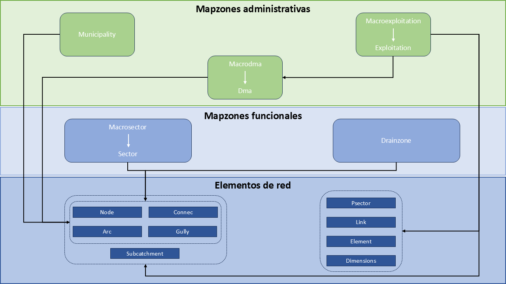

.. _data-model-giswater:

===========================
Data model for Giswater
===========================

.. only:: html

   .. contents::
      :local:

One of the most outstanding qualities of Giswater is the wide variety of elements that can be visualized in its working environment.
This allows a very faithful reproduction of reality, which facilitates the user in covering all his needs in relation to the conditions of the network he manages.

Elements that make up the networks
=================================

The elements that make up the network are all those that refer to the physical objects of the same that can have geometry
and that, therefore, can be represented graphically on the map.

They are all related to each other through the topology so that they must follow certain topological rules for their correct operation.

Thanks to the possibilities of QGIS symbolism we can achieve a representation of the different elements very close to reality.

Next, we can see a basic scheme of the types of elements of the networks in Giswater.

.. figure:: img/data-model-giswater/network-elements.png
  
   Schematic representation of the different elements existing in Giswater.

The main objects are:

- Node

It is one of the main types of elements of the network, it is governed by topological rules and **must always be the first ones to have**. They represent point elements of the network like, for example,
valves, hydrants, unions, meters, tanks... and are represented as points in QGIS.

The node type elements are divided into numerous categories, differentiated for ws and ud projects.
Although they are always represented as points, some may have associated polygons that represent their real perimeter when it is important (for example, tanks).

The nodes always sit between two arcs and, therefore, break them into different entities (parts).
Although most nodes are configured to break the arcs, there are some exceptions in which this does not happen (for example, the vents).

In addition to the nodes, in the figure we can observe:

- Arc

It is another of the main types of elements of the network, it is also governed by topological rules and **must always be the second ones to have**. They represent linear elements of the network, that is, the conduits and 
are represented as lines in QGIS. All its characteristics (diameter, material, roughness...) can be added in its attribute table.

**Each section must be located between two nodes obligatorily, so that they are inserted or digitalized after the nodes**.

There is a type of arc called *varc* or virtual arc that is used to connect topologically parts of the network. This type of arc, which in reality does not exist as such, allows us to give continuity and connectivity to the network 
without breaking the topology of the same. The virtual arc is easy to see in the tanks where, to give continuity, we must digitalize it between the tank and the input/output of the same.

- Connec

Main element of the network that represents the connections, that is, the elements that connect the network with buildings or other elements like, for example, fountains. They are represented as points in QGIS.

They are not located directly on the main network sections but are connected to it through the links.

- Gully

Main element specific to the urban drainage and sanitation networks that represents the imbornals and is represented as a point in QGIS.

They are usually located at a certain distance from the main network and are connected through the links.

- Link

Secondary linear elements that join the imbornals and the connections with their virtual nodes above the nearest arc, 
therefore, they perform the function of connecting the separated elements with the network.

- Element

Point objects that are not connected to the network and that the user has the possibility to customize.

It can be about accessories of the network or any other element that is necessary for a representation with the highest degree of reality possible.

.. _Catalogos:

Catalogs
=========

They are tables of the database with predefined values that allow organizing and ordering basic information, so that they restrict what data can be put in certain fields, thus generating value relationships fixed by the specific records defined in these catalogs.
They work through the concept of **foreign key** or foreign key, very common in relational databases. This means that the foreign key established in a table will not allow the introduction of any value that has not been previously defined in another table, in this case, the catalog table.

This concept of foreign key not only applies to catalogs but also to many other data that should be worked by a fixed value relationship for its proper functioning.

There are various types of catalogs in Giswater among which it is worth highlighting the ones for network objects, materials, management, hydraulic model as well as the ones corresponding to additional non-topological elements.

**To start working with Giswater we must fill in, at least, the catalogs for network objects (at least the node and arc catalogs) and materials**.

Filling a catalog is done analogously to creating an element in a table in QGIS:

- We put the catalog in edit mode.
- We add a new row.
- We fill in with the necessary data.
- We save the changes and we stop having the catalog in edit mode.

In :ref:`catalogs` you can find a list with all the catalogs available in Giswater.

.. _map-zones:

Map zones
==============

They are geographical areas defined in the network that allow managing and administering different scopes or sections.

There are different zones, each of which has specific characteristics and functionalities. Not only do they allow managing the entire scope of our network
but they are also very useful to establish zones that categorize the network according to certain characteristics.
Each element of the network will have different attributes according to which map zones it belongs to so that this relationship is established through foreign keys just like in the catalogs.

In addition to relating to the elements of the network, some of these zones also relate to each other, since they may depend on each other.

All of them must be represented geometrically in QGIS using polygons so that they are easier to identify.

There are four large blocks of map zones:

- Administrative map zones: allow grouping elements in a very general scope and, usually, refer to the predefined administrative limits.
- Operational map zones: 
- Commercial map zones (ws): 
- Functional map zones: they are much more variable and, generally, smaller. They have a direct relationship with the hydraulic management of the network.

It is worth highlighting that, in addition to being able to be drawn manually, Giswater allows calculating them automatically
thanks to an algorithm that uses the configuration made and the traceability of flows to establish the result of the zoning on our network.

Given that Giswater allows managing water supply and urban drainage networks, each type of network has its own map zones.
In the following schemas we can see the map zones for both types of network.

.. figure:: img/data-model-giswater/map-zones-ws.png

   Map zones for water supply networks.

   Map zones for urban drainage and sanitation networks.

In :ref:`map-zones` you can find the definition of the map zones available in Giswater.

Working rules
=================

Giswater allows controlling two fundamental types of rules. The first, inherent to the arc-node topology of the GIS, expresses the relationships existing between the points, lines and polygons
that are connected to each other in QGIS. The other, own to Giswater, is the referent to the state of the elements since, depending on their state, we may find ourselves with certain restrictions
when inserting new objects into the network.

To control these rules Giswater has several tools. On the one hand, if we are inserting new objects into the network, if we break any of these rules we will get a warning of the inconsistency committed.
On the other hand, if the network is already inserted but has topological errors, thanks to Giswater we have at our disposal certain tools that allow identifying where the errors are.
This is common when migrating networks from other sources.

In those cases in which it is necessary, we can deactivate the topological control tool (option *Topocontrol disable error*).

The working rules of Giswater are:

Arc-node behavior
------------------------

All nodes and arcs of the network must be connected to each other except for a few exceptions (for example, the vents in the water supply networks).

**Always** when we draw new elements **we will have to configure previously the autoassembly options** of QGIS to ensure that the network is well connected.

If it is not digitalized correctly, Giswater will show an error message and will not allow inserting the object.

.. figure:: img/data-model-giswater/arc-node-error.png

   Error when digitally incorrectly an arc.

Giswater is configured so that, if we move a node, all the sections connected to that node will also move. In this way, the topology is not broken.

In addition, in its toolbox it has specific processes with which we can detect, among others, arcs without initial or final nodes, duplicated nodes, orphan nodes...

Link-network behavior
-----------------------

The link is the graphical link between map elements. What it does is connect an input element (*connec* or *gully*) with an output element (*arc*, *node*, *connec* or *gully*).

By connecting the connec/gully with the network through the link, it captures the value of the related section in such a way that it is linked in the *arc_id* field that is in the connec/gully.
In this relationship between connec/gully, link and arc several rules are fulfilled:

- Respect to its input element (which is upstream), the link shares most of its attributes:

  - The map visibility, that is, the exploitation and state, takes it from this.
  - If the input element is deleted, the link is deleted.
  - The attributes of the link like length, diameter or material are represented and manifested in the data model of the input element to which it belongs.

- Respect to its output element (which is downstream), there is no belonging anymore but simply topology. Therefore:
  
  - If the output point is moved, the link moves automatically.
  - If the output element is a connec/gully, its *arc_id* value is transmitted.
  - If the final vertex of the link is updated towards another section, the *arc_id* field of the input element will be updated.

By default, when adding a connec/gully, it is disconnected from the network. To exist topology between the network and the connections, the links must be created.
This can be done in the following ways:

- Draw the link manually. This can be drawn, with the shape that one wants, as long as an input element is connected with an output element, using the usual drawing tools in QGIS.
- Connect to the network tool. Using the Giswater *Connect to the network* tool, one or several connections can be connected at the same time.
  In this case, the link will always point to the nearest section in a straight line.
- Connect automatically. There are configuration variables so that, when introducing a new connec/gully, it is automatically connected to the network.
  The result will be the same as if it is connected through the tool of the plugin.

Double geometric elements
---------------------------

In Giswater there are objects that, for their characteristics and for a better representation, have double geometry (point and polygon). An example are the tanks.

In these cases, apart from the point element, the polygon geometry can also be used so that it is stored in another layer thought for it.
Digitalizing it will be as simple as drawing the polygon around the point and it will be linked to it.
The polygon will only have as data the identifier of the point, which will be the one that has all the important information.

This relationship has its own topological rules:

- If the point is moved, the polygon also moves.
- If a new polygon is drawn around a point, the new one replaces the old one.
- A new polygon cannot be drawn without a point being inside it.
- If a point with double geometry is deleted, the associated polygon is also deleted.

To work with this type of double geometric elements it is important to have a configuration that manages its handling. 
In the catalog *cat_feature_* this function can be enabled/disabled through the *double_geom* field.
To do this, we will set its value to *true* or *false* depending on whether we want or not want Giswater to draw the associated polygon.
In the case of being drawn, a polygon will be represented around the digitalized object which we can modify according to our needs.

.. note::   
  
   Double geometric elements for **ws**: *Tank*, *Register* and *Fountain*.
    
   Double geometric elements for **ud**: *Storage*, *Chamber*, *Wwtp*, *Netgully* and *Gully*.

Topology of states
====================

All objects in Giswater can be classified into three states:

- Obsolete (value 0): state in which those elements that were part of the network but are no longer in use are found.
- Operative (value 1): state in which the elements that make up the network and are in operation are found.
- Planned (value 2): state in which the objects of the network that are part of some future alternative are found. These objects are always encompassed in the called **psector** (planning sectors)
  and allow us to check how the network would work in the case of making certain operational changes.

These are the three main states of the objects and cannot be changed. What can be done is to modify the sub states in such a way that complement the main state.
These sub states are called *state_type* or state types.

The topological rules of states in Giswater are:

- For obsolete objects there are no rules, everything is allowed.
- For operative objects there cannot be a node on top of another (duplicated nodes) and the sections always have to have nodes at their ends.
- For planned objects the complexity increases by the appearance of alternatives and their combinations.