===================
Digitalizar una red
===================

Una vez conocidas todas las variadas herramientas del *plugin Giswater*, ya se puede usar todo 
el potencial del programa y empezar a trabajar con su red de aguas. Se considera oportuno e 
interesante, en este momento, dedicar un apartado a conocer cuáles son los pasos necesarios 
para digitalizar partes de la red, pues es uno de los procesos más habituales para los 
encargados de la gestión de esta.

Pasos previos
=============

Si nos encontramos ante un proyecto vacío, antes de poder introducir cualquier 
elemento habrá que tener en cuenta algunos pasos previos. A continuación, 
veremos de forma práctica que es necesario hacer:

**1 - Rellenar catálogos**

Hay que rellenar los catálogos de elementos que vamos a introducir. Inicialmente 
habrá de introducir datos en las tablas *cat_feature, cat_feature_node, cat_feature_arc, cat_feature_connec, cat_feature_gully(ud).* 
Recordamos que la parte de catálogos se explica en el apartado :ref:`Catalogos` de este manual.

El siguiente esquema muestra la jerarquía de catálogos existentes dentro de Giswater:

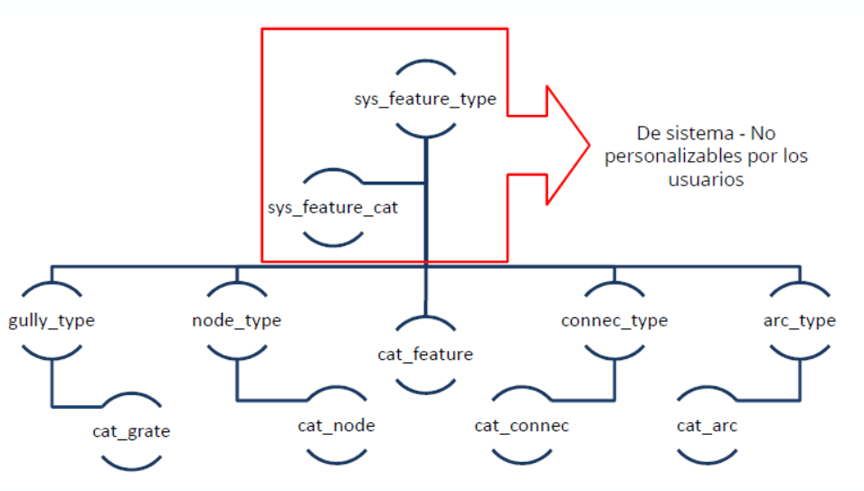

   Jerarquía de catálogos en Giswater

Antes de los catálogos de elementos habrá que tener algún registro en el catálogo de materiales, tanto para arcos como para nodos

**2 - Zonas del mapa**

Como se ha visto en el apartado :ref:`Zonas del mapa`, las zonas del mapa son imprescindibles para el uso de 
Giswater, de forma que, antes de introducir elementos, habrá que definir una serie de zonas 
del mapa.

Esto podemos hacerlo directamente con el proyecto de QGIS, buscando la capa 
correspondiente y añadiendo un elemento geométrico (poligonal). La relación de 
creación de zonas del mapa, por orden, debería ser esta:

1. Macroexplotation (sin geometría)

2. Exploitation

3. Dma

4. Sector

5. Municipality

Insertar objetos
================

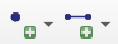
Para crear objetos nuevos utilizaremos los botones *Insertar punto* e *Insertar arco* |icon_insert|

Los campos comunes a todos los elementos que debemos rellenar son:

- *Nodecat_id/ Arccat_id*: id del **catálogo del elemento.** Se introduce automáticamente, con opción a personalizar.

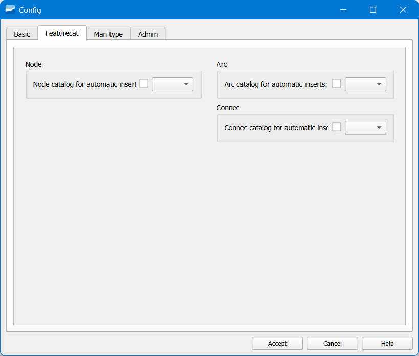

   Ventana Featurecat de Config.

- *Epa type*: **tipo EPA de elemento**. Está relacionado con la modelización hidráulica. 
Se captura automáticamente en función del tipo de elemento añadido.

- *Elevation*: **elevación** o cota **del punto**. Si no disponemos de ella en los datos de 
partida, la obtendremos del modelo digital de elevaciones. Giswater la capturará 
automáticamente si tenemos el ráster cargado en la base de datos y si tenemos marcada la casilla *Insert elevation from DEM*.

- *Exploitation*: **explotación** en la que se encuentra el **objeto**.

- *Sector*: **sector** en el que se encuentra el **objeto**.

- *Municipality*: **municipio** en el que se encuentra el **objeto**.

.. note::
   Los valores de *Exploitation, Sector* y *Municipality* se capturan automáticamente.

- *State*: **estado del objeto** creado. Es importante que los objetos nuevos se creen por 
defecto con el estado *Operativo*. Si se quiere, se puede cambiar en la pestaña Básico en la 
configuración de Giswater.

- *State type*: **tipo de estado del objeto creado**. Es importante que los objetos nuevos se 
creen por defecto con el tipo de estado *Operativo*. Si se quiere, se puede cambiar en la 
pestaña *Básico* en la configuración de Giswater.

- *Cat_matcat_id*: **material** del objeto.

- *Cat_pnom*: **presión** del objeto.

- *Cat_dnom*: **diámetro** del objeto.

.. note::
   Los valores de *Cat_matcat_id, Cat_pnom* y *Cat_dnom* no se pueden editar.  
   Se rellenan automáticamente en función del catálogo.

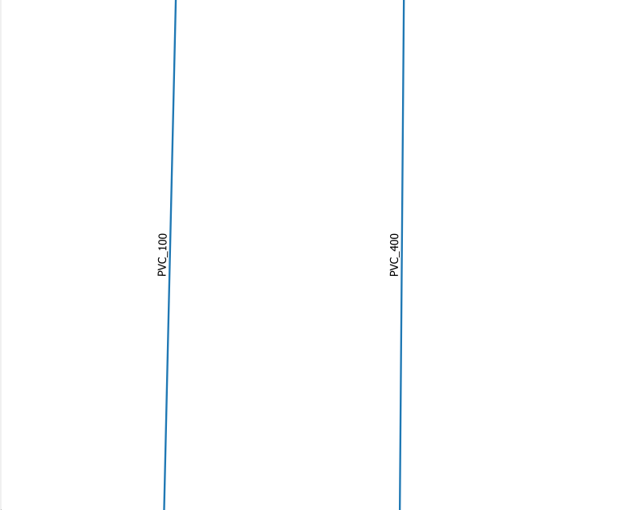

   Antes de insertar el elemento.

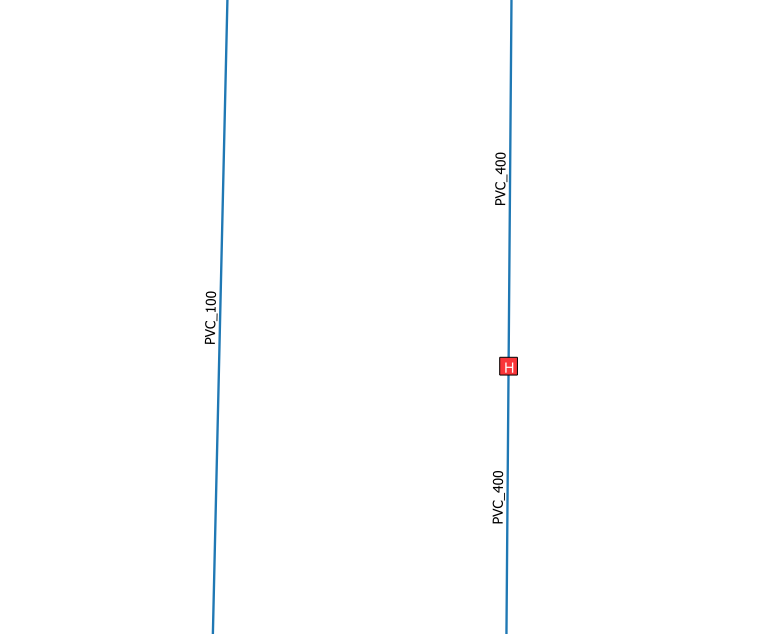

   Después de insertar el elemento.

Editar objetos
==============

Para editar un objeto utilizaremos la **herramienta** de Giswater ***Identificar objeto*** y pincharemos 
sobre el objeto a editar.

Con el **formulario** abierto, pincharemos en el botón **Edit** y podremos editar la información 
que necesitemos.

Para una **edición masiva** también se puede usar la **tabla de atributos** de la capa.

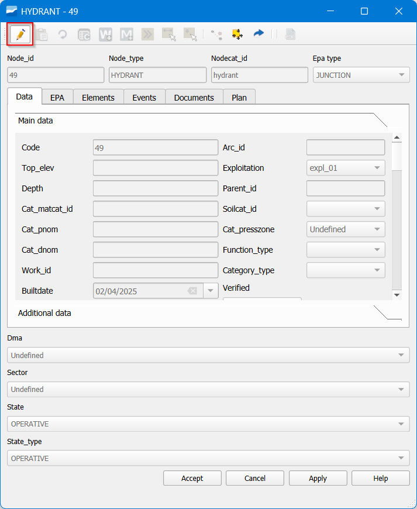

   Ventana de la herramienta Identificar objeto de Giswater.

**Editar objetos geográficamente**

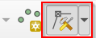
Para **editar la posición de nodos** podemos usar la **herramienta de vértices** |icon_vertice| 

Sólo estará activada en caso de tener la capa en **Edición**.

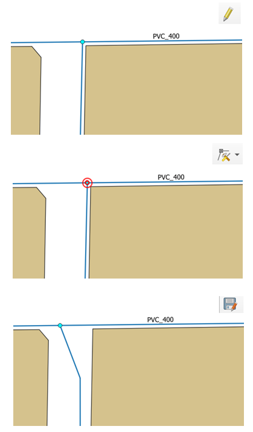

   Con ayuda de la topología, los tramos vinculados se mueven siguiendo el nodo.

Para **editar la geometría de un tramo** debemos usar la herramienta de vértices. Podemos:

- Insertar, eliminar o mover vértices intermedios.

- Mover **vértices iniciales y finales**, pero siempre hacia otro nodo.

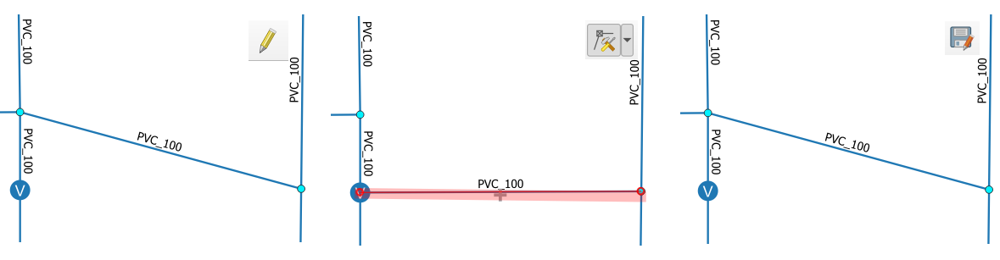

   Edición de la geomtería de un tramo.

Para poder mover vértices iniciales o finales **no debemos tener activada la edición topológica**, ya que 
moveríamos todos los tramos que se encuentran allí.

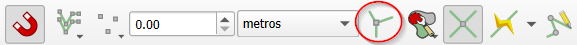

   Edición topológica en la barra de autoensamblado.

Insertar elementos
==================

Los **Elementos** son objetos que añaden información complementaria sobre ciertas partes de la red. 
Ejemplos: placa de hidrantes, cinta de señalización de agua potable…

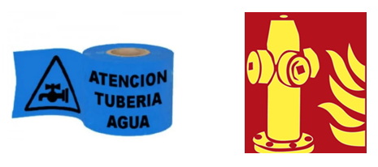

   Ejemplo de elementos.

Antes de añadirlos, debemos definirlos en el catálogo *Element catalog*. En dicho catálogo, los valores del campo 
*elementtype_id* vienen predefinidos. Si quisiéramos añadir más tipos de elementos, tendremos que cargar desde 
PostgreSQL el catálogo *element_type*.

Podemos añadir elementos de dos maneras distintas:

1. Formulario de atributos del objeto:

Abrimos el **formulario del objeto** que tendrá el elemento y, en la pestaña *Elementos*, podremos añadir un elemento 
nuevo pinchando en el botón *New element*.

En la ventana emergente añadiremos los datos necesarios (como mínimo, *Tipo elemento* y *Elementcat id*).

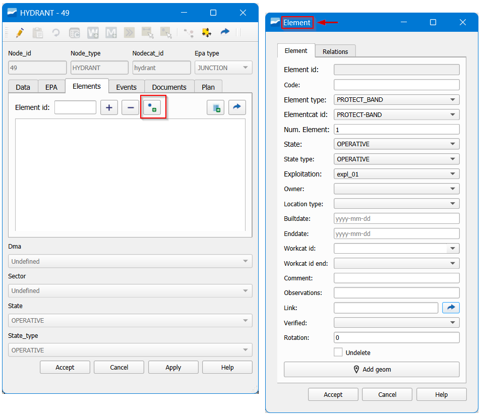

   Creación de un nuevo elemento desde el formulario del objeto.

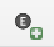
2. Desde el botón de Giswater *Añadir elemento*  |icon_add_element|

Al pinchar sobre él, se abrirá el formulario del elemento para rellenar con la información pertinente.
A continuación, para asignar el elemento a un objeto, iremos a la pestaña *Relaciones*.
Seleccionaremos la pestaña del tipo de objeto (arco, nodo, acometida o link) y seleccionaremos el objeto 
con el botón *Seleccionar objeto*.

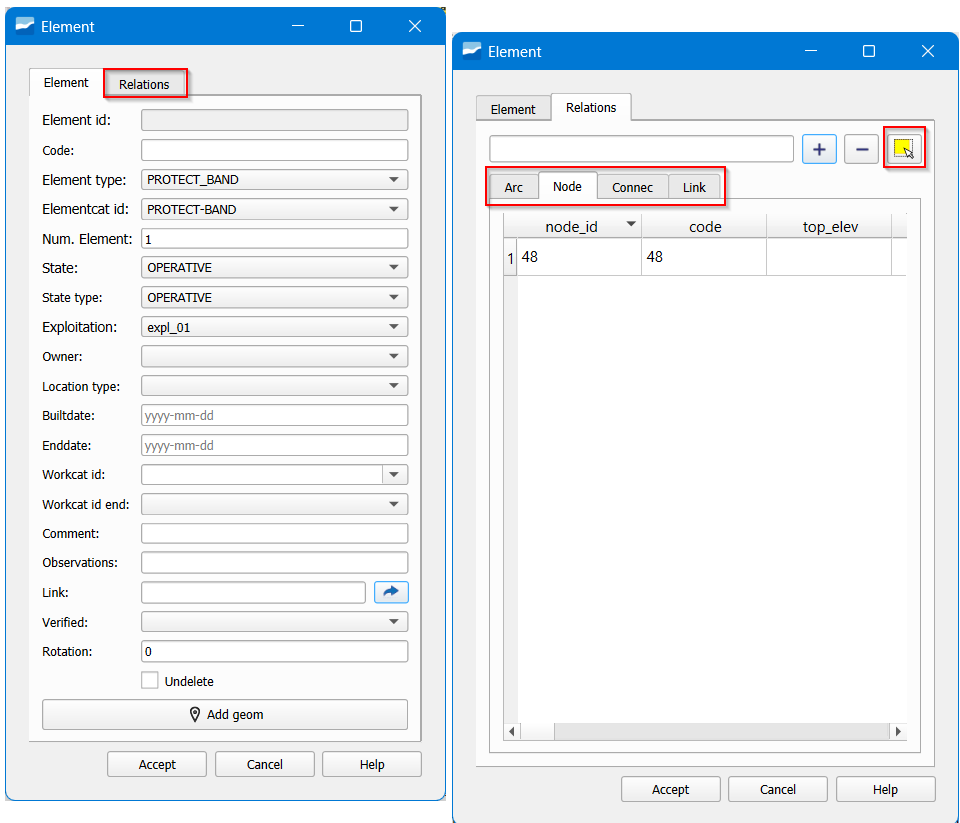

   Ventana del formulario tras pulsar "Añadir elemento".

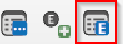
Para gestionar todos los elementos creados tenemos el Gestor de elementos al cual accedemos a través del 
botón |icon_element|

Sirve como inventario de los elementos contenidos en el proyecto.
Permite ver los elementos y su información.
Al hacer doble clic sobre uno, se abre su formulario y se ve remarcado en el canvas el objeto al que hace referencia.
Los elementos también los podemos consultar a través del formulario de atributos de cada objeto de red, 
pero ahí sólo veremos los asociados a un único objeto.

Para **eliminar un elemento** no bastará con eliminarlo desde el formulario del objeto 
de red. Hay que **eliminarlo también** en el *Gestor de elementos*.

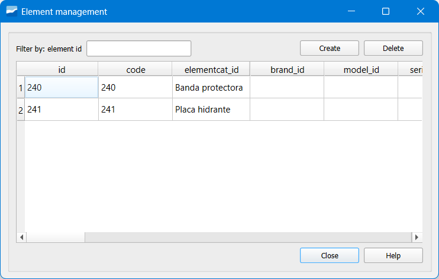

   Ventana *Gestor de Elementos*.

Insertar documentos
===================

Los **Documentos** nos permite añadir información contenida en documentos tipo Word, Excel, 
fotos, URL…
Al igual que con los elementos, podemos añadir un documento de dos formas distintas:

1. Formulario de atributos

Abrimos el formulario del objeto que contendrá el documento y, en la pestaña *Documentos,* 
podremos añadir un documento nuevo pinchando en el botón *Nuevo Documento*. En la ventana emergente 
especificaremos el tipo de documento, así como la ruta del archivo.

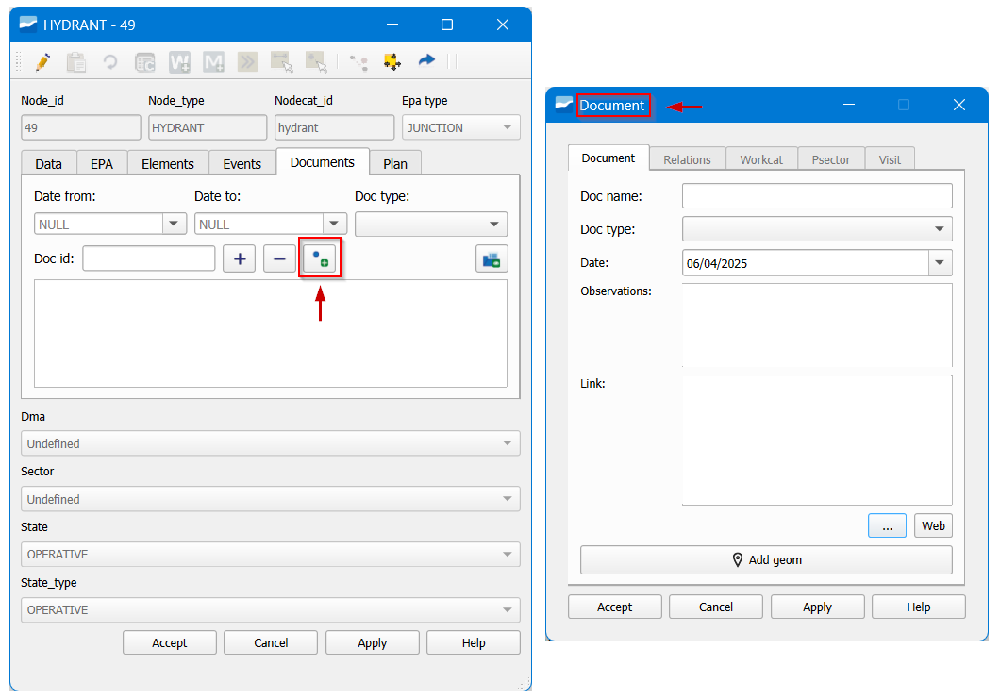

   Ventana del botón *Nuevo Documento*.

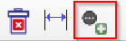
2. Desde el botón de Giswater *Añadir documento* |icon_new_document|

Al pinchar sobre él se abrirá el formulario para añadir el documento donde deberemos especificar, 
como mínimo, el tipo de documento y la ruta del mismo.
A continuación, para asignar dicho documento a un objeto de nuestra red, iremos a la pestaña 
*Relaciones.*
Seleccionaremos la pestaña del tipo de objeto (arco, nodo, acometida o link) y seleccionaremos el 
objeto con el botón *Seleccionar objeto.*

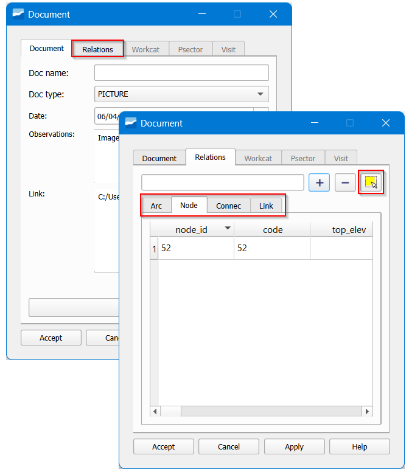

   Ventana del botón de Giswater Añadir documento.

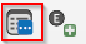
Para gestionar todos los documentos creados tenemos el Gestor de documentos al cual accedemos 
a través del botón |icon_gest_document|

Sirve como inventario de los documentos contenidos en el proyecto.
Al hacer doble clic sobre uno, se abre su formulario y se ve remarcado en el canvas el objeto 
al que hace referencia.
Los documentos también los podemos consultar a través del formulario de atributos de cada 
objeto de red, pero ahí sólo veremos los asociados a un único objeto.

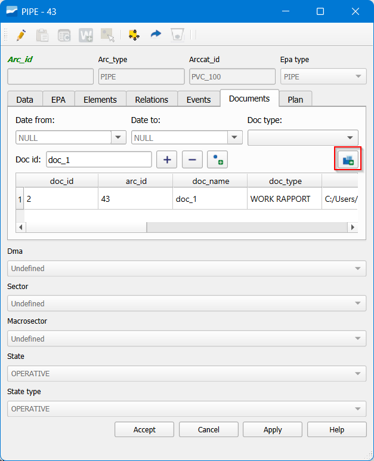

   Consulta de documentos desde el formulario de atributos.

Para **eliminar un documento** no bastará con eliminarlo desde el formulario del objeto de red. 
Hay que **eliminarlo también** en el *Gestor de documentos.*

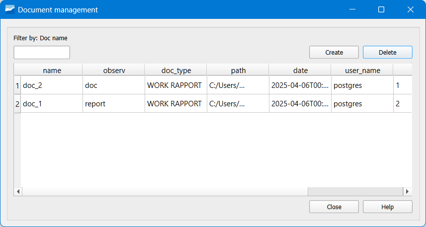

   Eliminación de documentos desde el *Gestor de documentos*.

