.. _entorno-trabajo:

==================
Entorno de trabajo
==================

.. only:: html

   .. contents::
      :local:

Cómo crear un esquema y un proyecto de trabajo
==============================================

Una vez que ya tenemos instalado el software necesario indicado en la sección :ref:`instalacion-puesta-marcha` y hemos creado las conexiones siguiendo los pasos de la sección :ref:`creacion-conexiones-previas`,
ya podemos empezar a trabajar con Giswater.

Lo primero que debemos hacer es crear un esquema de proyecto. Para ello, **sobre un proyecto en blanco de QGIS**, pincharemos en el botón de Giswater para que se abra la ventana del gestor de proyectos.

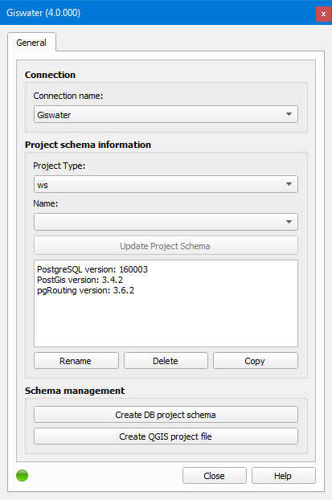

   Ventana del gestor de proyectos de Giswater.

Como podemos ver, la ventana está dividida en tres partes:

- Conexión: es el apartado donde debemos seleccionar el nombre de la conexión con la base de datos que queremos utilizar para trabajar.
  En el caso de que tengamos varias, podremos seleccionar la deseada en el desplegable correspondiente.
- Información del esquema del proyecto: este apartado está formado a su vez por tres partes. La primera, *Tipo proyecto*, nos permite seleccionar qué tipo de esquema de proyecto queremos crear.
  Las dos opciones disponibles son *ws* para proyectos de abastecimiento y *ud* para proyectos de saneamiento y drenaje urbano. La segunda parte, *Nombre*, indica el nombre del esquema.
  Cuando aparece en blanco es porque todavía no hay ningún esquema creado. En el caso de que tengamos varios, podremos seleccionar uno u otro en el desplegable.
  La tercera y última parte es la formada por un cuadro de texto en el que veremos información relacionada con el esquema creado. Aquí podremos consultar información sobre las versiones de PostgreSQL,
  PostGis, nombre del esquema, EPSG... Vemos que también tenemos cuatro botones disponibles:

   - Actualizar Esquema: botón que nos permite actualizar el esquema de trabajo cuando tenemos instalada una versión nueva de Giswater, la cual no coincide con la de creación del esquema.
     Solo estará habilitado cuando las versiones no coincidan.
   - Renombrar: botón que nos permite renombrar el esquema que tengamos seleccionado en el desplegable *Nombre*.
   - Borrar: botón que nos permite borrar el esquema que tengamos seleccionado en el desplegable *Nombre*.
   - Copiar: botón que nos permite copiar el esquema que tengamos seleccionado en el desplegable *Nombre*.
  
- Gestión de esquema: apartado con dos botones los cuales nos van a permitir crear un esquema nuevo (*Crear esquema proyecto BBDD*) y crear el proyecto de QGIS (*Crear archivo proyecto QGIS*).

Una vez que sepamos el tipo de esquema de proyecto a crear (ws o ud), lo seleccionaremos en el desplegable *Tipo proyecto*, pincharemos en el botón *Crear esquema proyecto BBDD* y se abrirá la siguiente ventana.

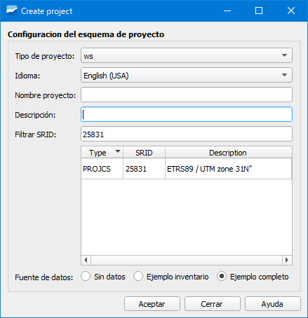

   Ventana de creación de esquema nuevo.

Esta ventana nos sirve para especificar aspectos importantes de nuestro esquema de trabajo así como para crearlo. Tendremos que especificar:

- Tipo de proyecto: tipo de proyecto que vamos a crear (ws o ud).
- Idioma: idioma en el que se creará el esquema. Podremos elegir uno de los disponibles en el desplegable.
  Si vamos a crear uno de los ejemplos disponibles (*Ejemplo inventario* o *Ejemplo completo*) **obligatoriamente tendremos que seleccionar el idioma English (USA)**.
- Nombre proyecto: indicaremos el nombre del esquema de proyecto. **No puede contener letras mayúsculas**.
- Descripción: breve descripción del proyecto.
- Filtrar SRID: sistema de referencia de coordenadas de la zona donde se creará el esquema.
- Fuente de datos: nos permite seleccionar entre:

    - Sin datos: opción seleccionada para crear un esquema en blanco. Será la opción seleccionada cuando queramos trabajar con nuestra red.
    - Ejemplo inventario: opción seleccionada para tener un esquema de ejemplo **solo con datos de inventario**.
    - Ejemplo completo: opción seleccionada para tener un esquema de ejemplo con **datos completos (inventario y EPA)**.

En cuanto hayamos especificado todos los datos, pincharemos en el botón *Aceptar* para que se inicie la creación del esquema.

Tras crearse el esquema la ventana de creación del esquema desaparecerá y veremos que ahora tenemos información sobre el esquema en el recuadro de texto.

Ahora, lo único que falta es crear el proyecto de QGIS para lo cual pincharemos en el botón *Crear archivo proyecto QGIS*.

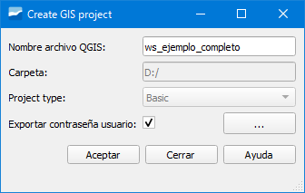
     
   Ventana de creación de proyecto QGIS.

En ella deberemos especificar:

- Nombre de archivo QGIS: nombre que queramos darle al proyecto. Por defecto coge el mismo nombre que el del esquema.
- Carpeta: ruta donde se guardará el proyecto. Para poder cambiar la que venga tendremos que pinchar en el botón con tres puntos y se abrirá una ventana del explorador.
- Exportar contraseña usuario: casilla que permite guardar o no la contraseña de acceso a la base de datos en el archivo GIS.

Nada más pinchar en el botón *Aceptar* se creará el proyecto y se abrirá.

.. warning::
  
   Si marcamos la casilla *Exportar contraseña usuario* la contraseña se guardará en el proyecto de QGIS. Si compartimos el proyecto con alguna otra persona **estaremos compartiendo también nuestra contraseña**.
   
   Extremar la precaución con el marcado de esta casilla.

Tabla de contenidos (ToC)
=========================

Una vez que tenemos el proyecto cargado en QGIS, vemos que en el ToC se han cargado una serie de capas las cuales están agrupadas por temáticas.

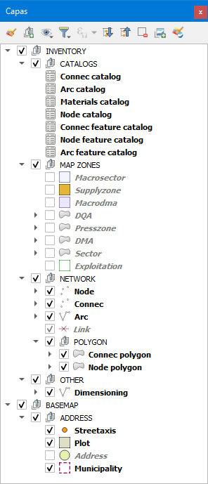

   Capas de un proyecto ws cargadas en el ToC.

- Grupo *INVENTORY*

En este grupo es donde nos encontramos las capas más importantes del proyecto ya que aquí se encuentran los catálogos (*CATALOGS*), las zonas del mapa (*MAP ZONES*) y
las propias capas de la red (*NETWORK*). Existe también un grupo adicional (*OTHER*) que contiene otras capas relevantes.

- Grupo *BASEMAP*

En este grupo se encuentran las capas para representar el callejero (*Streetaxis*), el polígono de los edificios (*Plot*), los números de portal (*Address*) y el límite municipal (*Municipality*).

Giswater incorpora dos botones adicionales al ToC de QGIS: *Cargar capa Giswater* y *Estilos Giswater*.

*Cargar capa Giswater* permite seleccionar qué capa queremos añadir al proyecto. Están agrupadas por temáticas y podremos incorporarla marcando la casilla de verificación correspondiente.
También se pueden añadir catálogos y el DEM en el caso de que lo hayamos importado a la base de datos.

*Estilos Giswater* permite modificar el estilo de las capas seleccionando entre uno de los disponibles. Como consecuencia de ello veremos que la simbología de la red se modifica.

.. note::

   Los estilos de las capas se pueden modificar en función de las necesidades del usuario. En tal caso, para evitar perder la simbología por defecto de Giswater, se recomienda crear una nueva
   y no modificar la existente.

Barras de herramientas
======================

Tras abrir un proyecto de Giswater, vemos que tenemos disponibles unas barras de herramientas con botones que nos permiten realizar distintas operaciones. A continuación, iremos viendo una por una.

Barra de herramientas *Basic*
-----------------------------

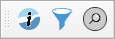

   Barra de herramientas Basic.

Barra de herramientas que contiene botones para realizar consultas básicas relacionadas con aspectos generales de la red. Contiene los siguientes botones:

- Info Giswater: permite abrir el formulario de un objeto para consultar su información. **Para abrirlo no es necesario tener una capa activa en el ToC**.
  Funciona como el botón *Identificar objeto espacial* de QGIS. Para ver más detalles, consultar la sección :doc:`../dialogs/info_feature/index`.

- Selector: permite filtrar la información que se quiere usar en diferentes ámbitos del proyecto. Se divide en varias pestañas cada una de las cuales permite activar/desactivar la visualización de elementos en el mapa.
  Para ver más detalles, consultar la sección :ref:`dialog-selector`.

- Buscador: permite realizar distintas búsquedas sobre distintos ámbitos del proyecto. Se divide en varias pestañas cada una de las cuales permite realizar una búsqueda distinta. 
  Para ver más detalles, consultar la sección :ref:`dialog-search`.

Barra de herramientas *OM*
--------------------------

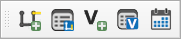

   Barra de herramientas OM para abastecimiento.

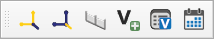

   Barra de herramientas OM para saneamiento y drenaje urbano.

Barra de herramientas que contiene botones para realizar gestiones y procesos relacionadas con operaciones y mantenimiento. Contiene los siguientes botones:

- Polígono de corte (ws): permite el cálculo de un nuevo polígono de corte a partir de la selección de un punto sobre la red. Para ver más detalles, consultar la sección :ref:`dialog-mincut`.
- Gestor de polígonos de corte (ws): permite hacer una gestión activa de los polígonos de corte planificados, en curso e históricos. Para ver más detalles, consultar la sección :ref:`dialog-mincut-manage`.
- Rastreo de flujo (ud): permite determinar todo lo que está aguas arriba de un nodo establecido. Para que el análisis se haga con éxito, la red debe tener continuidad y estar digitalizada
  en el sentido de las aguas (de aguas arriba hacia aguas abajo). Para más detalle, consultar la sección :ref:`dialog-flow-trace`.
- Salida de flujo (ud): permite determinar todo lo que está aguas abajo de un nodo establecido. Para que el análisis se haga con éxito, la red debe tener continuidad y estar digitalizada
  en el sentido de las aguas (de aguas arriba hacia aguas abajo). Para más detalle, consultar la sección :ref:`dialog-flow-exit`.
- Herramienta de perfil (ud): permite, estableciendo dos nodos, dibujar el perfil longitudinal entre ellos. Para más detalle, consultar la sección :ref:`dialog-profile-tool`.
- Añadir visita: permite añadir una nueva visita y vincularla a un elemento de la red. Cada visita podrá tener varios parámetros de información. Para ver más detalles, consultar la sección :ref:`dialog-add-visit`.
- Gestor de visita: permite gestionar las visitas existentes. Para ver más detalles, consultar la sección :ref:`dialog-manage-visit`.
- Selector de fechas: permite establecer una fecha inicial y final que será útil para usar en caso de tener consultas filtradas por este selector. Para ver más detalles, consultar la sección :ref:`dialog-date-selector`.

Barra de herramientas *Edit*
----------------------------

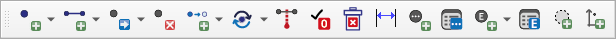

   Barra de herramientas Edit.

Barra de herramientas que contiene botones para realizar trabajos de edición de la red. Contiene los siguientes botones:

- Insertar punto: permite insertar un nuevo elemento puntual de la red (nodo/connec/gully). Para ver más detalles, consultar la sección :ref:`digitalization`.
- Insertar arco: permite insertar un nuevo elemento lineas de la red (arco/link). Para ver más detalles, consultar la sección :ref:`digitalization`.
- Dividir arco: permite dividir un tramo existente con un nodo, generando dos tramos nuevos. Para ver más detalles, consultar la sección :ref:`dialog-arc-divide`.
- Fusionar arco: permite fusionar dos tramos existentes en un único tramo. Para ver más detalles, consultar la sección :ref:`dialog-arc-fusion`.
- Cambiar el tipo de elemento: permite cambiar el tipo de elemento de un objeto de la red por otro de un tipo distinto. El cambio lo podemos hacer entre arcos, nodos, connecs o gullys
  Para ver más detalles, consultar la sección :ref:`dialog-change-featuretype`.
- Reemplazar objeto: permite sustituir un nodo, arco o connec por uno nuevo sin afectar la topología. Para ver más detalles, consultar la sección :ref:`dialog-replace-feature`.
- Conectar a la red: permite dibujar automáticamente los links entre connec/gully y arco. Para ver más detalles, consultar la sección :ref:`dialog-connect-to-net`.
- Dar de baja: permite cambiar a estado *Obsoleto* uno o varios elementos de la red. Para ver más detalles, consultar la sección :ref:`dialog-end-feature`.
- Eliminar elemento de red: permite borrar de manera definitiva un elemento de la red. Para ver más detalles, consultar la sección :ref:`dialog-delete-feature`.
- Acotaciones: permite dibujar acotaciones de referencia y soporte sobre el mapa. Para ver más detalles, consultar la sección :ref:`dialog-dimensioning`.
- Añadir documento: permite vincular cualquier tipo de documento con los elementos de la red. Para ver más detalles, consultar la sección :ref:`dialog-add-doc`.
- Gestor de documentos: permite gestionar los documentos vinculados con los elementos de la red. Para ver más detalles, consultar la sección :ref:`dialog-manage-docs`.
- Añadir elemento: permite vincular elementos asociados no topológicos con los objetos de la red. Para ver más detalles, consultar la sección :ref:`dialog-add-element`.
- Gestor de elementos: permite gestionar los elementos asociados con los objetos de la red. Para ver más detalles, consultar la sección :ref:`dialog-manage-element`.
- Crear círculo: permite dibujar círculos de soporte para poder digitalizar con precisión. Para ver más detalles, consultar la sección :ref:`dialog-create-circle`.
- Crear punto: permite dibujar puntos de soporte para poder digitalizar con precisión. Para ver más detalles, consultar la sección :ref:`dialog-create-point`.

Barra de herramientas *Epa*
---------------------------

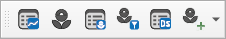

   Barra de herramientas Epa.

Barra de herramientas relacionada con el modelo hidráulico. Contiene los siguientes botones:

- Gestor de objetos no visuales: permite gestionar los objetos no visuales necesarios para el modelo hidráulico. Los podremos duplicar, crear y eliminar. Dependiendo del tipo de proyecto (ws o ud)
  gestionaremos unos u otros. Para ver más detalles, consultar la sección :ref:`dialog-non-visual-obj`.
- Go2Epa: permite establecer las opciones de exportación para los modelos hidráulicos así como si la red se simula desde el entorno de Giswater. Para ver más detalles, consultar la sección :ref:`dialog-go2epa`.
- Gestor de resultados Epa: permite visualizar todos los resultados de las simulaciones realizados en Giswater. Para ver más detalles, consultar la sección :ref:`dialog-result-manager`.
- Selector de resultados Epa: permite seleccionar qué resultados mostrar así como también permite comparar los resultados de una simulación con otra. Para más detalles, consultar la sección :ref:`dialog-result-selector`.
- Gestor de escenarios dinámicos: permite crear y gestionar escenarios dinámicos. Dependiendo del tipo de proyecto de trabajo (ws o ud) tendremos disponibles unas u otras opciones.
  Para más detalles, consultar la sección :ref:`dialog-dscenario-manager`.
- EPA tools: conjunto de herramientas destinadas a la gestión de la simulación hidráulica. Dependiendo del tipo de proyecto de trabajo (ws o ud) tendremos disponibles unas u otras herramientas.
  Para más detalles, consultar la sección :ref:`dialog-epa-tools`.

Barra de herramientas *Masterplan*
----------------------------------

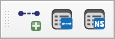

   Barra de herramientas Masterplan.

Barra de herramientas relacionada con los trabajos de planificación de red. Contiene los siguientes botones:

- Nuevo sector de planificaciones: permite crear un nuevo psector. Para más detalles, consultar la sección :ref:`dialog-new-psector`.
- Gestor de sectores de planificación: permite realizar operaciones de gestión sobre los psector tales como crear, fusionar, duplicar y borrar. Para más detalles, consultar la sección :ref:`dialog-psector-management`.
- Gestor de escenarios de red (ws): permite plantear escenarios en la red para realizar cambios en las zonas del mapa y conseguir optimizarlas. Para más detalles, consultar la sección :ref:`dialog-netscenarios`.

Barra de herramientas *Utilidades*
----------------------------------

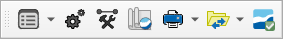

   Barra de herramientas Utilidades.

Barra de herramientas relacionada con aspectos generales del proyecto. Contiene los siguientes botones:

- Gestor de utilidades: incorpora varias funcionalidades entre las que cabe destacar el gestor de zonas del mapa. Para más detalles, consultar la sección :ref:`dialog-utils-manager`.
- Configuración: permite configurar diferentes variables y valores por defecto para el usuario/sistema. Para más detalles, consultar la sección :ref:`dialog-config`.
- Caja de herramientas: contiene procesos y reportes que permiten, entre otras cosas, detectar y corregir errores de la red. Para más detalles, consultar la sección :ref:`toolbox`.
- Espacios de trabajo: permite crear entornos de trabajo cuya configuración se podrá recuperar. Para más detalles, consultar la sección :ref:`dialog-workspace`.
- Impresión rápida: permite extraer fácilmente un mapa usando composiciones disponibles en QGIS. Para más detalles, consultar la sección :ref:`dialog-fastprint`.
- GW file transfer button: permite importar datos de archivos csv usando funciones preconfiguradas. Para más detalles, consultar la sección :ref:`dialog-gwfiletransferbutton`.
- Verificar proyecto: ejecuta distintos procesos para mostrar un resumen detallado del estado de salud del proyecto. Para más detalles, consultar la sección :ref:`dialog-check-project`.

Barra de herramientas *Audit*
-----------------------------

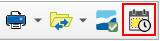

   Herramienta de recuperación temporal del estado de la red, incrustada en la barra de Utilidades

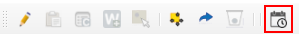

   Herramienta de inspección de cambios, incrustada en los formularios de los objetos de la red

Las herramientas de auditoría, Audit, estan subscritas al llamado módulo **audit** de Giswater, que tiene por objetivo ser un mecanismo de trazabilidad y auditoría dentro del GIS, registrando todos los cambios hechos durante el tiempo y permitiendo acceder a ellos en cualquier momento, de una forma sencilla e incrustada en el propio QGIS como herramientas propias de Giswater.

Para ver todos los detalles sobre la puesta en marcha, gestión y funcionamiento del módulo consultar la sección :ref:`additional-toolbars-audit`

- Recuperación temporal del estado de la red: permite reconstruir de forma precisa el estado histórico de la red en la extensión y fecha seleccionadas. El usuario podrá ver en tablas temporales el estado de la red durante la fecha seleccionada. A través de simbología categorizada será posible comparar si el objeto ha sido modificado o eliminado respecto la fecha actual.
- Inspección de cambios: permite consultar todas las modificaciones registradas (y auditadas) sobre el objeto en cuestión, presentando los resultados en un formulario adicional. Esta lista de versiones, ordenada cronológicamente, permite examinar la evolución completa del objeto a lo largo del tiempo.

Barra de herramientas *Campaign manage*
---------------------------------------

Barra de herramientas *Asset manage*
------------------------------------

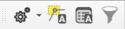

   Barra de herramientas Asset manage.

Barra de herramientas relacionada con la gestión de assets. Contiene los siguientes botones:

- Herramienta de administración: Agrupa varias funcionalidades avanzadas relacionadas con la gestión de la red. Incluye la asignación de fugas y el cálculo de prioridad (Global). Para más detalles, consultar la sección :ref:`dialog-am-administrative-tool`.
- Cálculo de prioridad por selección: Permite ejecutar el cálculo de prioridad de forma directa sobre la selección de elementos o sobre los conjuntos definidos. Para más detalles, consultar la sección :ref:`dialog-am-prioirity-calculation-by-selection`.
- Gestor de resultados: Proporciona un acceso centralizado a los resultados generados por los distintos procesos, facilitando su consulta, organización y exportación. Para más detalles, consultar la sección :ref:`dialog-am-result-manager`.
- Selector de resultados: Permite filtrar y seleccionar de manera rápida los resultados disponibles, optimizando la revisión y comparación de escenarios. Para más detalles, consultar la sección :ref:`dialog-am-result-selector`.

Formularios de los elementos
============================

Cada uno de los objetos de la red definido en los catálogos *cat_feature_* tiene un formulario asociado en el cual se muestran los campos comunes del tipo de elemento.
Es por ello que los formularios se parecen bastante unos a otros pero, como también hay campos específicos para cada tipo, existen ciertas diferencias.

Estos formularios se pueden personalizar de manera que podremos establecer qué campos queremos ver, qué etiquetas se mostrarán y de qué color, qué posición ocupan dentro del formulario...
Como son únicos para cada objeto, el nivel de personalización es tal que podremos hacer que cada formulario sea distinto a los demás.

La forma de poder visualizarlo es a través del botón *Info Giswater* y funciona para nodos, arcos, connecs, gullys, visitas y acotaciones.

.. _partes-del-formulario:

Partes del formulario
---------------------

Están formados por tres partes o layouts: el superior (1), el central (2) y el inferior (3).

Tanto el superior como el inferior serán siempre visibles mientras que la información mostrada en el medio será diferente dependiendo del objeto que estemos consultando y de la pestaña que estemos visualizando.

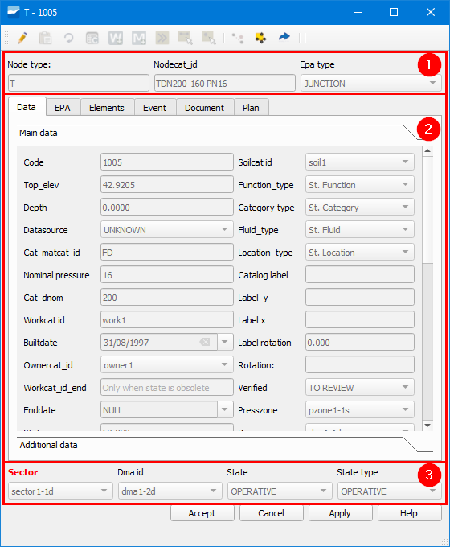

   Ejemplo de formulario de un nodo de la red de abastecimiento.

En la parte superior encontramos los widgets que hacen referencia al tipo de objeto (*Node type*) y su catálogo específico (*Nodecat_id*), además del tipo EPA (*Epa type*).

En la parte del medio encontramos la información de cada objeto organizada por pestañas.

En la parte inferior encontramos información sobre zonas del mapa (*Sector* y *Dma id*) así como se muestra su estado (*State*) y tipo de estado (*State type*).

A continuación, utilizando de ejemplo el formulario de la imagen anterior, vamos a describir las pestañas contenidas en la parte del medio.

.. note::

   Aunque se utiliza como referencia el formulario de un objeto de la red de abastecimiento, se explican las pestañas de los objetos de ambos tipos de redes.
    
- Data: contiene los datos de todos los atributos del objeto, tanto los comunes de su tipo como los específicos del tipo de objeto. Es la pestaña más importante. Dependiendo del objeto consultado veremos unos datos u otros.
- EPA: hace referencia a los datos específicos del mundo EPA (simulación hidráulica) y cambiarán en función del tipo EPA del elemento. Consta de dos columnas. La INP es utilizada para introducir los datos
  necesarios para el modelo y la RPT muestra los resultados de la simulación.
- Conections (ud): pestaña disponible **solo para nodos**. Veremos que hay dos partes. La superior donde se mostrarán todos los arcos que están aguas arriba del nodo (*Upstream features*)
  y la inferior donde se mostrarán todos los arcos que están aguas abajo del nodo (*Downstream features*).
- Elements: muestra información referente a los elementos asociados que pueda tener el objeto. En el caso de tener elementos asociados se verá una tabla con los datos correspondientes.
  Encima de la tabla hay varios botones que nos permitirán vincular o desvincular elementos existentes, añadir nuevos elementos o abrir los datos en un formulario flotante.
- Relations: pestaña disponible **solo para arcos**. En ella veremos una tabla con los objetos de red que están conectados al tramo (connecs o gullys).
- Hydrometer: pestaña disponible **solo para connecs** donde veremos una tabla con el listado de abonados asociados a la acometida.
- Hydrometer values: pestaña disponible **solo para connecs** que sirve para consultar los consumos de los abonados donde podremos filtrar por periodo y código.
- Event: al igual que para los elementos, mostrará una tabla con datos de los eventos que se han dado a lo largo del tiempo sobre nuestro objeto.
  Dichos eventos hacen referencia a todos los parámetros que se hayan registrado en una visita y tendremos información de la fecha, del tipo de parámetro y su valor
  así como de otros datos referentes a la visita. Los botones disponibles permiten abrir el gestor de visitas, añadir una nueva visita, mostrar la imagen relacionada con el evento o abrir su datos en un formulario flotante.
  En algunos casos, esta pestaña es sustituida por una llamada *Visit* la cual en vez de mostrar los eventos en formato tabla, los muestra en formato línea habiendo columnas para cada evento.
- Document: en ella visualizaremos todos los documentos vinculados al objeto donde lo más importante es el botón de la derecha, ya que nos permite abrir la ruta y visualizar el documento seleccionado.
- Plan: hace referencia al precio del objeto y mostrará un listado de los costes que tendría el elemento en el caso de ser renovado.
  Esto es especialmente interesante en el caso de los arcos, ya que tienen muchas más variables a tener en cuenta (tipo de suelo, excavación, transporte a vertedero...).
  Para poder visualizar estos precios hay que completar los catálogos *plan_price*, *cat_soil*, *cat_pavement* y asignar valores de *soilcat_id* y *pavcat_id* en la capa de arcos.

