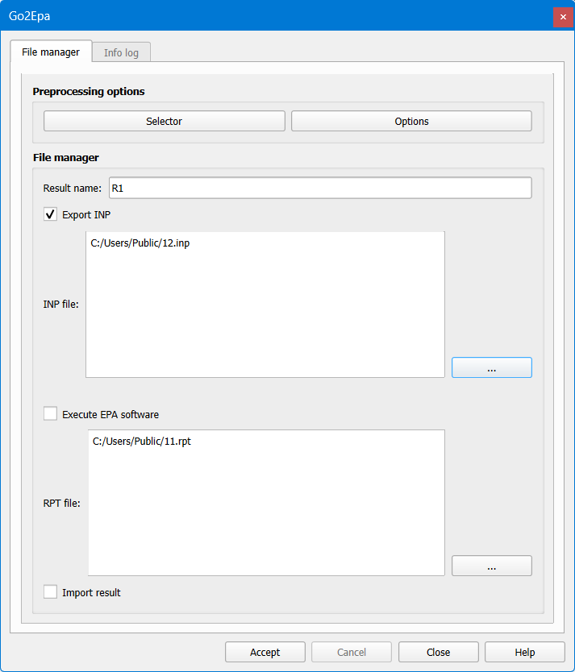
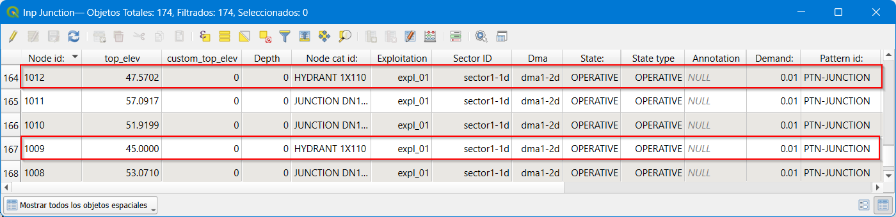
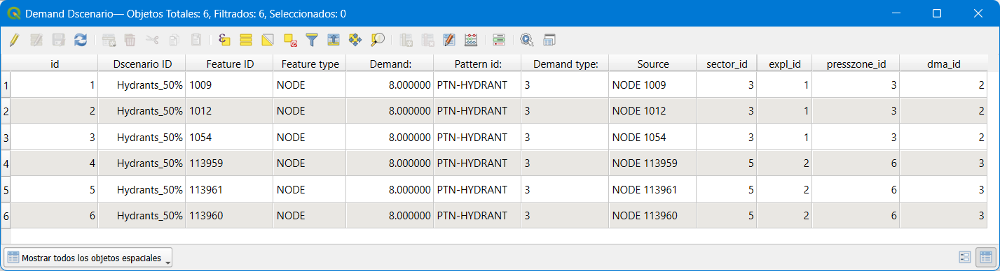
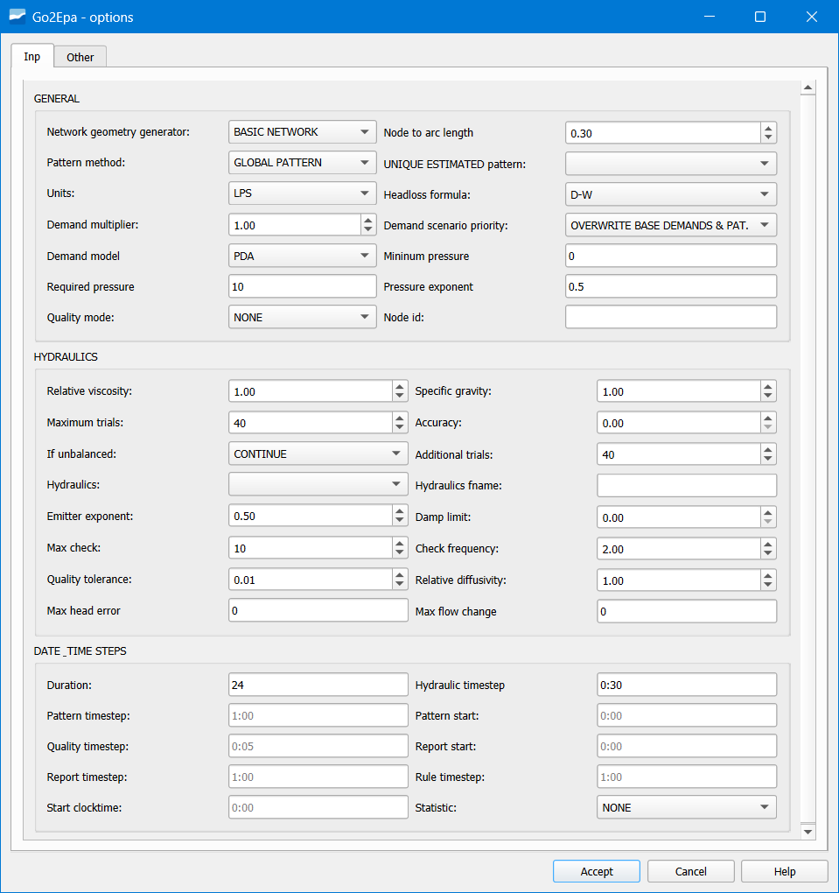

.. _export-network-for-hydraulic-modeling:

=====================================================
Exporting the network for its hydraulic modeling
=====================================================

.. only:: html

   .. contents::
      :local:

The export-import process to hydraulic model has changed with respect to previous versions of Giswater, 
pues now the plugin integrates all the functionality. Let's see some improvements added:

1. It is possible to send to model the elements according to their state (STATE) which can be operational, 
obsolete or planned, with the only condition that they have hydraulic coherence. For example, if in a sector 
**I only have a reservoir in the operational state**, and I send to hydraulic model only the **planned elements, 
this will not be possible.**

2. For the case of WS projects it is possible to configure the roughness according to the age of the pipe. 
To do this, the table *cat_mat_roughness* must be used and an age must be assigned to the element. In case of not assigning 
construction date to the element this will be considered new for the purpose of taking value of roughness.

3. Some new elements have appeared to which we have named *nodarcos*. The nodarcos are those elements that in the 
inventory management are nodes regulators of flow, as can be the case of valves or pumps, but that in hydraulic model 
must be arcs, since a flow regulator of conceptual form is always an 'arc' element that 
regulates flow between two different nodes

Exporting a supply network
========================================

For the realization of the hydraulic model it is necessary to have complete and precise data for each of the 
elements and parameters that are to be modeled, therefore, in order to understand everything required in each of the tables of 
hydraulic model, we will have the EPANET manual, which specifies in a very exact and detailed way all those 
necessary concepts.

Sector work
--------------------

The sector work allows the user to filter and send to the hydraulic model only those elements that 
belong to a certain sector, or to send several sectors at once. 
The *'sector_id'* field stores the data of the hydraulic sector to which the element belongs, and 
subsequently through the *'selector_sector'* table we filter those elements that belong to the sector/s 
selected.

It should be noted that the sector or sectors selected for the export to the hydraulic model 
must have hydraulic coherence, that is, for WS without equivalent number of water must have a water reservoir, 
which supplies the system (RESERVOIR, TANK) and at least one consumption point.

To select sectors to send to hydraulic model the basic tool 'Selector' must be used.

   From the form of the Go2Epa tool the different options can be managed.

Demand scenarios
---------------------

For the case of WS networks, demand scenarios appear. Demand scenarios 
allow the user to define different demand hypotheses on the consumption elements (JUNCTION).

In a normal case, the relationship between consumption point and demand value is 1:1 and the main 
value of the demand *'Demand'*, together with the consumption pattern *'Pattern_id'* are defined in the table 
*'inp_junction'*, as shown in the following image.

   Relationship between demand and consumption pattern in the *'inp_junction'* table.

Through the *'inp_dscenario_demand'* table, the user can apply an alternative demand to the main demand 
of the consumption node and at the same time change the demand pattern. For this, first a new scenario is created in the catalog table *'cat_dscenario'* and subsequently the node element is linked to the new demand and the scenario to which it belongs, as shown below. **#TELL ABBY THAT I DON'T SEE A TABLE CALLED INP_DEMAND FIND ONE CALLED inp_dscenario_demand PREG IF IT'S OK?**

   Demand scenario linkage.

Transformation of nodes to arcs
-------------------------------

Giswater solves this duality with the *'nodarco'* elements, elements that by their characteristics 
in the inventory are nodes, but by their behavior as a flow regulator in the hydraulic model 
must be an arc. This *'nodarco'* element is defined at demand by the user in the system table 
(node_type).

All those elements that are labeled as SHORTIPE / VALVE / PUMP are elements of type 
*'nodarco'*, and consequently their model information is stored in the tables:

- inp_shortpipe
- inp_valve
- inp_pump

For a *'nodarco'* element to be valid, it must generally contain 1 or 2 extreme arcs, otherwise the node will not be valid and will not become an arc.

The transformation process from NODE to ARC is the following:

- A new ARC type geometry of 0.5 meters or less (suffix _n2a) is generated.
- Two new JUNCTION type nodes (suffixes n2a1 'initial node' and n2a2 'final node') are generated.
- The arc geometries are 'cut' and reconnected to the new nodes to give room for the new arc.
- The attributes of the JUNCTION elements are inherited from the parent node.
- The attributes of the ARC elements are inherited from one of the two extreme arcs (material, diameter, etc.)

Possibility of multiple pump
-------------------------

When representing a pump within Giswater, it is possible that the relationship between the 
element and its behavior in the hydraulic model is not 1:1, that is, (a pump element 
equals a pump type flow regulator), but it contains more than one pump and therefore a 
relation 1:n with the element is generated, (a catalog element of type pump equals several flow regulators).

All flow regulators labeled as PUMP store their information in the *'inp_pump'* table, which must be completed with the parameters that regulate the operation of that pump, therefore, by default the relationship between the node and the number of pumps is 1:1.

Through the *'inp_pump_additional'* table, Giswater allows the user to manage more than one pump 
for a single pump element. In this table the id of the parent node, the number of pump defined in that node with respect to the total number of additional pumps and the working parameters of each of the additional pumps must be indicated, as shown in the following example:

.. figure:: img/export-network-for-hydraulic-modeling/pump_additional.png

   *Pump Additional* window.

The example shows two additional pumps to the node '1105', that is, that node, when exported to the hydraulic model, will be transformed into three *'pump'* type arcs each with their own working parameters.

Different simulation options
---------------------------------

   All possible export options.

.. figure:: img/export-network-for-hydraulic-modeling/options.png

   How the most important options are combined: NETWORK GEOMETRY GENERATOR, DEMAND TYPE & PATTERN METHOD.

The relationship established between them is complex and is detailed in the following table:

https://github.com/Giswater/docs/blob/master/github/pdf/go2epa_methods.pdf

On the other hand, regarding the management of the state of the valves of a supply network it is usually something dynamic, depending on the needs of the user the state of the same may be one or the other to perform the hydraulic simulation of the model. This modification of the state of the valves must be done, either by changes made in the inventory (broken valve, valve out of service, etc.) or by changes in its state when generating a cut polygon.

Así pues, se puede decir que las válvulas podrán tener diferente estado en función de la 
table in which the data is stored: *'inp_shorpipe', 'man_valve'* or *'anl_result_mincut_valve'*.

Through the *'Options'* button within the hydraulic model export form, the user can choose the state of the valves that will be used in that simulation.

- EPA TABLE: Those whose state is 'In service' or 'Planned' in the *'inp_shortpipe'* layer.

- INVENTORY VALUES: Those whose state is 'In service' or 'Planned' in the layer 
*'man_valve'*.

- MINCUT RESULT: Those valves that have been affected by the results generated by the cut polygon.
At the same time, the user can choose through the 'Mincut result id' dropdown the results of the cut polygon that he wants to model.

Exporting a sanitation and urban drainage network
======================================================

For the realization of the hydraulic model it is necessary to have complete and precise data 
for each of the elements and parameters that are to be modeled, therefore, in order to understand everything required in each of the hydraulic model tables, we will have the SWMM manual, 
which specifies in a very exact and detailed way all those necessary concepts.

Sector work
--------------------

The sector work allows the user to filter and send to the hydraulic model only those elements that 
belong to a certain sector, or to send several sectors at once.
The *'sector_id'* field stores the data of the hydraulic sector to which the element belongs, and 
subsequently through the *'selector_sector'* table we filter those elements that belong to the sector/s 
selected.

It should be noted that the sector or sectors selected for the export to the hydraulic model 
must have hydraulic coherence, that is, for UD networks the minimum requirements would be an entry point of water into the system, either through pluvial application in the (SUBCATCHMENTS) or through wastewater (DWF), 
and an exit point from the system (OUTFALL).

Hydrology scenarios management
-----------------------------------

For the case of UD networks, hydrology scenarios appear. Hydrology scenarios 
allow the user to define different hypotheses on the infiltration method, surface runoff, groundwater, etc. applied to the drainage subcatchments (SUBCATCHMENTS).

Through the catalog table *'cat_hydrology'* an element of catalog referring to the data related to water flows that enter naturally into the system is defined, indicating 
the identifier, a name and the infiltration method used.

The infiltration methods recognizable by SWMM are: *number of curve, Green-Ampt* or 
*Horton's equation*.

Once the hydrology catalog is defined, in the *inp_subcatchment* table each drainage subcatchment is related to the hydrology catalog to which it belongs, through the *Hydrology ID* field.

.. figure:: img/export-network-for-hydraulic-modeling/inp_subcatchment.png
   
   *Hydrology ID* field in the *inp_subcatchment* table.

This relationship allows applying different calculation hypotheses on the same drainage subcatchment, and with the hydrology selector select those we want to use for the simulation.

It is important to note that the fields filled that refer to the infiltration method in the *inp_subcatchment* table must be recognizable by the hydrology catalog that is imputed to them.

Integration of the normalized SWMM shape catalog
------------------------------------------------------

Giswater integrates into its system the different varieties of geometric sections that SWMM accepts 
SWMM to catalog the conduits of a UD network. Through the arc catalog table, the different types of conduits are defined, filling the following mandatory fields: *id, matcat_id, shape* and the *geom* fields necessary to define the shape (shape). 

To know what data to put in these fields, the SWMM section catalog must be consulted and known how this catalog and the table of normalized section values (*cat_arc_shape*) work in an integrated way.

In this sense it should be noted that the *cat_arc_shape* table is composed of the following fields:

- **Id:** name of the shape (in our language) of our catalog (it is the one that acts as the value domain of the *cat_arc_shape* field).

- **Epa:** name that the shape receives in SWMM (consult the SWMM section catalog).

- **tsect_id:** for the case of irregular open shapes, the label of the set of values of the *inp_transects* table that define the irregular geometry according to the HEC format.

- **curve_id:** for the case of shapes not contemplated in the catalog of the attached document, the name of the curve defined in the *inp_curve* table that defines the pairs of values that form the detail of the shape of this section.

- **image:** system field with the name of the png file that is stored in the plugin Giswater folder (plugins/giswater/png) and that is called when an info is made about an arc type element and a click is made on the cost tab.

- **descript:** auxiliary descriptive field of the section.

- **active:** boolean field that allows controlling if a shape is active in our catalog or has been deactivated and is not selectable.

Therefore, if we take as reference the previous information, and consult the SWMM section catalog, we are in a position to fill the *geom* fields according to the chosen shape.

Next, two examples of the relationship between the *cat_arc_shape* table and the *cat_arc* arc catalog are shown.

If I wanted to catalog conduits circular, for example, as 'Round' this translates into:

 **For the *cat_arc_shape* table,**

 cat_arc_shape.id = 'Round'

 cat_arc_shape.epa = 'CIRCULAR'    

 cat_arc_shape.image = 'ud_section_circular.png'

 **And in the *cat_arc* table,**

 cat_arc.shape = 'Round'

 cat_arc.geom1 = The value expressed in meters of the interior diameter of the element

If I wanted to catalog my rectangular closed conduits, for example, as 'Rectangular' this translates into:

 **For the *cat_arc_shape* table,**

 cat_arc_shape.id = 'Rectangular'

 cat_arc_shape.epa = 'RECT_CLOSED'    

 cat_arc_shape.image = 'ud_section_rect_closed.png'

 **Y en la tabla cat_arc,**

 cat_arc.shape = 'Rectangular'

 cat_arc.geom1 = The value expressed in meters of the vertical interior dimension of the element

 cat_arc.geom2 = The value expressed in meters of the horizontal interior dimension of the element

It should be noted that in reality the *cat_arc_shape* table is already filled with all the normalized shapes of SWMM, therefore, expanding this catalog according to our needs is quite simple to understand and proceed.

Three basic rules are always met:

1. The value of *cat_arc_shape.id* can be the one one wants, but the value of *cat_arc_shape.epa* **must always be normalized** to one of the values of the SWMM section catalog.

2. All measures (*cat_arc.geom*) **are interior** and must be expressed in **meters.**

3. The values of *cat_arc.geom1* always correspond to the vertical dimension of the element, as well as the values of *cat_arc.geom2* always correspond to the horizontal dimension of the element

For the other cases, consult the SWMM section catalog.

.. figure:: img/export-network-for-hydraulic-modeling/cuts.png
   
   Table with the different sections of SWMM that Giswater incorporates as a method of inventorying the shape of the conduits.

Flow regulators
--------------------

For the management of different flow regulators, version 4.0 of Giswater maintains the same logic as in previous versions where virtual arcs can be assigned an EPA element.

In this sense, two types of virtual arcs appear, those that enter the node (which would be the prolongation of the conduit that precedes it) and those that leave the node (which would be the flow regulator).

In the first case the **virtual** arc is simply a flow propagator, to which apart from the own characteristics of the element, the direction to which it drains (the node 2) must be indicated. 
In this way, when exporting to the hydraulic model, what Giswater does is join this virtual arc with its predecessor, converting the two into one of only.

In this way, when exporting to the hydraulic model, what Giswater does is join this virtual arc with its predecessor, converting the two into one of only.

In a practical case, the virtual flow propagators, would be applied to nodes of large dimensions such as reservoirs or chambers, whose arcs that reach it would not connect in the center, but would remain on the perimeter of this, and the connection between these two points would be what is called **virtual arc.**

In the second case the **virtual** arc behaves as a flow regulator, flow regulators are structures or devices used to control and derive the flows within the transport system. The flow regulators that SWMM can model are the following and their information is stored in the following tables:

- Orifices (orifice), table: inp_flwreg_orifice

- Weirs (weirs), table: inp_flwreg_weir

- Outlets (outlets), table: inp_flwreg_outlet

- Pumps (pump), table: inp_flwreg_pump

In the tables mentioned above, when introducing a new flow regulator, the following parameters must be defined: origin node, destination arc, regulation ordinal (if we want to introduce more than one regulator between that node and that arc with that type of regulation), and finally the different parameters that control that regulator. 
must define the following parameters: origin node, destination arc, regulation ordinal (if we want to introduce more than one regulator between that node and that arc with that type of regulation), and finally the different parameters that control that regulator. 

In the particular case of if just after the node there is a virtual arc, the *exit_conduit* field must not be the arc_id of the virtual arc but must be the arc_id of the conduit that receives the flow, since the fusion operation of the virtual arcs with this conduit is coupled with the arc_id of the conduit.

In case of coexisting more than one regulator between a node and a given arc, when exporting, the system draws for SWMM as many arcs as regulators exist.

Aspects to consider with the flw_length parameter:

- The flw_length parameter is the length of the flow regulator.

- In case of there being more than one flow regulator between a node and an arc, the system will take the maximum value.

- The length of the flow regulator is important for the case of overflows or orifices and refers to the distance downstream of the same in which it is not possible to assume normal flow conditions in the conduit, that is, it is an ineffective length of the downstream conduit.

