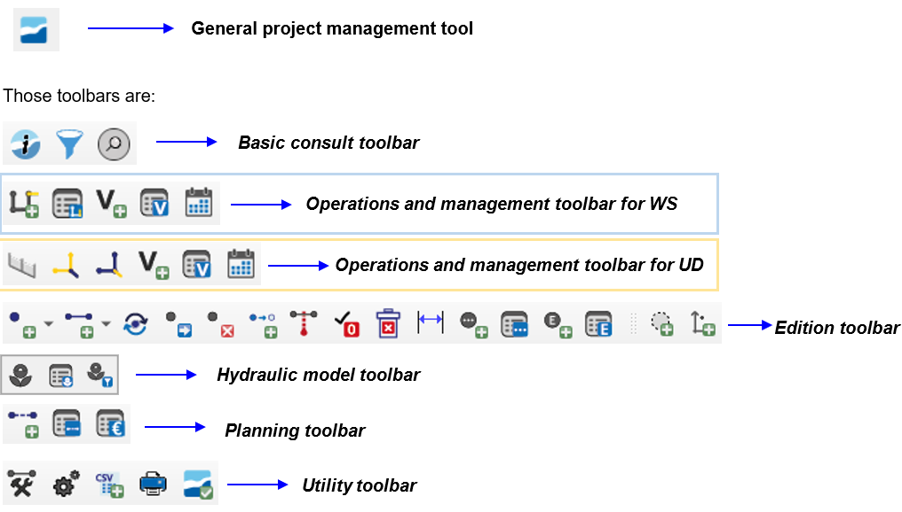

===============
Giswater plugin
===============

One of the most significant and notable improvements in the fourth version of Giswater, compared to previous versions,
can be found in the tools of the plugin. Not only have new capabilities been added, but the existing tools have been improved one by one.

The Giswater plugin is the part of the software with which the user must be most familiar,
since most of the actions they want to perform can be done using the tools available in the plugin.
In any way, everything they want to do in their network can be done using the plugin and the buttons it includes.

Currently, Giswater has up to 38 tools available, divided into different toolbars that must be associated with the six roles that exist in Giswater.
In addition to these management tools within projects, since version 3.1.105, a button has been added that includes the functionality of creating,
modifying and updating schemas.

Next, the functionality and objective of each of the tools will be detailed.

.. TODO: Añadir cada sección separada con su toctree

.. toctree::
   :maxdepth: 2
   :caption: Editing buttons

   
   

