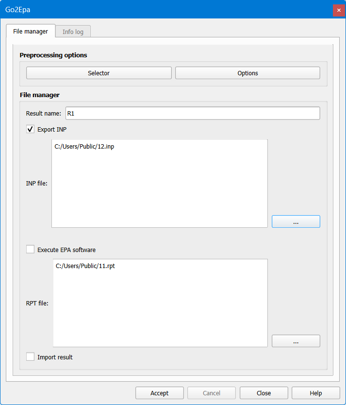
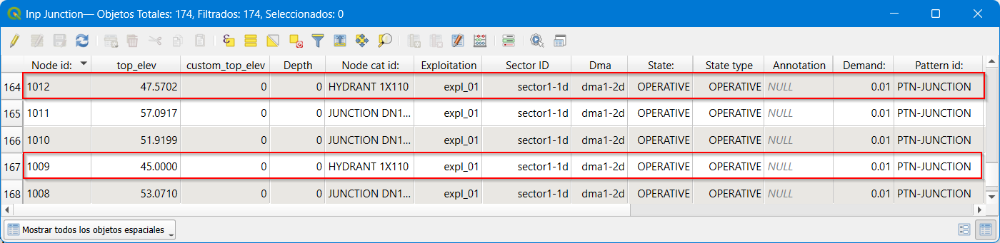
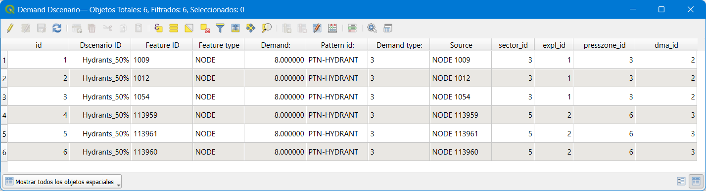
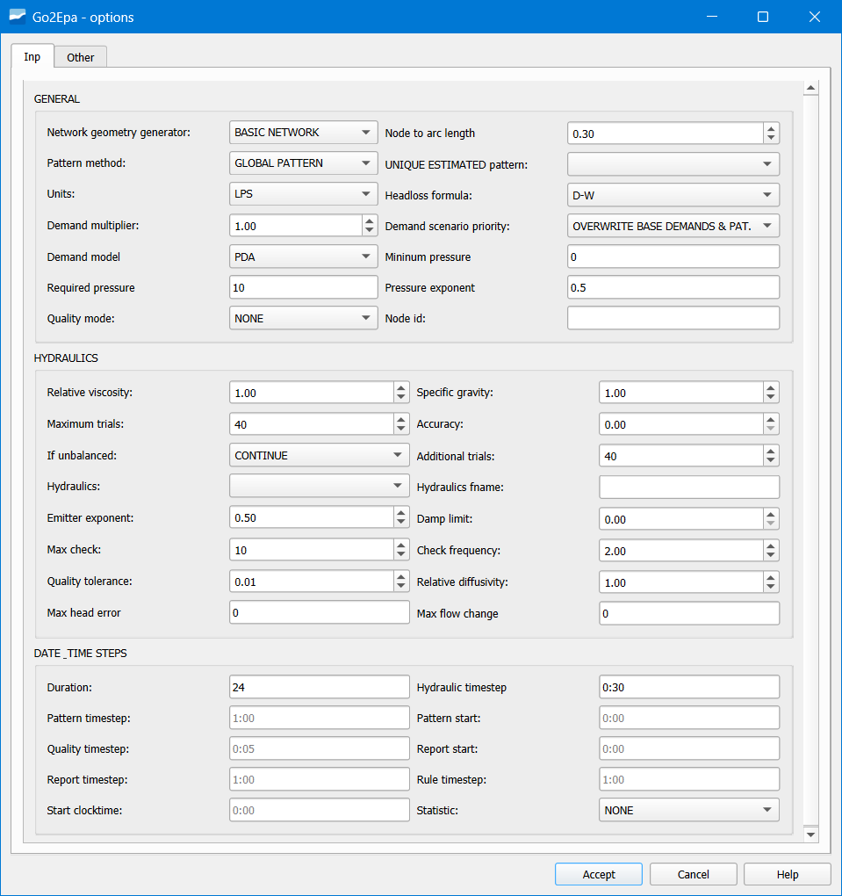
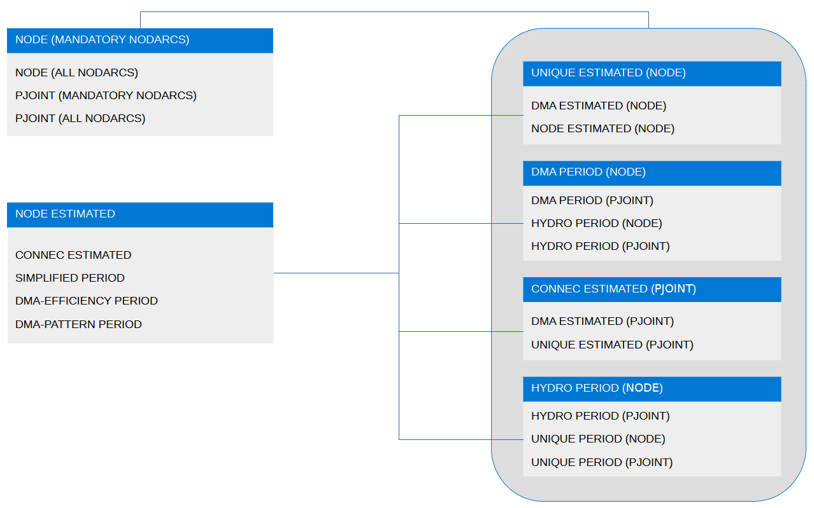
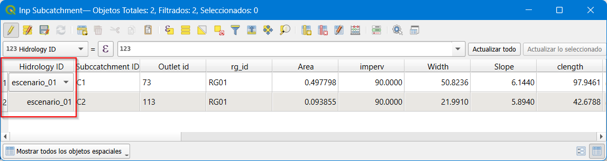
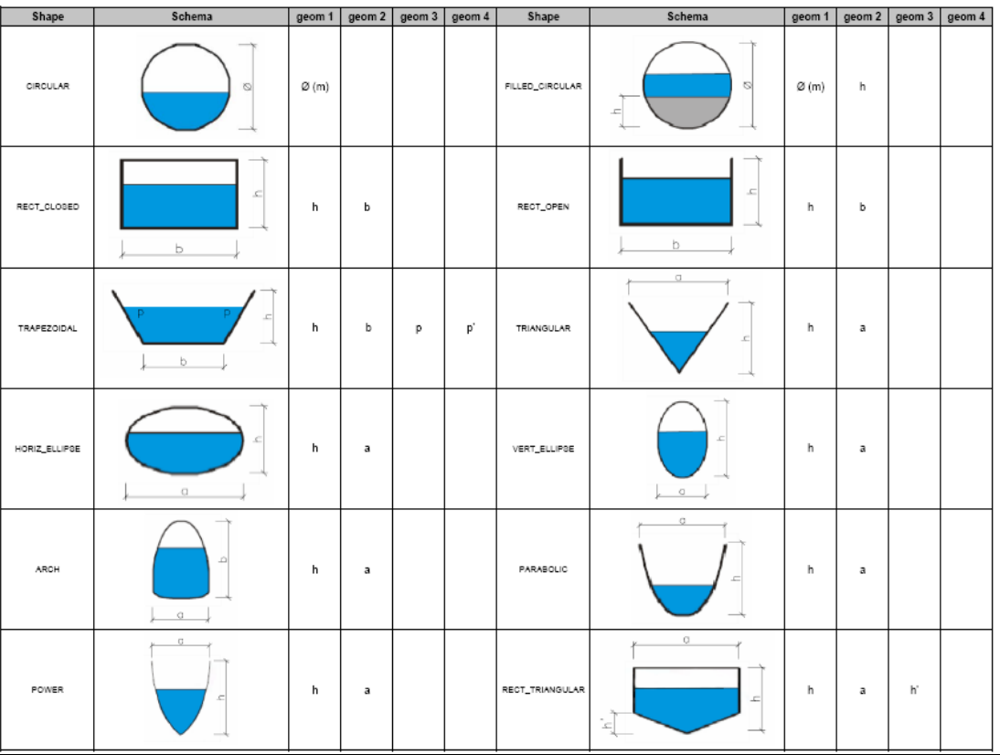

=====================================================
Exportación de la red para su modelización hidráulica
=====================================================

El proceso de exportación-importación a modelo hidráulico ha cambiado respecto versiones anteriores de Giswater, 
pues ahora el plugin integra toda la funcionalidad. Veamos algunas mejoras añadidas:

1. Se pueden enviar a modelo los elementos en función de su estado (STATE) que puede ser en operativo, 
obsoleto o planificado, con la única condición que tengan coherencia hidráulica. Por ejemplo, si en un sector 
**únicamente tengo un depósito en estado en servicio**, y mando a modelo hidráulico solo los **elementos planificados, 
esto no va a poder ser.**

2. Para el caso de proyectos WS es posible configurar la rugosidad en función de la edad de la tubería. 
Para ello se debe usar la tabla *cat_mat_roughness* y se debe asignar una edad al elemento. En caso de no asignar 
fecha de construcción al elemento este se considerará nuevo a efectos de tomar valor de rugosidad.

3. Aparecen unos elementos nuevos a los que hemos nombrado *nodarcos*. Los nodarcos son aquellos elementos que en la 
gestión de inventario son nodos reguladores de flujo, como puede ser el caso de válvulas o bombas, pero que en modelo 
hidráulico deben ser arcos, puesto que un regulador de flujo de forma conceptual siempre es un elemento 'arco' que 
regula flujo entre dos nodos diferentes

Exportación de una red de abastecimiento
========================================

Para la realización del modelo hidráulico es necesario disponer de datos completos y precisos para cada uno de los 
elementos y parámetros que se desee modelar, así pues, para entender todo lo requerido en cada una de las tablas de 
modelo hidráulico, dispondremos del manual de EPANET, el cual especifica de manera muy exacta y detallada todos aquellos 
conceptos necesarios.

Trabajo por sectores
--------------------

El trabajo por sectores permite al usuario filtrar y enviar al modelo hidráulico únicamente aquellos elementos que 
pertenecen a un sector determinado, o bien enviar varios sectores a la vez. 
El campo *'sector_id'* almacena los datos del sector hidráulico al cual pertenece dicho elemento, y 
posteriormente mediante la tabla *'selector_sector'* nos filtra aquellos elementos que pertenecen al sector/s 
seleccionado.

Cabe destacar que el sector o sectores seleccionados para la exportación al modelo hidráulico 
deben tener coherencia hidráulica, es decir, para WS sin equanum debe haber una reserva hídrica, 
la cual abastece el sistema (RESERVOIR, TANK) y como mínimo un punto de consumo.

Para seleccionar sectores para enviar a modelo hidráulico debe usarse la herramienta básica de 'Selector'.

   Desde el formulario de la herramienta Go2Epa se pueden gestionar las diferentes opciones.

Escenarios de demanda
---------------------

Para el caso de redes de WS, aparecen los escenarios de demanda. Los escenarios de demanda 
permiten al usuario definir diferentes hipótesis de demanda sobre los elementos de consumo (JUNCTION).

En un caso normal, la relación entre punto de consumo y valor de la demanda es 1:1 y el valor principal 
de la demanda *'Demand'*, junto con el patrón de consumo *'Pattern_id'* se definen en la tabla 
*'inp_junction'*, como se muestra en la siguiente imagen.

   Relación entre demanda y patrón de consumo en la tabla *'inp_junction'*.

Mediante la tabla *'inp_dscenario_demand'*, el usuario puede aplicar una demanda alternativa a la demanda 
principal del nodo de consumo y a su vez cambiar el patrón de demanda. Para ello en primer lugar se 
crea el nuevo escenario en la tabla de catálogo *'cat_dscenario'* y posteriormente se vincula el 
elemento nodo con la nueva demanda y al escenario al que pertenece, tal y como se muestra a 
continuación. **#DECIRLE A ABEL QUE NO VEO UNA TABLA LLAMADA INP_DEMAND ENONTRE UNA QUE SE LLAMA inp_dscenario_demand PREG SI ESTA BIEN?**

   Vinculación de escenarios de demanda.

Transformación de nodos a arcos
-------------------------------

Giswater resuelve esta dualidad con los elementos *'nodarco'*, elementos que por sus características 
en el inventario son nodos, pero por su comportamiento de regulador de flujo en el modelo hidráulico 
deben ser un arco. Este elemento *'nodarco'* se define a demanda del usuario en la tabla de sistema 
(node_type).

Todos aquellos elementos que sean etiquetados como SHORTIPE / VALVE / PUMP, son elementos tipo 
*'nodarco'*, y por consiguiente su información de modelo se almacene en las tablas:

- inp_shortpipe
- inp_valve
- inp_pump

Para que un elemento *'nodarco'* sea válido, debe cumplir por regla general que contenga 1 o 2 arcos 
extremales, en caso contrario el nodo no será válido y no pasará a ser un arco.

El proceso de transformación de NODO a ARCO es el siguiente:

- Se genera una nueva geometría tipo ARCO de 0,5 metros o menos (sufijo _n2a)
- Se generan dos nuevos nodos tipo JUNCTION (sufijos n2a1 ''nodo inicial' y n2a2 'nodo final')
- Se 'recortan' y reconectan a los nuevos nodos las geometrías arco de los arcos existentes para dar cabida al nuevo arco
- Los atributos de los elementos JUNCTION se heredan del nodo padre.
- Los atributos de los elementos ARCO se heredan de uno de los dos arcos extremales (material, diámetro, etc.)

Posibilidad de multibomba
-------------------------

Al representar un bombeo dentro de Giswater, cabe la posibilidad de que la relación entre el 
elemento y su comportamiento en el modelo hidráulico no sea 1:1, es decir, (un elemento bombeo 
equivale a un regulador de flujo tipo bomba), sino que contenga más de una bomba y por lo 
tanto se nos genere una relación 1:n con el elemento, (un elemento de catastro tipo bombeo 
equivale a varios reguladores de flujo).

Todo regulador de flujo etiquetado como PUMP, almacena su información en la 
tabla *'inp_pump'*, la cual se deberá completar con los parámetros que regulan el 
funcionamiento de dicha bomba, así pues, por defecto la relación que se genera entre el 
nodo y el número de bombas es 1:1.

Mediante la tabla *'inp_pump_additional'*, Giswater permite al usuario gestionar más de una bomba 
para un único elemento tipo bombeo. En dicha tabla se debe indicar el id del nodo padre, el 
número de bomba definida en ese nodo respecto el número total de bombas adicionales y los 
parámetros de trabajo de cada una de las bombas adicionales, tal y como se muestra en el 
siguiente ejemplo:

.. figure:: img/mod_hidraulic/pump_additional.png.png

   Ventana *Pump Additional*.

El ejemplo muestra dos bombas adicionales al nodo '1105', es decir, dicho nodo, cuando se 
exporte al modelo hidráulico, se transformará en tres arcos tipo *'pump'* cada uno con sus propios 
parámetros de trabajo.

Diferentes opciones de simulación
---------------------------------

   Todas las opciones de exportación posibles.

   Cómo se combina las opciones más importantes: NETWORK GEOMETRY GENERATOR, DEMAND TYPE & PATTERN METHOD.

La relación que se establece entre ellas es compleja y se detalla en el presente cuadro:

https://github.com/Giswater/docs/blob/master/github/pdf/go2epa_methods.pdf

Por otro lado, respecto la gestión del estado de las válvulas de una red de abastecimiento suele 
ser algo dinámico, en función de las necesidades del usuario el estado de las mismas podrá ser 
uno u otro para realizar la simulación hidráulica del modelo. Esta modificación del estado de 
las válvulas se debe, ya sea por cambios realizados en el inventario (válvula rota, válvula 
fuera de servicio, etc.) o bien cambios puntuales de su estado al generar un polígono de corte.

Así pues, se puede decir que las válvulas podrán tener diferente estado en función de la 
tabla en la que se almacenen los datos: *'inp_shorpipe', 'man_valve'* o *'anl_result_mincut_valve'*.

Mediante el botón de *'Opciones'* dentro del formulario de exportación al modelo hidráulico, 
el usuario podrá escoger el estado de las válvulas que utilizará en dicha simulación.

- EPA TABLE: Aquellas cuyo estado sea 'En servicio' o 'Planificado' en la capa *'inp_shortpipe'*.

- INVENTORY VALUES: Aquellas cuyo estado sea 'En servicio' o 'Planificado' en la capa 
*'man_valve'*.

- MINCUT RESULT: Aquellas válvulas que en función de los resultados generados por el polígono 
de corte se han visto afectadas. A su vez, el usuario podrá escoger mediante el desplegable 
de 'Mincut result id', los resultados del polígono de corte que desee modelar.

Exportación de una red de saneamiento y drenaje urbano
======================================================

Para la realización del modelo hidráulico es necesario disponer de datos completos y precisos 
para cada uno de los elementos y parámetros que se desee modelar, así pues, para entender todo 
lo requerido en cada una de las tablas de modelo hidráulico, dispondremos del manual de SWMM, 
el cual especifica de manera muy exacta y detallada todos aquellos conceptos necesarios.

Trabajo por sectores
--------------------

El trabajo por sectores permite al usuario filtrar y enviar al modelo hidráulico únicamente 
aquellos elementos que pertenecen a un sector determinado, o bien enviar varios sectores a 
la vez.
El campo *'sector_id'* almacena los datos del sector hidráulico al cual pertenece dicho 
elemento, y posteriormente mediante la tabla *'selector_sector'* nos filtra aquellos elementos 
que pertenecen al sector/es seleccionado.

Cabe destacar que el sector o sectores seleccionados para la exportación al modelo 
hidráulico deben tener coherencia hidráulica, es decir, para redes de UD los requisitos 
mínimos serian un punto de entrada de agua al sistema, ya bien sea pluviales, mediante la 
aplicación de una lluvia en las (SUBCATCHMENTS) o bien, mediante aguas residuales (DWF), 
y un punto de salida del sistema (OUTFALL).

Gestión de escenarios de hidrología
-----------------------------------

Para el caso de redes de UD, aparecen los escenarios de hidrología. Los escenarios de 
hidrología permiten al usuario definir diferentes hipótesis sobre el método de infiltración, 
escorrentía superficial, aguas subterráneas, deshielo, etc. aplicado a las subcuencas de 
drenaje (SUBCATCHMENTS).

Mediante la tabla de catálogo *'cat_hydrology'* se define un elemento de catálogo referido a 
los datos relativos a flujos de agua que entran de forma natural en el sistema, indicando 
el identificador, un nombre y el método de infiltración utilizado.

Los métodos de infiltración reconocibles por SWMM son: *número de curva, Green-Ampt* o bien 
*ecuación de Horton*.

Una vez definido el catálogo de hidrología, en la tabla *inp_subcatchment* se relaciona cada 
subcuenca de drenaje con el catálogo de hidrología al cual pertenece, mediante el campo 
*Hydrology ID*.

   
   Campo *Hydrology ID* en la tabla inp_subcatchment.

Esta relación permite aplicar diferentes hipótesis de cálculo sobre una misma subcuenca de 
drenaje, y con el selector de hidrología seleccionar aquellas que deseamos utilizar para 
la simulación.

Importante destacar que los campos rellenados que hacen referencia al método de infiltración 
en la tabla *inp_subcatchment*, deben ser reconocibles por el catálogo de hidrología que 
se les imputa.

Integración del catálogo de formas normalizado de SWMM
------------------------------------------------------

Giswater integra en su sistema las distintas variedades de secciones geométricas que admite 
SWMM para catalogar los conductos de una red de UD. Mediante la tabla de catálogo de arcos, 
se definen las diferentes tipologías de conductos, rellenando los siguientes campos 
obligatorios: *id, matcat_id, shape* y los campos *geom* necesarios para definir la forma (shape). 

Para saber que datos hay que poner en estos campos se debe consultar el catálogo de 
secciones de SWMM y conocer cómo funcionan de forma integrada este catálogo y la tabla 
de dominio de valores de secciones normalizadas (*cat_arc_shape*).

En este sentido comentar que la tabla cat_arc_shape está compuesta por los siguientes campos:

- **Id:** nombre de la forma (en nuestro idioma) de nuestro catálogo (es la que actúa cómo 
dominio de valores del campo cat_arc_shape).

- **Epa:** nombre que recibe la forma en SWMM (consultar catálogo de secciones de SWMM).

- **tsect_id:** para el caso de formas irregulares abiertas, etiqueta del conjunto de 
valores de la tabla inp_transects que definen la geometría irregular según el formato del HEC.

- **curve_id:** para el caso de formas no contempladas en el catálogo del documento adjunto, 
nombre de la curva definida en la tabla inp_curve que define los pares de valores 
que conforman el detalle de forma de esta sección.

- **image:** campo de sistema con el nombre del archivo png que se almacena en la carpeta 
del plugin Giswater (plugins/giswater/png) y que es llamada cuando se hace una 
info sobre un elemento tipo arco y se hace clic en el tab de cost.

- **descript:** campo auxiliar descriptivo de la sección.

- **active:** campo booleano que nos permite controlar si es una forma que está activa 
en nuestro catálogo o se ha dado de baja y no es seleccionable.

Con lo cual, si tomamos por referencia la información anterior, y consultamos el 
catálogo de secciones de SWMM, ya estamos en disposición de llenar los campos *geom* en 
función de la forma escogida.

A continuación, se muestran dos ejemplos de la relación entre la tabla *cat_arc_shape* 
y el catálogo de arcos *cat_arc*.

Si quisiera catalogar conductos circulares, por ejemplo, como 'Redondo' esto se traduce en:

 **Para la tabla cat_arc_shape,**

 cat_arc_shape.id = 'Redondo'

 cat_arc_shape.epa = 'CIRCULAR'    

 cat_arc_shape.image = 'ud_section_circular.png'

 **Y en la tabla cat_arc,**

 cat_arc.shape = 'Redondo'

 cat_arc.geom1 = El valor expresado en metros de diámetro interior del elemento

Si quisiera catalogar mis conductos rectangulares cerrados, por ejemplo, como 
'Rectangular' esto se traduce en:

 **Para la tabla cat_arc_shape,**

 cat_arc_shape.id = 'Rectangular'

 cat_arc_shape.epa = 'RECT_CLOSED'    

 cat_arc_shape.image = 'ud_section_rect_closed.png'

 **Y en la tabla cat_arc,**

 cat_arc.shape = 'Rectangular'

 cat_arc.geom1 = El valor expresado en metros de la dimensión vertical interior del elemento

 cat_arc.geom2 = El valor expresado en metros de la dimensión horizontal interior del elemento

Comentar que en realidad la table *cat_arc_shape* ya viene llena con todas las formas 
normalizadas de SWMM, con lo cual ampliar este catálogo en función de nuestras 
necesidades resulta bastante sencillo de entender y proceder.

Siempre se cumplen **TRES REGLAS BÁSICAS:**

1. El valor de cat_arc_shape.id puede ser el que uno quiera, en cambio el valor de 
cat_arc_shape.epa **siempre debe ser normalizado** a uno de los valores del catálogo de 
secciones de SWMM.

2. odas las medidas (*cat_arc.geom*) **son interiores** y deben estar expresadas en **metros.**

3. Los valores de cat_arc.geom1 siempre se corresponden con la dimensión vertical del elemento, así como los valores de cat_arc.geom2 siempre se corresponden con dimensión horizontal del elemento

Para los otros casos, consultar el catálogo de secciones de SWMM.

   
   Tabla con las distintas secciones de SWMM que Giswater incorpora como método de inventariar la forma de los conductos.

Reguladores de flujo
--------------------

Para la gestión de los diferentes reguladores de flujo, la versión 4.0 de Giswater mantiene la misma 
lógica que en versiones anteriores donde a los arcos virtuales se les puede asignar un elemento EPA.

En este sentido aparecen dos tipos de arcos virtuales, los que entran al nodo (que sería la 
prolongación de la conducción que le precede) y los que salen del nodo (que sería el regulador de flujo).

En el primer caso el arco **virtual** es simplemente un propagador de flujo, al cual se le debe indicar 
a parte de las características propias del elemento, la dirección a la que drena (el nodo 2). 
De esta manera al realizar la exportación al modelo hidráulico lo que hace Giswater es juntar este 
arco virtual con su predecesor, convirtiendo los dos en uno de solo.

A su vez si el campo *add_length* lo tenemos en *true*, la longitud del arco virtual se sumará en 
el momento de fusionarse, en cambio sí lo tenemos en *false*, la longitud de dicho elemento no se sumará.

En un caso práctico, los arcos virtuales propagadores de flujo, se aplicarían a nodos de grandes 
dimensiones como depósitos o cámaras, cuyos arcos que le llegan no conectarían en el centro, 
sino que se quedarían en el perímetro de este, y el tramo de conexión entre estos dos puntos sería 
lo que se denomina **arco_virtual.**

En el segundo caso el arco **virtual** se comporta como un regulador de flujo, los reguladores 
de flujo son estructuras o dispositivos utilizados para controlar y derivar los caudales 
dentro del sistema de transporte. Los elementos reguladores de caudal que puede modelar 
SWMM son los siguientes y su información se almacena en las siguientes tablas:

- Orificios (orifice), tabla: inp_flwreg_orifice

- Vertederos (weirs), tabla: inp_flwreg_weir

- Descargas (outlets), tabla: inp_flwreg_outlet

- Bombas (pump), table: inp_flwreg_pump

En las tablas nombradas anteriormente, en el momento de introducir un nuevo regulador de flujo se 
le deben definir los siguientes parámetros: nodo origen, arco destino, ordinal de regulación (por si queremos 
introducir más de un regulador entre ese nodo y ese arco con ese tipo de regulación), y por 
último los diferentes parámetros que controlan dicho regulador. 

En el caso particular de si justo después del nodo existe un arco virtual, el campo *exit_conduit* 
no debe ser el arc_id del arco virtual sino debe ser el arc_id del conduit que recibe el flujo, 
puesto que la operación de fusión de los arcos virtuales con el conducto este se acopla con el arc_id del conducto.

En caso de coexistir más de un regulador entre un nodo y un arco dados, en el momento de 
la exportación, el sistema dibuja para SWMM tantos arcos como reguladores existan.

Aspectos a tener en cuenta con el parámetro flw_length:

- El parámetro flw_length es la longitud del regulador de flujo.

- En caso de existir más de un regulador de flujo entre un nodo y un arco el sistema 
cogerá el valor máximo.

- La longitud del regulador de flujo es importante para el caso de aliviaderos u orificios 
y hace referencia a la distancia aguas abajo del mismo en la que no se puede suponer 
condiciones normales de flujo en el conducto, es decir, se trata de una longitud inefectiva del conducto aguas abajo.

