===============================
Instalación y puesta en marcha
===============================

En este apartado, el usuario encontrará una guía detallada para la instalación y configuración del software necesario para trabajar con Giswater.
Este proceso incluye los pasos previos requeridos, la instalación de los programas necesarios.

.. toctree::
   :maxdepth: 2
   :caption:  SOFTWARE NECESARIO

Para trabajar con Giswater será necesario, como mínimo, contar con la instalación de dos programas en nuestro entorno

**PostgreSQL:** Es la base de datos que almacena toda la información relacionada con el proyecto.
El proceso de instalación debe incluir la selección de pgAdmin (Gestor de Bases de Datos) y la extensión espacial PostGIS.

**QGIS:** Software de geoprocesamiento o Programa GIS con capacidad para representar geográficamente la red e interactuar con ella.

PostgreSQL puede estar en nuestra máquina o en cualquier servidor donde tengamos acceso. QGIS, en cambio, lo instalaremos siempre en nuestra máquina.

.. attention::
  Es **imprescindible** verificar la compatibilidad de versiones de
  `POSTGRESQL-QGIS-GISWATER-EPANET-SWMM <https://github.com/Giswater/giswater_dbmodel/wiki/Version-compatibility>`_

.. note:: Para descargar todo el software necesario se recomienda visitar el sitio web de
  :guilabel:`web de Giswater`, donde se pueden encontrar los links de descarga y **las versiones compatibles con la última versión del plugin Giswater.**

  `web Gis Water <https://www.giswater.org/descarga/>`_,

Instalación de QGIS
-----------------------------
**QGIS** es uno de los mejores programas GIS open source (GIS de código abierto). Cuenta con gran cantidad de
**herramientas y procesos para analizar y exportar datos.** Permite **representar** la información y geometría de nuestra red **en el plano.**

1. Descarga del Software

   .. figure:: img/instalacion-puesta-marcha/QGIS_1.png

   Ingresar a `QGIS.org <https://www.qgis.org//>`_,
   y hacer clic en cualquiera de las dos opciones que
   aparecen en la página de inicio **"Descargar"**.

   .. figure:: img/instalacion-puesta-marcha/QGIS_2.png

.. attention::  Vamos a descargar la versión estable de QGIS
  que se llama QGIS 3.40 :guilabel:`LTR`.

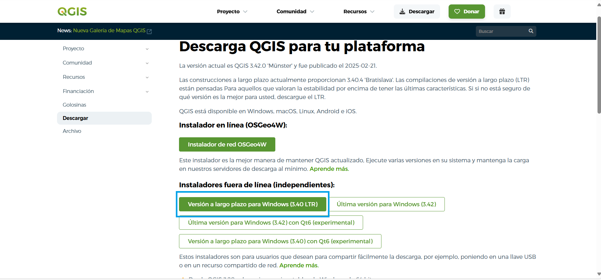

Si no tenes Windows, podes elegir la versión que mejor se adapte a tu
sistema operativo:

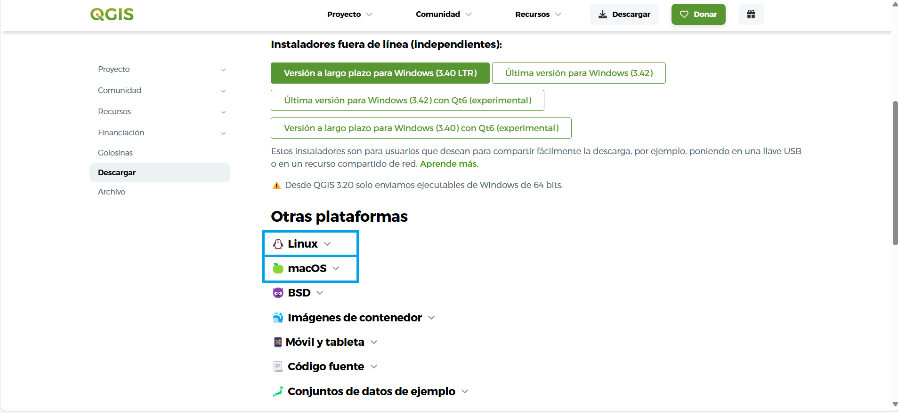

**En Windows**
Se descargará en su PC un archivo ejecutable, haciendo doble clic sobre él,
comenzará la instalación de QGIS.
El archivo descargado se guarda de la siguiente manera:

**En MacOS**
En algunas ocasiones puede ser necesario aquí aceptar y/o
modificar las condiciones de seguridad por defecto para garantizar la correcta
instalación. También va a descargarse un archivo ejecutable en tu PC.
Se descargará en su PC un archivo ejecutable, haciendo doble clic sobre él,
comenzará la instalación de QGIS.
El archivo descargado se guarda de la siguiente manera:

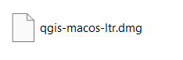

**En Linux**
La página tiene una guía de instalación para seguir paso a paso:

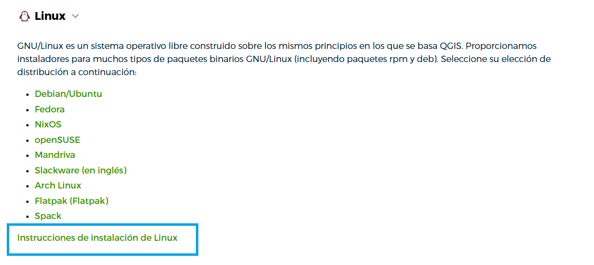

2. Instalación (para Windows)
   Una vez descargado el instalador de QGIS 3.40, seguimos los pasos:

   * Abrimos el instalador ejecutable, guardado en descargas:

   .. figure:: img/instalacion-puesta-marcha/QGIS_8.png

   * Se abre el instalador, damos clic en Siguiente

   .. figure:: img/instalacion-puesta-marcha/QGIS_9.png

   * Aceptamos los términos de licencia:

   .. figure:: img/instalacion-puesta-marcha/QGIS_10.png

   * Elegimos la carpeta de destino (recomendamos dejarlo por defecto):

   .. figure:: img/instalacion-puesta-marcha/QGIS_11.png

   * Inicia la instalación del programa. Puede tardar unos 10 a 20 minutos
     dependiendo de la PC

   .. figure:: img/instalacion-puesta-marcha/QGIS_12.png

   * Una vez concluida, damos clic en "Finish/Terminar".

   * En Windows, se creará una carpeta con los accesos directos al
     paquete de software instalados junto con QGIS.

En su defecto, si no queremos tener el acceso directo en Escritorio, podemos
borrar la carpeta, y acceder a QGIS desde **Inicio**

.. note:: Actualizaciones periódicas:
   * Con Giswater recomendamos la versión :guilabel:`Long Term Release (LTR) de QGIS`.
   * Gran facilidad para trabajar con **PostgreSQL**, gracias a la extensión espacial **PostGIS**.
   * Cantidad de complementos disponibles para añadir todo tipo de funcionalidades.

Instalación de PostgreSQL y PostGIS
-----------------------------
**PostgreSQL** es una base de datos open source con un enorme potencial, que servirá para almacenar todos los datos con los que se trabaja en Giswater.
Gracias a su extensión geoespacial **PostGIS** permite una relación muy cómoda con los GIS, especialmente QGIS. Esta extensión contiene más de 1000 funciones geoespaciales,
por lo que la convierte en uno de los softwares GIS más potentes que existe, aunque PostgreSQL no sea un programa específico de GIS.

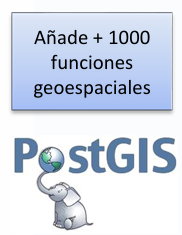

Estructura de datos en PostgreSQL
PostgreSQL organiza la información siguiendo una jerarquía bien definida que facilita la gestión eficiente y escalable de los datos.

.. note::  PostgreSQL almacena toda la información de Giswater en tablas.

1. Servidor: Es el nivel más alto en la jerarquía. Representa la instancia de PostgreSQL en ejecución y actúa como el punto de conexión para los usuarios.
   Un mismo servidor puede gestionar múltiples bases de datos de manera simultánea.

2. Base de datos: Dentro de un servidor pueden existir varias bases de datos independientes, cada una funcionando como un contenedor autónomo de información.

3. Esquema: Dentro de una base de datos pueden existir varios esquemas, los cuales funcionan como espacios de nombres que organizan y agrupan objetos como tablas, vistas y funciones.
   Un esquema puede utilizarse para separar conjuntos de datos dentro de la misma base de datos o representar un proyecto específico, facilitando la administración y el acceso a la información.

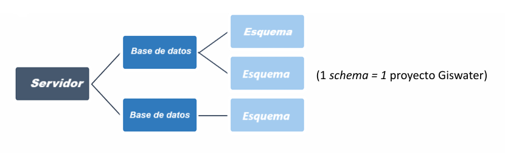

   Estructura jerárquica de PostgreSQL

Hay distintas versiones disponibles para descargar. Para trabajar con Giswater se necesita una versión entre la 10 y la 16.
Consulta la compatibilidad de versiones de PostgreSQL con Giswater.

La descarga de PostgreSQL se puede realizar desde su sitio `web oficial <https://www.postgresql.org/download/>`_.
Junto con la base de datos, se instala el programa de administración **pgAdmin4**, que es el software predeterminado para la gestión de bases de datos.

.. note::
   Aunque pgAdmin4 es una opción predeterminada, recomendamos el uso de :guilabel:`DBeaver`, un administrador de bases de datos más avanzado y flexible.

Descarga y configuración de PostgreSQL

1. Descarga del instalador
   Ingresa y selecciona tu sistema operativo.

   .. figure:: img/instalacion-puesta-marcha/PostgreSQL_3.png

   Si utilizas un sistema operativo distinto a Windows, selecciona la familia de sistemas operativos correspondiente.

   Haz clic en Descargue el instalador. Esto abrirá la ventana para descargar PostgreSQL, donde tambien podrás elegir la versión deseada y el sistema operativo correspondiente: Linux, Mac OS X o Windows

   .. figure:: img/instalacion-puesta-marcha/PostgreSQL_4.png

   Descarga del archivo ejecutable. Haz doble clic sobre él para comenzar la instalación. El archivo descargado (para Windows) se verá similar a esto:

   .. figure:: img/instalacion-puesta-marcha/PostgreSQL_5.png

2. Instalación (para Windows)
   Una vez descargado el instalador de PostgreSQL, sigue estos pasos

   * Abre el instalador ejecutable que se encuentra en la carpeta de descargas.
   * Aparecerá el asistente de instalación. Haz clic en Siguiente.

   .. figure:: img/instalacion-puesta-marcha/PostgreSQL_6.png

   * Selecciona el destino de instalación (recomendamos dejarlo por defecto).

   .. figure:: img/instalacion-puesta-marcha/PostgreSQL_7.png

   * Selección de componentes: Aparecerá una ventana para seleccionar los componentes a instalar.
     En general, es recomendable seleccionar todos los componentes si alguno no está marcado por defecto.
     En esta etapa se incluyen herramientas como *pgAdmin4*, que viene configurado por defecto.
     Adicionalmente, asegúrate de que la opción para instalar *Stack Builder* esté seleccionada, ya que permitirá gestionar complementos y herramientas adicionales, como **PostGIS**.
     Una vez hecho esto, haz clic en Siguiente.

   .. figure:: img/instalacion-puesta-marcha/PostgreSQL_8.png

   * Directorio de datos: Se pedirá elegir la ubicación del directorio de datos.
     Sugerimos mantener la configuración predeterminada para asegurar compatibilidad y evitar configuraciones innecesarias. Haz clic en Siguiente.

   .. figure:: img/instalacion-puesta-marcha/PostgreSQL_9.png

   * Contraseña del usuario: Define una contraseña para el usuario predeterminado de la base de datos (postgres).
     Asegúrate de guardar esta contraseña en un lugar seguro, ya que será esencial para gestionar la base de datos. Luego, haz clic en Siguiente.

   .. figure:: img/instalacion-puesta-marcha/PostgreSQL_10.png

   * Puerto de conexión: En la siguiente pantalla, se define el puerto de conexión del servidor.
     El valor predeterminado es **5432**, pero si este no está disponible, se asignará automáticamente otro, como 5434. Haz clic en Siguiente.

   .. figure:: img/instalacion-puesta-marcha/PostgreSQL_11.png

   * Opciones avanzadas: Aquí se seleccionará la configuración regional del nuevo clúster de base de datos.
     Recomendamos dejar la configuración predeterminada para asegurar un funcionamiento óptimo. Haz clic en Siguiente.

   .. figure:: img/instalacion-puesta-marcha/PostgreSQL_12.png

   * Listo para instalar: El asistente mostrará un resumen indicando que el programa está listo para iniciar la instalación de PostgreSQL. Haz clic en Siguiente para comenzar.
   * Instalación en progreso: Aparecerá una ventana de progreso indicando que la instalación está en curso. Este proceso puede tardar unos minutos, dependiendo de las especificaciones del ordenador.

   .. figure:: img/instalacion-puesta-marcha/PostgreSQL_13.png

   * Finalización de la instalación: Una vez completada la instalación, aparecerá una ventana indicando que PostgreSQL se ha instalado correctamente.
     El mensaje preguntará: *"¿Lanzar Stack Builder al finalizar?" Stack Builder es una herramienta que permite descargar e instalar componentes adicionales, como* **PostGIS** , *para ampliar las funcionalidades de PostgreSQL*.
     Es importante asegurarse de que esta opción esté seleccionada (generalmente viene activada por defecto). Luego, haz clic en Finalizar para proceder.

   .. figure:: img/instalacion-puesta-marcha/PostgreSQL_14.png

**PostGIS** es una extensión de PostgreSQL que convierte este sistema de bases de datos en una base de datos espacial.
Lo que hace es aumentar las capacidades de Postgres mediante un enorme paquete de funciones geoespaciales para consultar, procesar, transformar y analizar información espacial dentro de la estructura de la BBDD.
Es decir, habilita la capacidad de emplear PostgreSQL como una base de datos espacial en un Sistema de Información Geográfica.

La instalación de PostGIS requiere que PostgreSQL ya esté instalado en tu sistema.

* Una vez finalizada la instalación de PostgreSQL, **Stack Builder** se abrirá automáticamente.
  En esta ventana aparecerá la instalación correspondiente de PostgreSQL. Haz clic en 'Next' para continuar.

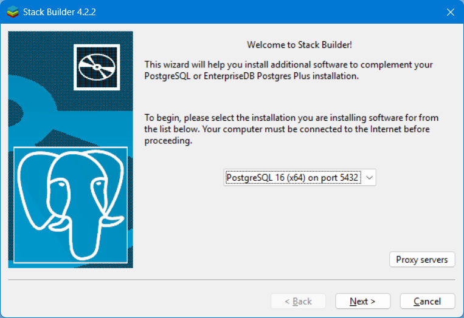

.. attention:: Asegúrate de que tu computadora esté conectada a Internet antes de proceder, ya que este paso es fundamental para descargar e instalar los componentes necesarios.

* Selección de aplicaciones adicionales: En esta etapa, Stack Builder mostrará una lista de categorías y aplicaciones disponibles para instalar.
  Entre estas, seleccionaremos la categoría **SPATIAL EXTENSIONS** (que se traduce como **EXTENSIONES ESPACIALES**).
  Dentro de esta categoría encontrarás las versiones disponibles de PostGIS. Una vez seleccionada, haz clic en 'Next' para continuar

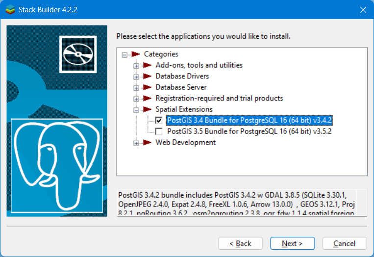

* Selecciona el destino de descarga: Revisa tus selecciones realizadas y verifica el directorio de descarga.
  Recomendamos dejar el directorio en su ubicación predeterminada, pero asegúrate de que esté configurado correctamente en la carpeta donde se encuentra PostgreSQL (por ejemplo, C:\Program Files\PostgreSQL)
  Haz clic en el botón Next para comenzar la descarga e instalación de los paquetes seleccionados.

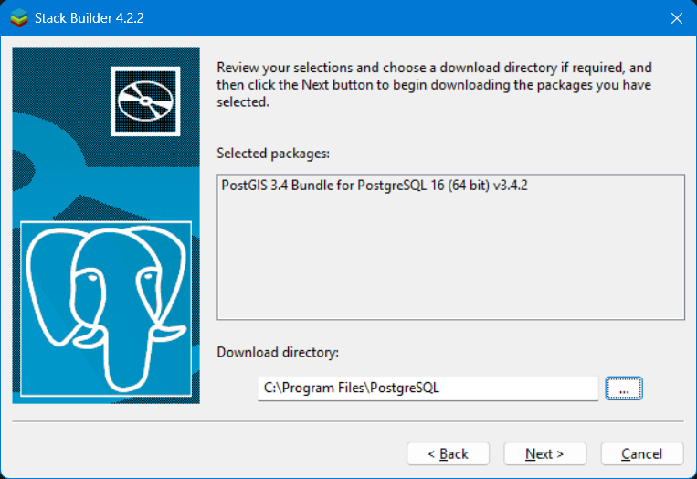

* Una vez que se complete la descarga de los paquetes seleccionados, *Stack Builder* se cerrará automáticamente y se abrirá el instalador de *PostGIS*.
  Puedes revisar los términos de la licencia antes de instalar PostGIS. Desliza hacia abajo para ver el resto del acuerdo si es necesario.
  Acepta los términos del acuerdo haciendo clic en I Agree ("Estoy de acuerdo") para continuar. Es obligatorio aceptar este acuerdo para proceder con la instalación del *PostGIS*.

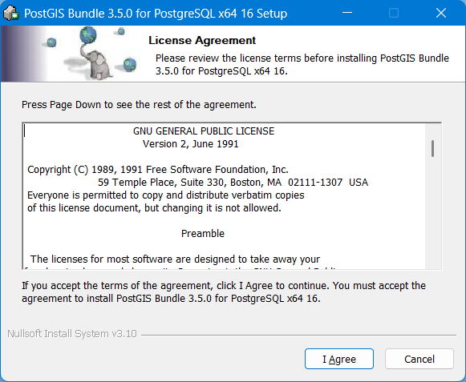

* Elegir componentes, selecciona las características de *PostGIS* que deseas instalar.
  Por lo general, las opciones aparecen marcadas por defecto, como se muestra en la imagen, y recomendamos dejarlas así para una configuración óptima y haz clic en Next para continuar.

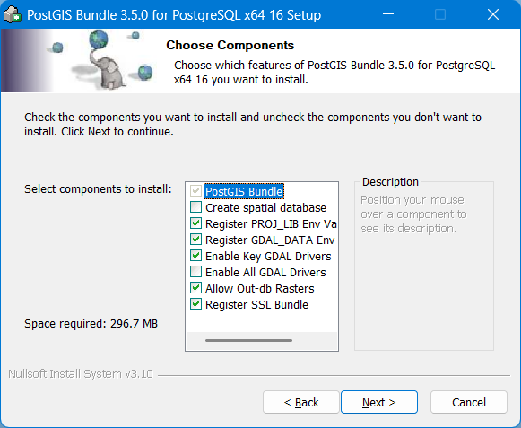

* Ubicación de instalación, elige la carpeta donde deseas instalar PostGIS. Recomendamos dejarlo por defecto y asegurarte de que esté en la ubicación del PostgreSQL
  (por ejemplo, C:\Program Files\PostgreSQL\16\). Haz clic en Next para continuar con la instalación.

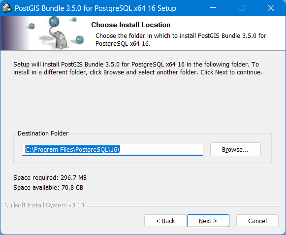

* Una vez que se haya completado esta etapa, el proceso de instalación continuará automáticamente. Este paso puede tardar un par de minutos, así que te pedimos paciencia.
  Una vez que termine de cargar, podrás cerrar la ventana, finalizando así la instalación de PostGIS.

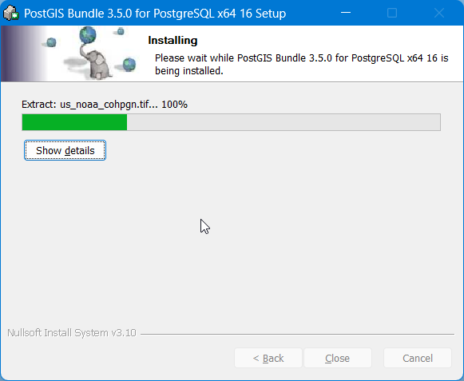

Instalación de Dbeaver
-----------------------------
**DBeaver** este potente administrador de bases de datos **open source** ofrece herramientas avanzadas y una mayor flexibilidad, siendo ideal para gestionar bases de datos de manera más eficiente.
Permite modificar tablas, vistas y reglas, así como consultar y gestionar toda la información con un enfoque profesional y visualmente amigable.

.. figure:: img/instalacion-puesta-marcha/DBeaver_1.png

La descarga e instalación de **DBeaver** es un proceso sencillo. Puedes obtener el software visitando su página web oficial en `este enlace <https://dbeaver.io/download/>`_.

* Este enlace te llevará directamente a la página donde podrás elegir la versión que necesitas para tu sistema operativo y descargarla.
  Dentro del sitio web, veras el apartado *"Comunidad DBeaver 25.0.0"*. A partir de allí, podremos elegir la versión correspondiente al sistema operativo que utilizamos: Windows, Mac OSX o Linux.

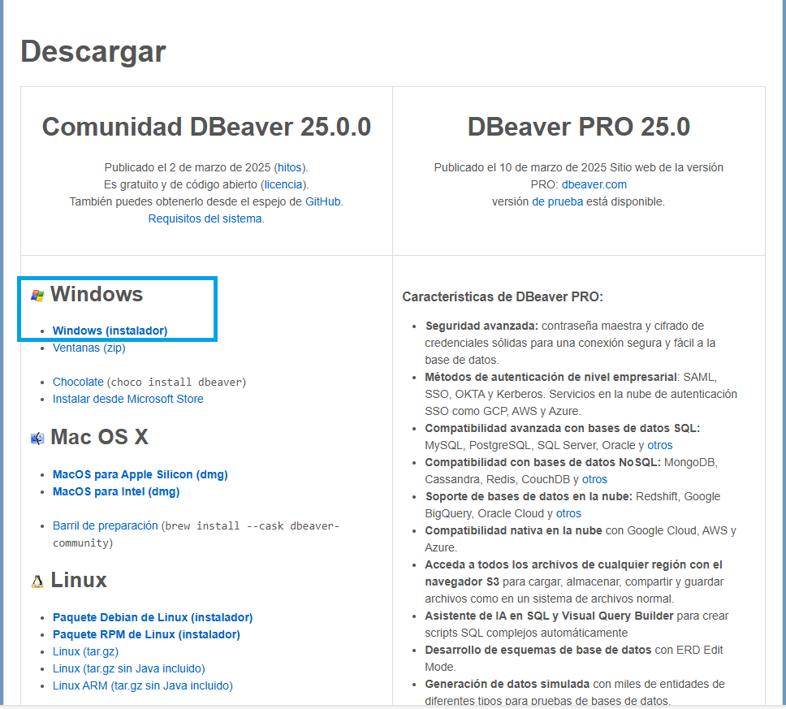

* El archivo descargado se verá como el siguiente (si estás usando Windows).
  Este es el instalador que utilizaremos para continuar con el proceso de instalación de **DBeaver**.

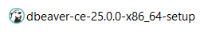

* Una vez descargado el instalador, hacemos clic en él para comenzar la instalación.
  Seleccionamos el lenguaje de instalación (de preferencia Español) y damos clic en "Ok".

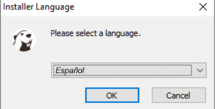

* Aparece un mensaje de bienvenida al asistente de instalación.
  Se recomienda cerrar todas las demás aplicaciones antes de comenzar la instalación. Hacemos clic en "Siguiente".

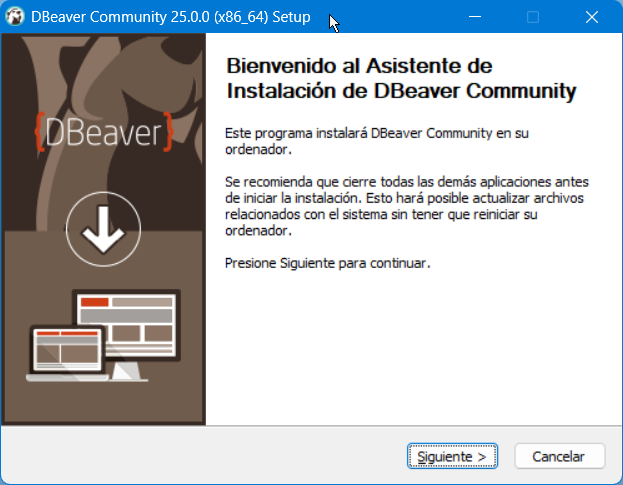

* En el acuerdo de licencia, lee los términos del acuerdo. Debes aceptarlos para continuar con la instalación de DBeaver.

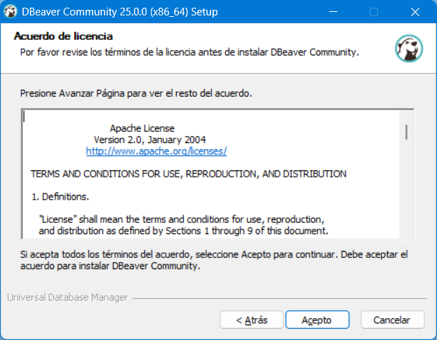

* Decidimos si queremos instalar el programa para todos los usuarios del equipo o solo para el usuario actual.
  Luego hacemos clic en "Siguiente", lo que solicitará permisos de administrador para continuar.

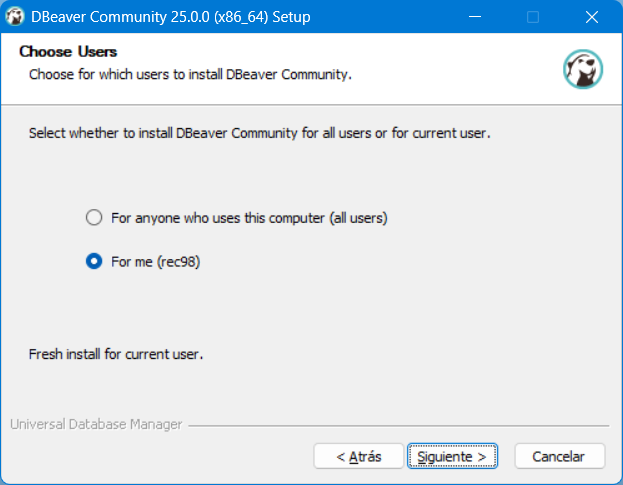

* En la siguiente pantalla, marcamos los componentes para instalar.
  Seleccionamos los componentes que consideremos necesarios y damos clic en "Siguiente".

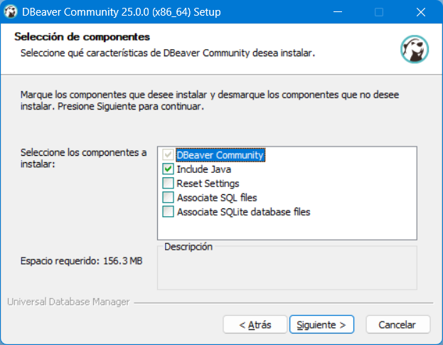

* Seleccionamos la carpeta donde se instalará el programa (o dejamos la opción por defecto) y damos clic en "Siguiente".

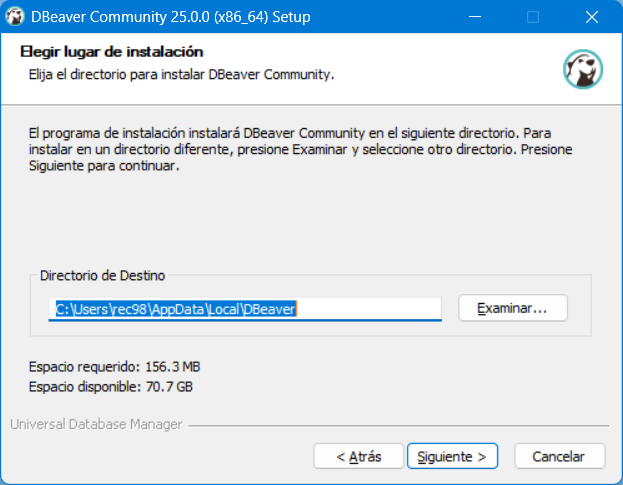

* Elegimos, si es necesario, la creación de un acceso directo en el escritorio, o seleccionamos no crear accesos directos.
  Luego hacemos clic en "Instalar".

* Esperamos a que se instale el programa y hacemos clic en "Siguiente".

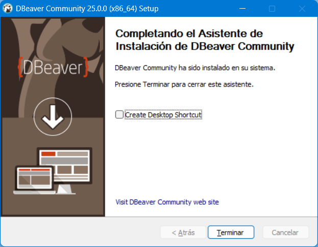

* Por último, decidimos si queremos crear un acceso directo en el escritorio y hacemos clic en "Terminar".
  Con esto, habremos finalizado la instalación del programa.

Instalación de Giswater
-----------------------------
En versiones anteriores, Giswater estaba compuesto por un aplicativo, que actuaba como driver para la configuración,
creación y gestión de los diferentes proyectos sobre la base de datos, y un plugin basado en QGIS para la explotación de los elementos de red.

A partir de la versión 3.2, únicamente será necesaria la instalación del plugin en QGIS para desarrollar todas las funcionalidades citadas anteriormente.

* Para la descarga del plugin, será necesaria la URL del repositorio:
  https://download.giswater.org/plugin/3.6/giswater.xml

  Esta se puede encontrar en la página web de Giswater (https://www.giswater.org/descarga/), desde la cual también se podrá acceder al contenido de versiones anteriores del plugin.

  A parte de la pestaña de descarga, en el portal web también se puede consultar información acerca del producto,
  de los beneficios de los programas open source, la comunidad de expertos que desarrollan Giswater u obtener materiales y tutoriales para aprender a usarlo.

Instalación del plugin en QGIS

Para la instalación y conexión del plugin Giswater con QGIS, es necesaria la configuración de un nuevo repositorio,
el cual nos permitirá visualizar el plugin Giswater en el conjunto de la lista de complementos. Para esto debemos seguir los siguientes pasos:

1. Abrir QGIS y acceder al repositorio de plugins (complementos).

2. Acceder a la pestaña *'Configuración'* (Settings) y añadir un nuevo repositorio.

3. Introducir un nombre que identifique el repositorio y la URL.

4. Buscar e instalar el plugin Giswater, desde la pestaña *'Todos'*.

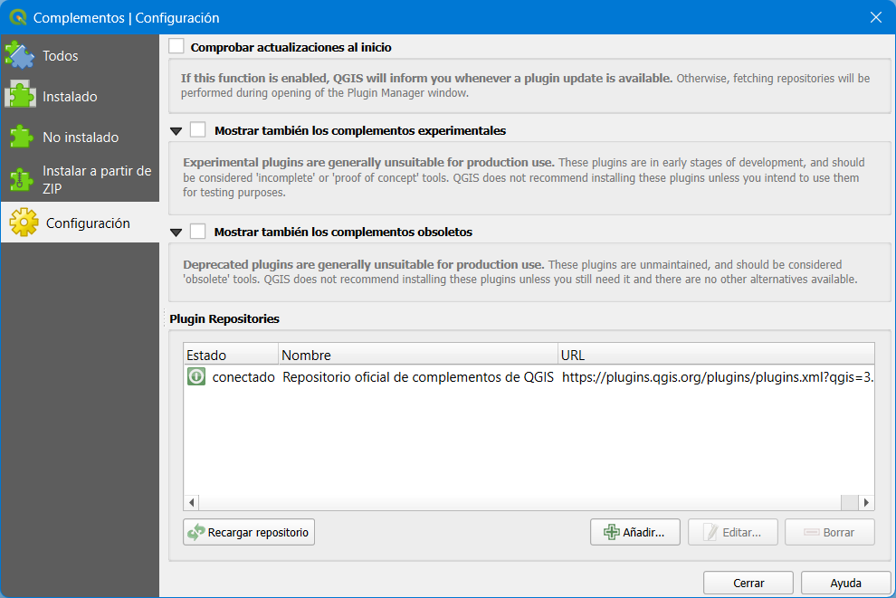

Para añadir el plugin de Giswater a QGIS hay que buscarlo en la pestaña Complementos.

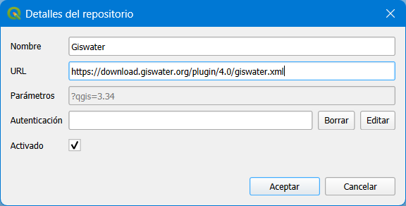

Se añade el repositorio manualmente, mediante una URL.

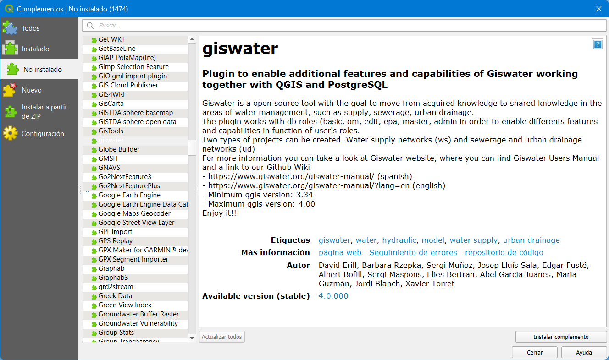

Siempre podremos ver la versión del plugin que tenemos instalada actualmente y la versión disponible en el repositorio.

.. attention::
   Si queremos actualizar a una versión del plugin más reciente, se puede hacer, pero esto puede tener implicaciones que veremos más adelante.

*La herramienta del plugin Giswater debe aparecer en la barra de herramientas de Complementos. Si no la tenemos activada, habrá que hacerlo mediante Ver > Barras de herramientas > Complementos.*

*Si al instalar el plugin por primera vez con resultado satisfactorio no nos sale automáticamente el botón Giswater en la barra de Complementos, deberemos cerrar QGIS y abrirlo de nuevo.*

*En caso de tener más de un proyecto de QGIS abierto, el comportamiento del plugin puede presentar inestabilidades, así pues, se recomienda no usar el plugin con más de un proyecto de QGIS abierto.*
