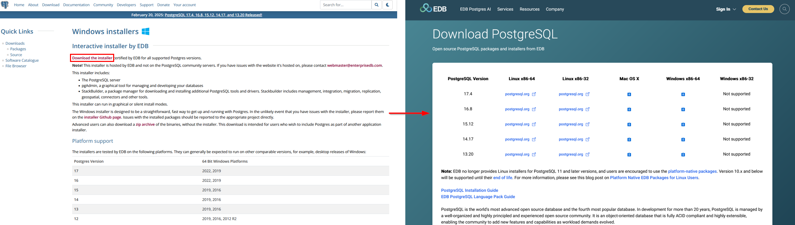

.. _instalacion-puesta-marcha:

==============================
Instalación y puesta en marcha
==============================

.. only:: html

   .. contents::
      :local:

Como acabamos de ver en la sección :ref:`que-es-giswater`, para poder trabajar con Giswater tenemos que tener instalados, como mínimo, QGIS y PostgreSQL junto con PostGIS.

PostgreSQL podemos tenerlo instalado en nuestro ordenador o en un servidor remoto pero QGIS tenemos que tenerlo instalado **obligatoriamente** en nuestro ordenador.

Aunque no es obligatorio, es recomendable tener instalado el gestor de bases de datos DBeaver así como los programas de simulación de redes EPANET y SWMM.

.. attention::

     Es **imprescindible** verificar la `compatibilidad <https://github.com/Giswater/giswater_dbmodel/wiki/version-compatibility>`_ de versiones de QGIS, PostgreSQL, Giswater, EPANET y SWMM.

.. note::

     Para descargar los programas a utilizar se recomienda hacerlo desde las páginas oficiales de cada uno de ellos.
     También se puede hacer desde el centro de descargas de la web de `Giswater <https://www.giswater.org/descarga/>`_.

Instalación de QGIS
===================

QGIS es el programa GIS de código abierto utilizado para representar geográficamente las redes e interactuar con ellas.
Para instalarlo, iremos al `centro de descargas de su web oficial <https://qgis.org/download/>`_ donde, tras saltar la ventana de donación, podremos descargarlo.

    
     Cerrar ventana de diálogo de donación al proyecto QGIS.

QGIS está disponible para Windows, macOS, Linux, Android e iOS así que tendremos que seleccionar uno u otro en función de nuestro sistema operativo. Una vez localizado, ya lo podremos descargar.

    
     Descargar QGIS para Windows.

.. warning::

     Para trabajar con Giswater **obligatoriamente** descargaremos la versión LTR de QGIS.

Una vez que se haya descargado QGIS, ejecutaremos el archivo descargado y seguiremos las instrucciones para instalarlo.

Instalación de PostgreSQL y PostGIS
===================================

Instalación de PostgreSQL
-------------------------

PostgreSQL es un sistema de gestión de bases de datos relacional y de código abierto donde se almacena toda la información utilizada para trabajar con Giswater.

Para instalarlo, iremos al `centro de descargas de su web oficial <https://www.postgresql.org/download/>`_ donde tendremos que seleccionar el paquete correspondiente a nuestro sistema operativo.

     Descargar PostgreSQL para Windows.

Tras seleccionar la opción de Windows, en la siguiente ventana tendremos que pinchar en *Download the installer* para que nos redirija a la web de EnterpriseDB para poder descargar alguna de las versiones de PostgreSQL compatibles con Giswater.

    
     Descargar PostgreSQL compatible con Giswater.

Una vez que se haya descargado PostgreSQL, ejecutaremos el archivo descargado y seguiremos las instrucciones para instalarlo.

.. important::

     Durante la instalación se nos pedirá crear una contraseña para el superusuario. Es muy importante recordarla ya que la necesitaremos introducir cada vez que nos conectemos a la base de datos.

     Ventana para crear contraseña durante la instalación.

En el proceso de instalación se instalará también pgAdmin (programa gestor de bases de datos) y Stack Builder (administrador que nos permite instalar complementos a PostgreSQL y que utilizaremos para instalar PostGIS).

Instalación de PostGIS
----------------------

PostGIS es una extensión de PostgreSQL la cual nos permite dotar a la base de datos de la componente espacial y podremos instalarlo gracias a Stack Builder.

Tras finalizar la instalación de PostgreSQL veremos una ventana que nos informa de ello y nos da la posibilidad de lanzar Stack Builder.

     Ventana de finalización de instalación de PostgreSQL y lanzamiento de Stack Builder.

Al pinchar en el botón *Terminar* se abrirá directamente la ventana de Stack Builder donde tendremos que seleccionar la versión de PostgreSQL sobre la que queremos instalar PostGIS.

En la siguiente ventana, tendremos que desplegar la categoría *Spatial Extensions* y marcar la casilla correspondiente para poder instalar PostGIS.

.. figure:: img/instalacion-puesta-marcha/install-postgis.png

     Instalación de PostGIS.

Con la casilla marcada, pincharemos en el botón *Next* y seguiremos las instrucciones para continuar con la instalación. Una vez finalizada, pincharemos en el botón *Finish* de Stack Builder y ya tendremos instalado PostGIS.

Instalación de Giswater
=======================

Giswater está desarrollado como un complemento de QGIS alojado en un repositorio propio.
Para poder instalarlo iremos al menú *Complementos / Administrar e instalar complementos* en QGIS y empezaremos por crear una conexión al repositorio donde se encuentra alojado para poder descargarlo.
La URL de conexión a dicho repositorio donde podremos descargar la versión más reciente la encontraremos en el `centro de descargas de su web oficial <https://www.giswater.org/descarga/>`_.

.. figure:: img/instalacion-puesta-marcha/download-giswater.png

     URL de la versión más reciente de Giswater.

En el caso de que fuera necesario, tendremos disponibles también versiones anteriores.

Lo que tendremos que hacer es copiar la URL que está marcada en rojo en la figura anterior y pegarla en la ventana de creación de un repositorio nuevo.

     Crear repositorio nuevo en QGIS.

Con el repositorio creado, lo buscaremos en el apartado de complementos no instalados y lo instalaremos como cualquier otro complemento de QGIS.
Una vez que la instalación haya finalizado ya lo podremos ver listado junto con el resto de complementos instalados.

     Giswater instalado.

Tras la instalación veremos que se ha creado un botón nuevo en las barras de herramientas así como un menú nuevo.

Instalación de Dbeaver (opcional)
=================================

Como hemos comentado al principio de este apartado, durante la instalación de PostgreSQL se instala también el gestor de bases de datos pgAdmin.
Aunque no sería necesario instalar ningún otro gestor ya que el instalado cumple los requisitos necesarios para gestionar las bases de datos, 
recomendamos la instalación de DBeaver dado que su interfaz gráfica es más amigable y fácil de manejar que la de pgAdmin.

Para descargarlo iremos al `centro de descargas de su web oficial <https://dbeaver.io/download/>`_ donde elegiremos el instalador correspondiente a nuestro sistema operativo (Windows, Mac OS X o Linux).
En cuanto se haya descargado el instalador, lo ejecutaremos y seguiremos las instrucciones mostradas en pantalla para poder instalarlo.

Instalación de EPANET (opcional)
================================

EPANET es un programa desarrollado por la agencia de protección del medio ambiente (EPA) de Estados Unidos el cual permite simular el comportamiento hidráulico y de calidad del agua en las redes de distribución de agua potable y 
es utilizado por Giswater para realizar las simulaciones hidráulicas.

Para instalarlo iremos a su `web oficial <https://www.epa.gov/water-research/epanet>`_ donde nos desplazaremos por la página hasta localizar el archivo que tenemos que descargar para poder instalarlo.

     Archivo a descargar para instalar EPANET.

En cuanto se haya descargado el instalador, lo ejecutaremos y seguiremos las instrucciones mostradas en pantalla para poder instalarlo.

Instalación de SWMM (opcional)
==============================

SWMM es un programa desarrollado por la agencia de protección del medio ambiente (EPA) de Estados Unidos el cual permite simular las redes de saneamiento y drenaje urbano en zonas urbanas.

Para instalarlo iremos a su `web oficial <https://www.epa.gov/water-research/storm-water-management-model-swmm>`_ donde nos desplazaremos por la página hasta localizar el archivo que tenemos que descargar para poder instalarlo.

     Archivo a descargar para instalar SWMM.

En cuanto se haya descargado el instalador, lo ejecutaremos y seguiremos las instrucciones mostradas en pantalla para poder instalarlo.    

.. warning::
    
     Las versiones a utilizar de EPANET y SWMM serán siempre las **versiones originales en inglés**.